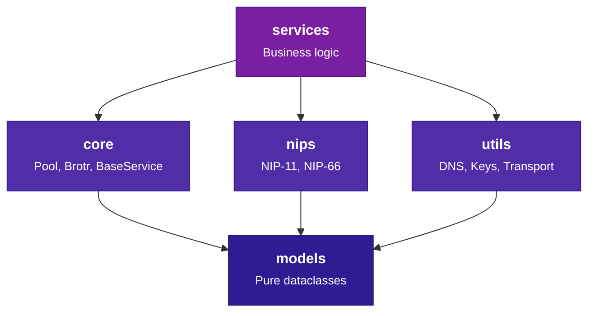

# Contributing to BigBrotr

Guidelines for contributing to BigBrotr: code standards, workflow, and architecture rules.

---

## Code of Conduct

This project adheres to the [Contributor Covenant Code of Conduct](https://github.com/BigBrotr/bigbrotr/blob/main/.github/CODE_OF_CONDUCT.md).
By participating, you are expected to uphold this code.

---

## Development Setup

### Prerequisites

- Python 3.11 or higher
- Docker and Docker Compose
- Git

### Quick Start

```bash
# Clone the repository
git clone https://github.com/BigBrotr/bigbrotr.git
cd bigbrotr

# Create virtual environment
python3 -m venv .venv
source .venv/bin/activate

# Install dependencies (includes dev tools and pre-commit hooks)
make install

# Start database for integration tests
docker compose -f deployments/bigbrotr/docker-compose.yaml up -d postgres pgbouncer

# Run tests to verify setup
make test-unit
```

### Finding Issues

- Look for issues labeled `good first issue` for beginner-friendly tasks
- Issues labeled `help wanted` are open for community contribution
- Check [GitHub Issues](https://github.com/BigBrotr/bigbrotr/issues) for planned work

---

## Branch Naming

Create branches from `develop` with a descriptive prefix:

```text
feature/add-api-service
fix/connection-timeout
refactor/pool-retry-logic
docs/update-readme
test/add-monitor-tests
```

---

## Commit Messages

Follow [Conventional Commits](https://www.conventionalcommits.org/):

| Prefix | Use case |
|--------|----------|
| `feat:` | New feature |
| `fix:` | Bug fix |
| `refactor:` | Code restructuring (no behavior change) |
| `docs:` | Documentation only |
| `test:` | Adding or updating tests |
| `chore:` | Dependency updates, CI config, tooling |

Examples:

```text
feat: add REST API service with OpenAPI documentation
fix: handle connection timeout in pool retry logic
refactor: split monitor into publisher and tags modules
docs: update architecture documentation
test: add monitor health check tests
chore: update dependencies
```

---

## Pull Request Process

### Before Submitting

Run all quality checks:

```bash
# Run lint, format, typecheck, unit tests, SQL checks
make ci

# Run integration tests
make test-integration

# Run all pre-commit hooks
make pre-commit
```

Update documentation if you changed:

- Public API or configuration options
- Database schema or stored procedures
- Deployment process

Add your changes to `CHANGELOG.md` under `[Unreleased]`.

### Submitting

1. Push your branch to your fork
2. Create a Pull Request targeting `develop` (or `main` for releases)
3. Fill out the PR template completely
4. Wait for CI checks to pass
5. Address any review feedback

### PR Requirements Checklist

- [ ] Unit tests pass (`make test-unit`)
- [ ] Integration tests pass (`make test-integration`)
- [ ] Pre-commit hooks pass (`make pre-commit`)
- [ ] Documentation updated (if applicable)
- [ ] `CHANGELOG.md` updated

---

## Coding Standards

### Ruff (Linting and Formatting)

| Setting | Value |
|---------|-------|
| Line length | 100 |
| Target | Python 3.11 |
| Source paths | `src/`, `tests/` |
| Rule categories | 26 enabled (E, W, F, I, B, C4, UP, ARG, SIM, TCH, S, PT, N, T20, ASYNC, FBT, FURB, and more) |

Key linting rules:

- `ban-relative-imports = "parents"` -- only sibling-relative imports allowed
- `known-first-party = ["bigbrotr"]`
- Tests have relaxed rules (S101, E501, PLR0913, FBT, etc.)

```bash
# Lint with auto-fix
ruff check src/ tests/ --fix

# Format
ruff format src/ tests/
```

### mypy (Strict Type Checking)

- **Strict mode** enabled on `src/bigbrotr`
- External libraries with missing stubs configured with `ignore_missing_imports`
- Special override: `bigbrotr.utils.transport` allows `allow_subclassing_any = true`

```bash
mypy src/bigbrotr
```

### Pre-commit Hooks

All hooks run automatically on `git commit`:

| Hook | Purpose |
|------|---------|
| trailing-whitespace, end-of-file-fixer | Whitespace cleanup |
| check-yaml, check-json, check-toml | Config file validation |
| check-added-large-files (1 MB) | Prevent large file commits |
| check-merge-conflict, check-case-conflict | Merge and case conflict detection |
| detect-private-key, detect-secrets | Secret detection |
| debug-statements, check-docstring-first | Python hygiene |
| mixed-line-ending (LF) | Consistent line endings |
| ruff, ruff-format | Python lint + format |
| mypy | Type checking |
| yamllint | YAML linting |
| markdownlint | Markdown linting (MD013, MD033, MD041 disabled) |
| hadolint | Dockerfile linting |
| sqlfluff-fix | SQL formatting (PostgreSQL dialect) |

Run all hooks manually:

```bash
pre-commit run --all-files
```

> **Tip:** Pre-commit auto-formats on commit. If hooks modify files, re-stage and commit again.

### SQL Formatting

- **Dialect**: PostgreSQL
- **Tool**: sqlfluff
- **Keywords**: UPPER, identifiers: lower, types: UPPER
- **Max line length**: 150
- **Tab size**: 4 spaces

---

## Import Conventions

### Cross-package: Absolute Imports

```python
from bigbrotr.core.logger import Logger
from bigbrotr.core.base_service import BaseService, BaseServiceConfig
from bigbrotr.core.exceptions import ConnectivityError, RelayTimeoutError
from bigbrotr.models.constants import NetworkType
from bigbrotr.models.constants import EventKind, ServiceName
from bigbrotr.models.service_state import ServiceState, ServiceStateType
from bigbrotr.nips.nip11 import Nip11
from bigbrotr.utils.transport import connect_relay, is_nostr_relay
```

### Within Same Package: Relative Imports

```python
from .logger import Logger
from .common.queries import get_all_relay_urls
```

### Models Layer: stdlib Only

```python
import logging
logger = logging.getLogger(__name__)
```

> **Warning:** Parent-relative imports (`from ..core import ...`) are banned by the
> `ban-relative-imports = "parents"` rule. Only sibling-relative imports are allowed.

---

## Model Patterns

All models follow a strict immutable pattern:

- Decorated with `@dataclass(frozen=True, slots=True)`
- Cache `to_db_params()` result in `__post_init__` via a `_db_params` field
- Pattern: `_compute_db_params()` -> cached `_db_params` -> `to_db_params()` returns it
- Use `object.__setattr__` in `__post_init__` (frozen workaround)
- Provide `from_db_params()` classmethod for reconstruction from database rows

Key type locations:

- `NetworkType` in `models/constants.py`
- `MetadataType` in `models/metadata.py`
- `ServiceState`, `ServiceStateType`, `ServiceStateDbParams` in `models/service_state.py`
- `ServiceName`, `EventKind`, `EVENT_KIND_MAX` in `models/constants.py`

---

## Architecture Rules

### Diamond DAG

Imports flow strictly downward. No layer may import from a layer above it:



| Layer | Allowed Dependencies | Description |
|-------|---------------------|-------------|
| **models** | stdlib only | Pure frozen dataclasses, zero I/O |
| **core** | models | Pool, Brotr, BaseService, Logger, Metrics, YAML |
| **utils** | models | DNS resolution, keys, transport helpers |
| **nips** | models, utils | NIP-11 and NIP-66 protocol I/O |
| **services** | core, nips, utils, models | Business logic (all 5 services) |

### Adding a New Service

1. Create `src/bigbrotr/services/myservice.py`:

    ```python
    from bigbrotr.core.base_service import BaseService, BaseServiceConfig


    class MyServiceConfig(BaseServiceConfig):
        """Configuration for MyService."""

        my_setting: int = 42


    class MyService(BaseService[MyServiceConfig]):
        CONFIG_CLASS = MyServiceConfig

        async def run(self) -> None:
            """Execute one service cycle."""
            ...
    ```

2. Register in `src/bigbrotr/__main__.py`:

    ```python
    SERVICE_REGISTRY[ServiceName.MYSERVICE] = ServiceEntry(
        cls=MyService,
        config_path=Path("config/services/myservice.yaml"),
    )
    ```

3. Add `ServiceName.MYSERVICE` to `src/bigbrotr/models/constants.py`

4. Create `deployments/*/config/services/myservice.yaml`

5. Add tests in `tests/unit/services/test_myservice.py`

---

## Testing

### Running Tests

```bash
# Unit tests
make test-unit

# Integration tests (requires Docker)
make test-integration

# Unit tests without slow markers
make test-fast

# With coverage
make coverage

# Specific file
pytest tests/unit/core/test_pool.py -v

# Matching pattern
pytest -k "health_check" -v
```

### Writing Tests

- Place tests in `tests/` mirroring the source tree structure
- Name test files `test_<module>.py`
- Use shared fixtures from `conftest.py` and `tests/fixtures/`
- Mock at the **consumer's** namespace, not the source:
  - Correct: `@patch("bigbrotr.services.validator.is_nostr_relay")`
  - Wrong: `@patch("bigbrotr.utils.transport.is_nostr_relay")`
- Test both success and error cases
- `asyncio_mode = "auto"` -- no need for `@pytest.mark.asyncio`

---

## Documentation Standards

### Docstrings

Use [Google-style](https://google.github.io/styleguide/pyguide.html#38-comments-and-docstrings)
docstrings for all classes and public methods:

```python
def fetch_relay_info(url: str, timeout: float = 10.0) -> dict[str, Any]:
    """Fetch NIP-11 relay information document.

    Args:
        url: WebSocket URL of the relay (wss:// or ws://).
        timeout: Request timeout in seconds.

    Returns:
        Parsed relay information document as a dictionary.

    Raises:
        ConnectivityError: If the relay is unreachable.
        ProtocolError: If the response is not valid JSON.
    """
```

Include these sections as applicable: **Args**, **Returns**, **Raises**, **Examples**.

### Building Docs

```bash
# Build documentation site
make docs

# Serve locally with live reload
make docs-serve
```

### When to Update Documentation

- New features or services
- Configuration option changes
- Database schema changes
- API changes
- Deployment process changes

---

## Questions?

- Open a [Discussion](https://github.com/BigBrotr/bigbrotr/discussions) for questions
- Open an [Issue](https://github.com/BigBrotr/bigbrotr/issues) for bugs or feature requests
- Check existing issues before creating new ones
