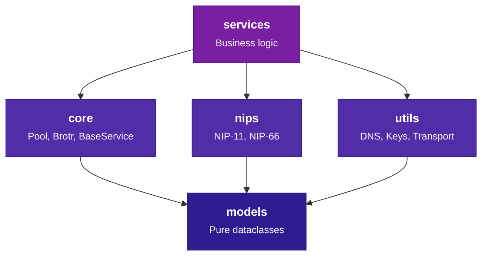

```mermaid
graph TD
    S["<b>services</b><br/><small>Business logic</small>"]
    C["<b>core</b><br/><small>Pool, Brotr, BaseService</small>"]
    N["<b>nips</b><br/><small>NIP-11, NIP-66</small>"]
    U["<b>utils</b><br/><small>DNS, Keys, Transport</small>"]
    M["<b>models</b><br/><small>Pure dataclasses</small>"]

    S --> C
    S --> N
    S --> U
    C --> M
    N --> M
    U --> M

    style S fill:#7B1FA2,color:#fff,stroke:#4A148C
    style C fill:#512DA8,color:#fff,stroke:#311B92
    style N fill:#512DA8,color:#fff,stroke:#311B92
    style U fill:#512DA8,color:#fff,stroke:#311B92
    style M fill:#311B92,color:#fff,stroke:#1A237E
```
