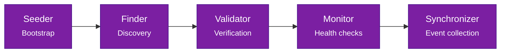

```mermaid
flowchart LR
    A["Seeder<br/><small>Bootstrap</small>"]
    B["Finder<br/><small>Discovery</small>"]
    C["Validator<br/><small>Verification</small>"]
    D["Monitor<br/><small>Health checks</small>"]
    E["Synchronizer<br/><small>Event collection</small>"]

    A --> B --> C --> D --> E

    style A fill:#7B1FA2,color:#fff,stroke:#4A148C
    style B fill:#7B1FA2,color:#fff,stroke:#4A148C
    style C fill:#7B1FA2,color:#fff,stroke:#4A148C
    style D fill:#7B1FA2,color:#fff,stroke:#4A148C
    style E fill:#7B1FA2,color:#fff,stroke:#4A148C
```
