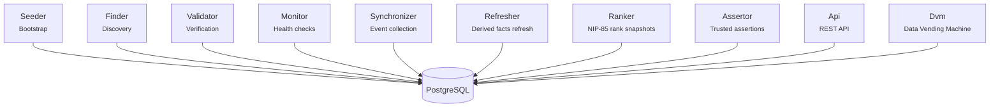

```mermaid
flowchart TD
    DB[("PostgreSQL")]

    SE["Seeder<br/><small>Bootstrap</small>"]
    FI["Finder<br/><small>Discovery</small>"]
    VA["Validator<br/><small>Verification</small>"]
    MO["Monitor<br/><small>Health checks</small>"]
    SY["Synchronizer<br/><small>Event collection</small>"]
    RE["Refresher<br/><small>Derived facts refresh</small>"]
    RA["Ranker<br/><small>NIP-85 rank snapshots</small>"]
    AS["Assertor<br/><small>Trusted assertions</small>"]
    AP["Api<br/><small>REST API</small>"]
    DV["Dvm<br/><small>Data Vending Machine</small>"]

    SE --> DB
    FI --> DB
    VA --> DB
    MO --> DB
    SY --> DB
    RE --> DB
    RA --> DB
    AS --> DB
    AP --> DB
    DV --> DB
```
