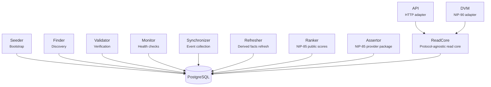

```mermaid
flowchart TD
    DB[("PostgreSQL")]
    RC["ReadCore<br/><small>Protocol-agnostic read core</small>"]

    SE["Seeder<br/><small>Bootstrap</small>"]
    FI["Finder<br/><small>Discovery</small>"]
    VA["Validator<br/><small>Verification</small>"]
    MO["Monitor<br/><small>Health checks</small>"]
    SY["Synchronizer<br/><small>Event collection</small>"]
    RE["Refresher<br/><small>Derived facts refresh</small>"]
    RA["Ranker<br/><small>NIP-85 public scores</small>"]
    AS["Assertor<br/><small>NIP-85 provider package</small>"]
    AP["API<br/><small>HTTP adapter</small>"]
    DV["DVM<br/><small>NIP-90 adapter</small>"]

    SE --> DB
    FI --> DB
    VA --> DB
    MO --> DB
    SY --> DB
    RE --> DB
    RA --> DB
    AS --> DB
    AP --> RC
    DV --> RC
    RC --> DB
```
