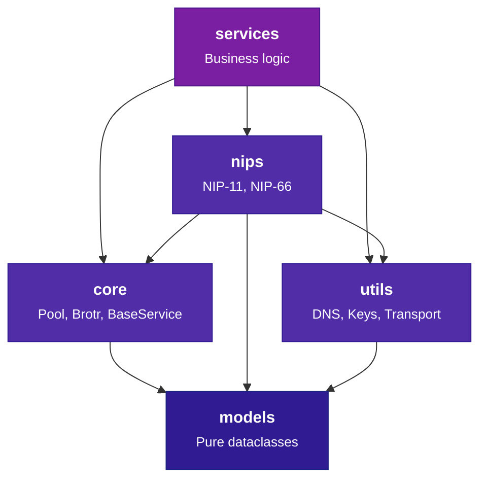

# Coding Standards

Linting, formatting, type checking, import conventions, model patterns,
error handling, and architecture rules for the BigBrotr codebase.

---

## Ruff (Linting and Formatting)

| Setting | Value |
|---------|-------|
| Line length | 100 |
| Target | Python 3.11 |
| Source paths | `src/`, `tests/` |
| Rule categories | 31 enabled |

Enabled rule categories:

```text
E, W, F, I, B, C4, UP, ARG, SIM, TCH, PTH, ERA, PL, RUF, TID, PIE,
PGH, PERF, S, A, LOG, ASYNC, FBT, FURB, N, PT, RSE, RET, T20
```

Key rules:

- `ban-relative-imports = "parents"` -- only sibling-relative imports allowed
- `known-first-party = ["bigbrotr"]`
- `lines-after-imports = 2` -- two blank lines after imports

Tests have relaxed rules: `S101` (assert), `E501` (line length), `PLR0913` (too many args),
`ARG001/ARG002` (unused args), `FBT` (boolean traps), and others.

```bash
# Lint with auto-fix
ruff check src/ tests/ --fix

# Format
ruff format src/ tests/

# Check formatting without modifying files
ruff format --check src/ tests/
```

---

## mypy (Strict Type Checking)

- **Strict mode** enabled on `src/bigbrotr`
- External libraries with missing stubs configured with `ignore_missing_imports`
- Special override: `bigbrotr.utils.transport` allows `allow_subclassing_any = true`

```bash
mypy src/bigbrotr
```

---

## Pre-commit Hooks

All hooks run automatically on `git commit`. Run all hooks manually:

```bash
pre-commit run --all-files
```

| Hook | Purpose |
|------|---------|
| trailing-whitespace, end-of-file-fixer | Whitespace cleanup |
| check-yaml, check-json, check-toml | Config file validation |
| check-added-large-files (1 MB) | Prevent large file commits |
| check-merge-conflict, check-case-conflict | Merge and case conflict detection |
| detect-private-key, detect-secrets | Secret detection |
| debug-statements, check-docstring-first | Python hygiene |
| mixed-line-ending (LF) | Consistent line endings |
| uv-lock | Verify uv.lock is in sync with pyproject.toml |
| ruff, ruff-format | Python lint + format |
| mypy | Type checking (full `src/` scan, not per-file) |
| yamllint | YAML linting |
| markdownlint | Markdown linting (MD013, MD033, MD041 disabled) |
| hadolint | Dockerfile linting |
| sqlfluff-fix | SQL formatting (PostgreSQL dialect) |
| codespell | Spell checking (Python, Markdown, YAML) |

!!! tip
    Pre-commit auto-formats on commit. If hooks modify files, re-stage and commit again.

---

## SQL Formatting

| Setting | Value |
|---------|-------|
| Dialect | PostgreSQL |
| Tool | sqlfluff |
| Keywords | UPPER |
| Identifiers | lower |
| Functions | UPPER |
| Max line length | 150 |
| Tab size | 4 spaces |

---

## Import Conventions

### Cross-package: Absolute Imports

```python
from bigbrotr.core.logger import Logger
from bigbrotr.core.base_service import BaseService, BaseServiceConfig
from bigbrotr.models.constants import NetworkType
from bigbrotr.models.constants import EventKind, ServiceName
from bigbrotr.models.service_state import ServiceState, ServiceStateType
from bigbrotr.nips.nip11 import Nip11
from bigbrotr.utils.transport import connect_relay, is_nostr_relay
```

### Within Same Package: Relative Imports

```python
from .logger import Logger
from .common.queries import get_all_relay_urls
```

### Models Layer: stdlib Only

```python
import logging
logger = logging.getLogger(__name__)
```

!!! warning
    Parent-relative imports (`from ..core import ...`) are banned by the
    `ban-relative-imports = "parents"` rule. Only sibling-relative imports are allowed.

---

## Model Patterns

All models follow a strict immutable pattern:

- Decorated with `@dataclass(frozen=True, slots=True)`
- Cache `to_db_params()` result in `__post_init__` via a `_db_params` field
- Pattern: `_compute_db_params()` -> cached `_db_params` -> `to_db_params()` returns it
- Use `object.__setattr__` in `__post_init__` (frozen workaround)

Key type locations:

| Type | Module |
|------|--------|
| `NetworkType`, `ServiceName`, `EventKind`, `EVENT_KIND_MAX` | `models/constants.py` |
| `MetadataType` | `models/metadata.py` |
| `ServiceState`, `ServiceStateType`, `ServiceStateDbParams` | `models/service_state.py` |

Design principles:

- **Fail-fast validation**: invalid instances never escape the constructor
- **Content-addressed deduplication**: Metadata hashed with SHA-256 (same data = same hash)
- **Never trust stored data**: constructors re-validate all inputs and re-compute hashes

---

## Error Handling

The project uses Python built-in and library exceptions (e.g., `ConnectionError`, `asyncio.TimeoutError`, `asyncpg.PostgresError`, `OSError`). There is no custom exception hierarchy.

| Scenario | Exception | Retry? |
|----------|-----------|--------|
| Pool exhausted, connection refused | `ConnectionError`, `asyncpg.PostgresError` | Yes (transient) |
| Bad SQL, constraint violation | `asyncpg.PostgresError` | No (permanent) |
| Relay unreachable, connection dropped | `ConnectionError`, `OSError` | Depends |
| Connection or response timed out | `asyncio.TimeoutError`, `TimeoutError` | Yes |
| TLS/SSL handshake failure | `ssl.SSLError` | No |
| Invalid NIP-11 JSON, malformed data | `ValueError`, `KeyError`, `json.JSONDecodeError` | No |

Rules:

- **Never** use bare `except Exception` in service code. `run_forever()` is the only broad boundary.
- **Never** catch `asyncio.CancelledError`, `KeyboardInterrupt`, or `SystemExit`.
- **Always** re-raise after logging in catch blocks unless intentionally swallowed (document why).

---

## Architecture Rules

### Diamond DAG

Imports flow strictly downward. No layer may import from a layer above it:



| Layer | Allowed Dependencies | Description |
|-------|---------------------|-------------|
| **models** | stdlib only | Pure frozen dataclasses, zero I/O |
| **core** | models | Pool, Brotr, BaseService, Logger, Metrics, YAML |
| **utils** | models | DNS resolution, keys, transport helpers |
| **nips** | models, utils, core | NIP-11 and NIP-66 protocol I/O |
| **services** | core, nips, utils, models | Business logic (all 6 services) |

### Adding a New Service

1. Create `src/bigbrotr/services/myservice/` as a package with `service.py` and `configs.py`

2. Service class inherits `BaseService[MyServiceConfig]` and implements `async def run()`

3. Register in `src/bigbrotr/__main__.py`:

    ```python
    SERVICE_REGISTRY[ServiceName.MYSERVICE] = ServiceEntry(
        cls=MyService,
        config_path=Path("config/services/myservice.yaml"),
    )
    ```

4. Add `ServiceName.MYSERVICE` to `src/bigbrotr/models/constants.py`

5. Create `deployments/*/config/services/myservice.yaml`

6. Add tests in `tests/unit/services/test_myservice.py`

---

## Documentation Standards

### Docstrings

Use [Google-style](https://google.github.io/styleguide/pyguide.html#38-comments-and-docstrings)
docstrings for all classes and public methods:

```python
def fetch_relay_info(url: str, timeout: float = 10.0) -> dict[str, Any]:
    """Fetch NIP-11 relay information document.

    Args:
        url: WebSocket URL of the relay (wss:// or ws://).
        timeout: Request timeout in seconds.

    Returns:
        Parsed relay information document as a dictionary.

    Raises:
        ConnectionError: If the relay is unreachable.
        ValueError: If the response is not valid JSON.
    """
```

Include these sections as applicable: **Args**, **Returns**, **Raises**, **Examples**.

### Building Docs

```bash
# Build documentation site (strict mode)
make docs

# Serve locally with live reload
make docs-serve
```

### When to Update Documentation

- New features or services
- Configuration option changes
- Database schema changes
- API changes
- Deployment process changes

---

## Related Documentation

- [Setup](setup.md) -- Prerequisites, installation, and Makefile targets
- [Testing](testing.md) -- Test configuration, fixtures, and mock patterns
- [SQL Templates](sql-templates.md) -- Schema generation from Jinja2 templates
- [Contributing](contributing.md) -- Branch workflow and PR process
