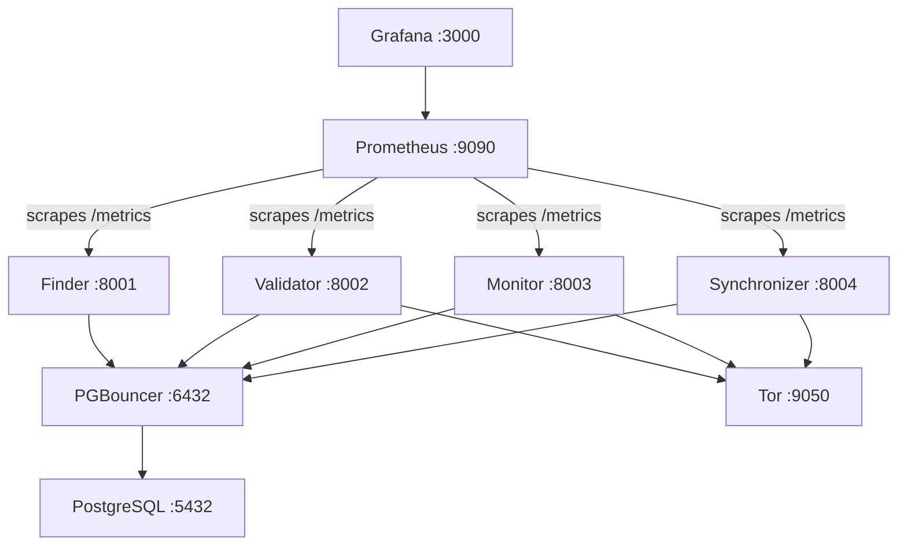

# Docker Compose Deployment

Deploy the full BigBrotr stack using Docker Compose, including PostgreSQL, PGBouncer, Tor proxy, all application services, and the monitoring stack.

---

## Prerequisites

- Docker 20.10+
- Docker Compose 2.0+
- Git
- Outbound HTTPS (port 443) for relay connections
- Outbound Tor (port 9050) if monitoring `.onion` relays

## Step-by-step Deployment

### 1. Clone the repository

```bash
git clone https://github.com/BigBrotr/bigbrotr.git
cd bigbrotr/deployments/bigbrotr
```

### 2. Configure environment variables

```bash
cp .env.example .env
```

Edit `.env` and set the required secrets:

```bash
# Required
DB_PASSWORD=your_secure_password        # openssl rand -base64 32
PRIVATE_KEY=your_hex_private_key        # openssl rand -hex 32
GRAFANA_PASSWORD=your_grafana_password  # openssl rand -base64 16

# Optional -- metrics port overrides
FINDER_METRICS_PORT=8001
VALIDATOR_METRICS_PORT=8002
MONITOR_METRICS_PORT=8003
SYNCHRONIZER_METRICS_PORT=8004
```

!!! danger "Protect your `.env` file"
    Run `chmod 600 .env` to prevent other users from reading your secrets.

### 3. Start the stack

```bash
docker compose up -d
```

This starts all containers: PostgreSQL, PGBouncer, Tor, Seeder, Finder, Validator, Monitor, Synchronizer, Prometheus, and Grafana.

### 4. Verify deployment

```bash
# Check all containers are healthy
docker compose ps

# Watch the seeder complete its one-shot run
docker compose logs -f seeder

# Follow service logs
docker compose logs -f finder validator monitor synchronizer
```

!!! tip
    The seeder runs once and exits (`restart: no`). All other services restart automatically.

## Architecture



## Network Isolation

Each deployment creates two Docker bridge networks:

| Network | Members | Purpose |
|---------|---------|---------|
| **data-network** | PostgreSQL, PGBouncer, Tor, all services | Database and relay connectivity |
| **monitoring-network** | Prometheus, Grafana, all services | Metrics scraping and dashboards |

PostgreSQL is only on the data network. Grafana is only on the monitoring network. Application services bridge both networks.

## Resource Limits

| Service | Restart Policy | CPU | Memory | Log Max |
|---------|---------------|-----|--------|---------|
| Seeder | `no` (one-shot) | 0.5 | 256 MB | 10 MB |
| Finder | `unless-stopped` | 1 | 512 MB | 50 MB |
| Validator | `unless-stopped` | 1 | 512 MB | 50 MB |
| Monitor | `unless-stopped` | 1 | 512 MB | 50 MB |
| Synchronizer | `unless-stopped` | 1 | 512 MB | 100 MB |

## Docker Commands Quick Reference

```bash
# Start all services
docker compose up -d

# Start specific services only
docker compose up -d postgres pgbouncer finder

# View logs (all or specific service)
docker compose logs -f
docker compose logs -f synchronizer

# Stop services (keep containers)
docker compose stop

# Stop and remove containers
docker compose down

# Rebuild images after code changes
docker compose build --no-cache

# Check service health
docker compose ps
```

## Port Mappings

All ports bind to `127.0.0.1` (localhost only).

| Service | BigBrotr | LilBrotr |
|---------|----------|----------|
| PostgreSQL | 5432 | 5433 |
| PGBouncer | 6432 | 6433 |
| Tor SOCKS5 | 9050 | 9051 |
| Finder Metrics | 8001 | 9001 |
| Validator Metrics | 8002 | 9002 |
| Monitor Metrics | 8003 | 9003 |
| Synchronizer Metrics | 8004 | 9004 |
| Prometheus | 9090 | 9091 |
| Grafana | 3000 | 3001 |

!!! note
    BigBrotr and LilBrotr use different ports and can run simultaneously on the same host.

---

## Related Documentation

- [Manual Deployment](manual-deploy.md) -- deploy without Docker
- [Custom Deployment](custom-deployment.md) -- create a new deployment from the template
- [Monitoring Setup](monitoring-setup.md) -- configure Prometheus and Grafana
- [Troubleshooting](troubleshooting.md) -- resolve common deployment issues
