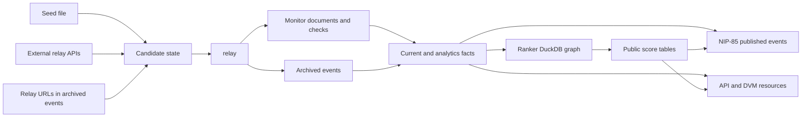

# Data Flow

This page reconstructs BigBrotr's end-to-end data flow from raw relay discovery
through public read surfaces.

## High-Level Pipeline

## Discovery To Validation

Seeder and Finder create candidate relay records in `service_state`. Validator
owns promotion from candidates into the canonical `relay` table. This keeps
untrusted discovery input out of the validated relay set until the WebSocket
protocol check succeeds.

Cross references:

- [Seeder, Finder, Validator](../user-guide/services.md#seeder)
- [Configuration](../user-guide/configuration.md)
- [Database: service_state](../user-guide/database.md#service_state)

## Monitoring And Archiving

Monitor reads validated relays and writes content-addressed `document` records
plus `relay_document` associations. Synchronizer reads validated relays and
writes `event` and `event_observation` rows. Both services checkpoint progress
through `service_state`.

Monitor output supports health and metadata reporting. Synchronizer output
supports event discovery, analytics, current winner maps, contact facts, and
NIP-85 fact tables.

Cross references:

- [Monitor](../user-guide/services.md#monitor)
- [Synchronizer](../user-guide/services.md#synchronizer)
- [Database: core archive](../user-guide/database.md#schema-map)
- [Monitoring](../user-guide/monitoring.md)

## Refresh And Fact Derivation

Refresher is the boundary between raw observations and queryable facts. It runs
PostgreSQL refresh functions in dependency order:

1. current winner maps;
2. operational contact-list facts;
3. analytics and NIP-85 fact tables;
4. periodic reconciliation targets.

The refresh layer deliberately writes concrete tables rather than asking API,
DVM, Ranker, or Assertor to recalculate heavy derivations on demand.

Cross references:

- [Refresher](../user-guide/services.md#refresher)
- [Database: derived data flow](../user-guide/database.md#derived-data-flow)
- [SQL Templates](../development/sql-templates.md)

## Ranker State

Ranker has two state surfaces:

- PostgreSQL is the canonical source for facts and the canonical destination
  for public score snapshots.
- DuckDB is the private analytical store for the local graph, graph-sync
  checkpoint, PageRank working tables, run records, non-user staging, and local
  current-rank snapshots.

Each cycle synchronizes changed followers from PostgreSQL into DuckDB, then
recomputes PageRank over the full local graph. The graph is not stored in
`service_state` because it is analytical, large, and owned by Ranker.

Cross references:

- [Ranker](../user-guide/services.md#ranker)
- [NIP-85 Pipeline](../user-guide/nip85-pipeline.md)
- [Backup And Restore](../how-to/backup-restore.md)

## Public Outputs

Assertor publishes NIP-85 provider-package and assertion events from canonical
facts and score outputs. API and DVM expose enabled readable resources over two
different transports:

- API serves HTTP/FastAPI routes;
- DVM serves NIP-90 requests over Nostr.

Both adapters use the same read-side resource catalog.

Cross references:

- [Assertor](../user-guide/services.md#assertor)
- [Read Side](../user-guide/read-side.md)
- [NIP-85 Pipeline](../user-guide/nip85-pipeline.md)
- [API and DVM services](../user-guide/services.md#api)

Related pages:

- [Project Orientation](index.md)
- [Repository Map](repository-map.md)
- [Database](../user-guide/database.md)
- [Services](../user-guide/services.md)
