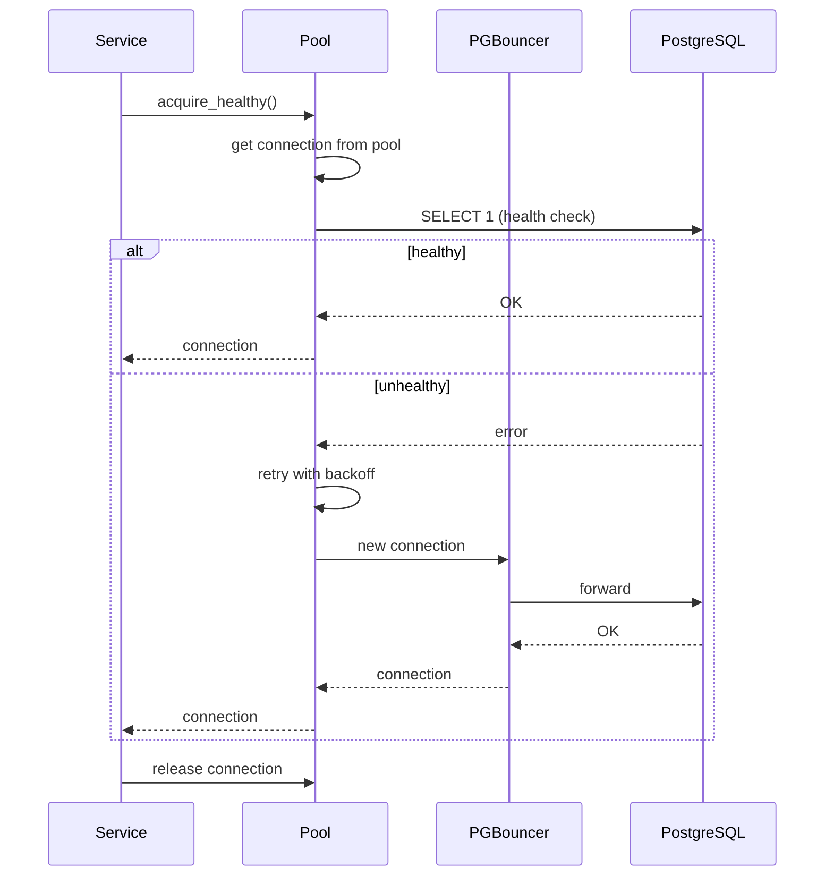
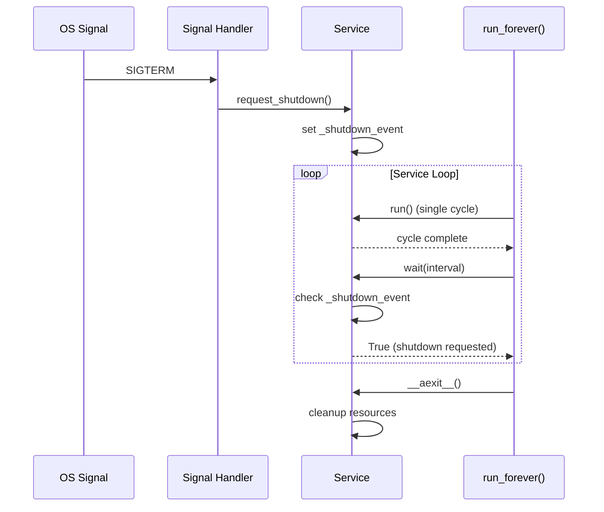
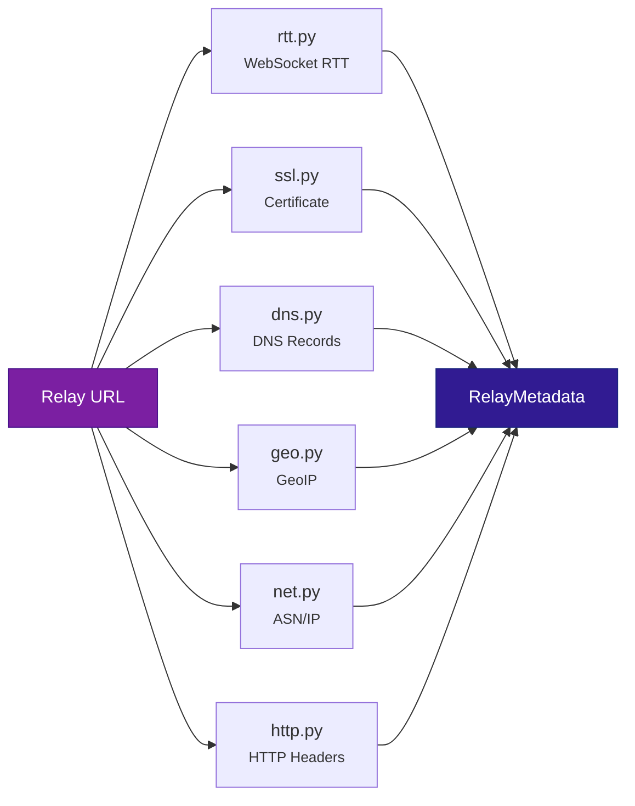
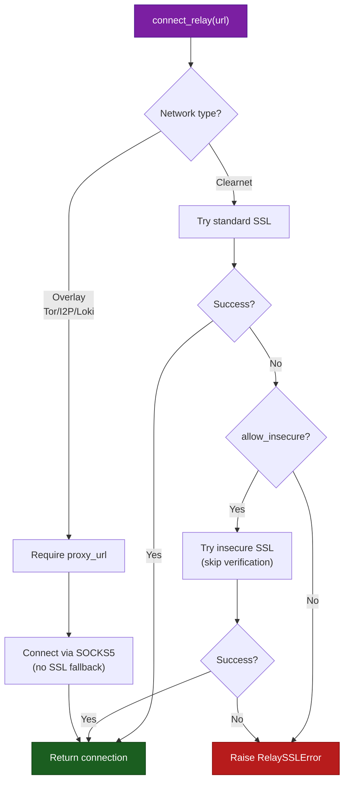
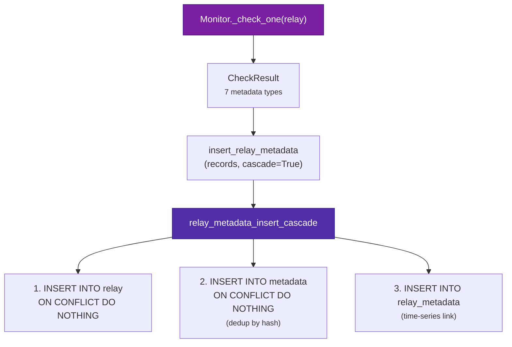
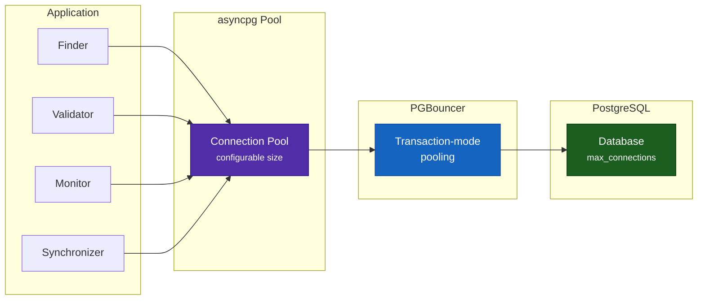
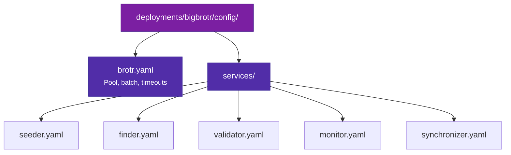

# Architecture

Comprehensive architecture reference for BigBrotr.

---

## Overview

BigBrotr uses a **Diamond DAG** architecture. Five layers with strict top-to-bottom import flow:

--8<-- "docs/_snippets/dag-diagram.md"

| Tier | Layer | Purpose | Changes When |
|------|-------|---------|--------------|
| **Top** | Services | Business logic, orchestration | New features, protocol updates |
| **Mid** | Core | Pool, Brotr, BaseService, Exceptions, Logger, Metrics | Rarely |
| **Mid** | NIPs | NIP-11 info fetch/parse, NIP-66 health checks (I/O) | Protocol spec updates |
| **Mid** | Utils | DNS, keys, transport, SOCKS5 proxy | Cross-cutting needs |
| **Foundation** | Models | Frozen dataclasses, validation, DB mapping | Schema changes |

Deployments (`deployments/{bigbrotr,lilbrotr,_template}/`) sit outside the package and configure behavior through YAML, SQL schemas, and Docker Compose.

---

## Models Layer

`src/bigbrotr/models/` -- Pure frozen dataclasses. Zero I/O, zero `bigbrotr` imports. Uses only `import logging` + `logging.getLogger()`.

### Data Models

| Model | File | Purpose |
|-------|------|---------|
| `Relay` | `relay.py` | URL validation (rfc3986), network detection (clearnet/tor/i2p/loki/local), local IP rejection |
| `Event` | `event.py` | Wraps nostr-sdk Event, extracts hex fields, tag parsing |
| `EventRelay` | `event_relay.py` | Event-relay junction with `seen_at` timestamp |
| `Metadata` | `metadata.py` | Content-addressed metadata: SHA-256 hash over canonical JSON |
| `RelayMetadata` | `relay_metadata.py` | Relay-metadata junction with `metadata_type` and `generated_at` |
| `ServiceState` | `service_state.py` | Per-service operational state (candidates, cursors, checkpoints) |

### Enumerations

| Type | File | Values |
|------|------|--------|
| `NetworkType` | `constants.py` | `clearnet`, `tor`, `i2p`, `loki`, `local`, `unknown` |
| `MetadataType` | `metadata.py` | `nip11_info`, `nip66_rtt`, `nip66_ssl`, `nip66_geo`, `nip66_net`, `nip66_dns`, `nip66_http` |
| `ServiceStateType` | `service_state.py` | `candidate`, `cursor`, `checkpoint` |
| `ServiceName` | `constants.py` | `seeder`, `finder`, `validator`, `monitor`, `synchronizer` |
| `EventKind` | `constants.py` | `RECOMMEND_RELAY=2`, `CONTACTS=3`, `RELAY_LIST=10002`, `NIP66_TEST=22456`, `MONITOR_ANNOUNCEMENT=10166`, `RELAY_DISCOVERY=30166` |

### Model Patterns

All models follow the same frozen dataclass pattern:

```python
@dataclass(frozen=True, slots=True)
class Relay:
    url: str
    discovered_at: int
    _db_params: RelayDbParams = field(init=False, repr=False)

    def __post_init__(self) -> None:
        # Validate and compute derived fields
        parsed = rfc3986.uri_reference(self.url)
        network = _detect_network(parsed.host)
        object.__setattr__(self, "network", network)
        object.__setattr__(self, "_db_params", self._compute_db_params())

    def _compute_db_params(self) -> RelayDbParams: ...
    def to_db_params(self) -> RelayDbParams:
        return self._db_params  # cached, no recomputation

    @classmethod
    def from_db_params(cls, url: str, ...) -> Relay: ...
```

Key characteristics:

- `frozen=True` + `slots=True` on all models
- `_compute_db_params()` runs once in `__post_init__`, cached in `_db_params`
- `object.__setattr__` for setting fields in frozen `__post_init__`
- `from_db_params()` classmethod for reconstruction from database rows
- `to_db_params()` returns a typed NamedTuple matching stored procedure parameter order

### ServiceState

`ServiceState` follows the same DbParams pattern as other models, with typed `ServiceName` and `ServiceStateType` enum fields.

```python
@dataclass(frozen=True, slots=True)
class ServiceState:
    service_name: ServiceName
    state_type: ServiceStateType
    state_key: str
    state_value: dict[str, Any]
    updated_at: int
```

---

## Core Layer

`src/bigbrotr/core/` -- Reusable infrastructure with zero business logic. Depends only on models.

### Pool (`pool.py`)

Async PostgreSQL connection pool via asyncpg with retry/backoff, health-checked acquisition.

**Configuration:**

```python
class PoolConfig(BaseModel):
    database: DatabaseConfig       # host, port, database, user (password from DB_PASSWORD env)
    limits: LimitsConfig           # min_size, max_size, max_queries, max_inactive_connection_lifetime
    timeouts: PoolTimeoutsConfig   # acquisition, health_check
    retry: PoolRetryConfig         # max_attempts, initial_delay, max_delay, exponential_backoff
    server_settings: ServerSettingsConfig  # application_name, timezone, statement_timeout
```

!!! tip "API Reference"
    See [`bigbrotr.core.pool`](../reference/core/pool.md) for the complete Pool API.

**Key methods:**

| Method | Purpose |
|--------|---------|
| `connect()` | Create asyncpg pool with retry backoff |
| `close()` | Idempotent pool teardown |
| `acquire()` | Get connection from pool |
| `acquire_healthy()` | Get connection with health check retry |
| `transaction()` | Async context manager for ACID transactions |
| `fetch()`, `fetchrow()`, `fetchval()` | Query methods with automatic retry on transient errors |
| `execute()`, `executemany()` | Mutation methods |
| `metrics` (property) | Pool statistics: size, utilization, is_connected |

**Connection pooling flow:**



In Docker deployments, services connect to **PGBouncer** (port 6432/6433) which provides infrastructure-level connection pooling in transaction mode. Pool provides application-level retry, health checking, and query methods.

### Brotr (`brotr.py`)

High-level database facade. Wraps stored procedures via `_call_procedure()`. Provides generic query methods that services use.

!!! tip "API Reference"
    See [`bigbrotr.core.brotr`](../reference/core/brotr.md) for the complete Brotr API.

**Configuration:**

```python
class BrotrConfig(BaseModel):
    batch: BatchConfig              # max_size (default 1000)
    timeouts: BrotrTimeoutsConfig   # query (60s), batch (120s), cleanup (90s), refresh (None)
```

**Insert operations** (all accept lists, auto-batch by `batch.max_size`):

| Method | Stored Function Called | Cascade |
|--------|----------------------|---------|
| `insert_relay(relays)` | `relay_insert` | -- |
| `insert_event(events)` | `event_insert` | -- |
| `insert_metadata(metadata)` | `metadata_insert` | -- |
| `insert_event_relay(records, cascade=True)` | `event_relay_insert_cascade` | Relay + Event + Junction |
| `insert_relay_metadata(records, cascade=True)` | `relay_metadata_insert_cascade` | Relay + Metadata + Junction |

**Service state:**

| Method | Stored Function Called |
|--------|----------------------|
| `upsert_service_state(records)` | `service_state_upsert` |
| `get_service_state(service, type, key?)` | `service_state_get` |
| `delete_service_state(keys)` | `service_state_delete` |

**Cleanup and maintenance:**

| Method | Stored Function Called |
|--------|----------------------|
| `delete_orphan_event()` | `orphan_event_delete` |
| `delete_orphan_metadata()` | `orphan_metadata_delete` |
| `refresh_materialized_view(name)` | `{name}_refresh` |

**Generic query facade** (used by services for ad-hoc queries):

- `fetch(query, *args, timeout)` -> `list[Record]`
- `fetchrow(query, *args, timeout)` -> `Record | None`
- `fetchval(query, *args, timeout)` -> `Any`
- `execute(query, *args, timeout)` -> `str`
- `transaction()` -> async context manager yielding a connection

!!! warning
    `Brotr._pool` is **private** -- services use Brotr methods, never pool directly.

### BaseService (`base_service.py`)

Abstract base class for all five services. Generic over configuration type.

```python
class BaseService(ABC, Generic[ConfigT]):
    SERVICE_NAME: ClassVar[str]
    CONFIG_CLASS: ClassVar[type[BaseModel]]

    _brotr: Brotr
    _config: ConfigT
```

!!! tip "API Reference"
    See [`bigbrotr.core.base_service`](../reference/core/base_service.md) for the complete BaseService API.

**Lifecycle:**

| Method | Purpose |
|--------|---------|
| `run()` | Abstract -- single cycle logic |
| `run_forever()` | Loop: `run()` -> `wait(interval)` -> repeat. Tracks consecutive failures. |
| `request_shutdown()` | Sync-safe flag for signal handlers |
| `wait(timeout)` -> `bool` | Interruptible sleep. Returns `True` if shutdown was requested. |
| `is_running` (property) | `True` until shutdown requested |

**Factory methods:**

- `from_yaml(config_path, brotr, **kwargs)` -> configured service instance
- `from_dict(data, brotr, **kwargs)` -> configured service instance

**Metrics integration:**

- `set_gauge(name, value)` -- custom Prometheus gauge
- `inc_counter(name, value=1)` -- custom Prometheus counter
- Automatic cycle duration tracking via `CYCLE_DURATION_SECONDS` histogram

**Context manager** (`async with service:`) handles lifecycle setup/teardown.

**Graceful shutdown flow:**



### Exceptions (`exceptions.py`)

Structured exception hierarchy replacing bare `except Exception`:

--8<-- "docs/_snippets/exception-hierarchy.md"

Services catch specific exceptions for appropriate handling: retry on `ConnectionPoolError`, skip relay on `RelayTimeoutError`, log and continue on `ProtocolError`.

!!! tip "API Reference"
    See [`bigbrotr.core.exceptions`](../reference/core/exceptions.md) for the complete exception hierarchy.

### Logger (`logger.py`)

Structured key=value logging with optional JSON output mode.

```python
logger = Logger("synchronizer")
logger.info("sync_completed", events=1500, duration=45.2)
# Output: 2026-02-09 12:00:00 INFO synchronizer: sync_completed events=1500 duration=45.2
```

JSON mode output for cloud aggregation:

```json
{"timestamp": "2026-02-09T12:34:56+00:00", "level": "info", "service": "synchronizer", "message": "sync_completed", "events": 1500}
```

### Metrics (`metrics.py`)

Prometheus metrics served on `/metrics` (port 8000).

| Metric | Type | Labels | Description |
|--------|------|--------|-------------|
| `service_info` | Info | service | Static service metadata |
| `service_gauge` | Gauge | service, name | Point-in-time state (consecutive_failures, progress, last_cycle_timestamp) |
| `service_counter` | Counter | service, name | Cumulative totals (cycles_success, cycles_failed, errors) |
| `cycle_duration_seconds` | Histogram | service | Cycle latency, 10 buckets (1s to 1h) |

!!! note
    For details on alerting and dashboard setup, see [Monitoring](monitoring.md).

### YAML Loader (`yaml.py`)

YAML configuration loading with environment variable interpolation.

---

## NIPs Layer

`src/bigbrotr/nips/` -- NIP-11 and NIP-66 protocol implementations. Has I/O (HTTP, DNS, SSL, WebSocket, GeoIP). Depends on models, utils, core.

### NIP-11 (`nip11/`)

Relay Information Document (NIP-11) fetch and parse.

| Module | Purpose |
|--------|---------|
| `fetch.py` | HTTP GET to relay URL with `Accept: application/nostr+json` |
| `data.py` | Parsed NIP-11 document fields (name, description, pubkey, contact, supported_nips, etc.) |
| `logs.py` | Structured logging for NIP-11 operations |
| `nip11.py` | `Nip11` orchestrator class |

### NIP-66 (`nip66/`)

Relay Monitoring and Discovery (NIP-66) health check implementations.

| Module | What It Measures |
|--------|-----------------|
| `rtt.py` | WebSocket round-trip times: open, read, write latency (ms) |
| `ssl.py` | Certificate validity, expiry date, issuer, cipher suite |
| `dns.py` | A/AAAA/CNAME/NS/PTR records, query time |
| `geo.py` | Country, city, coordinates, timezone, geohash (via GeoLite2) |
| `net.py` | IP address, ASN number, ASN organization (via GeoLite2 ASN) |
| `http.py` | Server header, X-Powered-By header |
| `nip66.py` | `Nip66` orchestrator class |

Each module produces a `RelayMetadata` object with the corresponding `MetadataType`. The Monitor service calls these and persists results.

**NIP-66 health check data flow:**



---

## Utils Layer

`src/bigbrotr/utils/` -- Shared utilities. Depends only on models.

| Module | Key Exports | Purpose |
|--------|-------------|---------|
| `transport.py` | `connect_relay()`, `is_nostr_relay()`, `create_client()`, `create_insecure_client()` | WebSocket/HTTP transport with SOCKS5 proxy and SSL fallback |
| `keys.py` | `load_keys_from_env()`, `KeysConfig` | Nostr key management (hex/nsec loading from env) |
| `dns.py` | DNS resolution utilities | dnspython wrapper |

### Transport SSL Fallback

`connect_relay()` implements a two-phase connection strategy:



`InsecureWebSocketAdapter` and `InsecureWebSocketTransport` handle relays with invalid certificates.

---

## Service Layer

`src/bigbrotr/services/` -- Business logic. Depends on core, nips, utils, models.

!!! note
    For a detailed walkthrough of each service and data flow, see [Service Pipeline](pipeline.md).

### Service Architecture Pattern

All five services follow the same pattern:

```python
class MyService(BaseService[MyServiceConfig]):
    SERVICE_NAME = "myservice"
    CONFIG_CLASS = MyServiceConfig

    def __init__(self, brotr: Brotr, config: MyServiceConfig | None = None):
        super().__init__(brotr=brotr, config=config or MyServiceConfig())

    async def run(self) -> None:
        """Single cycle -- called repeatedly by run_forever()."""
        ...
```

Configuration classes inherit from `BaseServiceConfig` which provides:

- `interval: float` (default 300s, minimum 60s)
- `max_consecutive_failures: int` (default 5, 0=unlimited)
- `metrics: MetricsConfig`

### Shared Infrastructure (`services/common/`)

| Module | Purpose |
|--------|---------|
| `queries.py` | 13 domain SQL query functions |
| `mixins.py` | `BatchProgress` dataclass, `BatchProgressMixin`, `NetworkSemaphoreMixin` |
| `configs.py` | Per-network Pydantic config models |

**Domain Query Functions** (13 total in `queries.py`):

| Function | Purpose |
|----------|---------|
| `get_all_relay_urls(brotr)` | All relay URLs |
| `get_all_relays(brotr)` | All relays with network + discovered_at |
| `filter_new_relay_urls(brotr, urls)` | URLs not yet in relay table |
| `count_relays_due_for_check(brotr, ...)` | Count relays needing health check |
| `fetch_relays_due_for_check(brotr, ...)` | Fetch relays needing health check |
| `get_events_with_relay_urls(brotr, ...)` | Events containing relay URLs |
| `upsert_candidates(brotr, relays)` | Insert/update validation candidates |
| `count_candidates(brotr, networks)` | Count pending candidates |
| `fetch_candidate_chunk(brotr, ...)` | Fetch candidate batch for validation |
| `delete_stale_candidates(brotr)` | Remove candidates already in relay table |
| `delete_exhausted_candidates(brotr, ...)` | Remove candidates exceeding max_failures |
| `promote_candidates(brotr, relays)` | Move validated candidates to relay table |
| `get_all_service_cursors(brotr, ...)` | Get sync cursors for all relays |

**Network Configuration** (`configs.py`):

| Config | Default Enabled | Proxy | Max Tasks | Timeout |
|--------|----------------|-------|-----------|---------|
| `ClearnetConfig` | Yes | None | 50 | 10s |
| `TorConfig` | No | `socks5://tor:9050` | 10 | 30s |
| `I2pConfig` | No | `socks5://i2p:4447` | 5 | 45s |
| `LokiConfig` | No | `socks5://lokinet:1080` | 5 | 30s |

`NetworkConfig` wraps all four and provides `get(network)`, `is_enabled(network)`, `get_proxy_url(network)`, `get_enabled_networks()`.

**BatchProgress** (`mixins.py`):

Mutable tracker for batch operations (not frozen -- has `reset()` method):

```python
@dataclass(slots=True)
class BatchProgress:
    started_at: float      # wall-clock
    total: int
    processed: int
    success: int
    failure: int
    chunks: int
```

**NetworkSemaphoreMixin**: creates one `asyncio.Semaphore` per enabled network, limiting concurrency to `max_tasks`.

---

## Data Flow

### Metadata Deduplication

Metadata is content-addressed: SHA-256 hash over canonical JSON. When the Monitor produces identical metadata for a relay, only a new `relay_metadata` row is inserted (linking the relay to the existing `metadata` record). The cascade function handles this:



---

## Concurrency Model

### Async I/O

All I/O is async:

- `asyncpg` for database
- `aiohttp` for HTTP
- `aiohttp-socks` for SOCKS5 proxy
- `nostr-sdk` for WebSocket (via Rust FFI/PyO3)

### Connection Pooling



### Per-Network Semaphores

Services that contact relays (Validator, Monitor, Synchronizer) use `NetworkSemaphoreMixin` to limit concurrent connections per network type:

| Network | Default Max Tasks | Default Timeout |
|---------|-------------------|-----------------|
| Clearnet | 50 | 10s |
| Tor | 10 | 30s |
| I2P | 5 | 45s |
| Lokinet | 5 | 30s |

---

## Design Patterns

### Dependency Injection

Services receive `Brotr` via constructor, enabling mock injection for testing:

```python
service = Monitor(brotr=brotr, config=config)

# Testing
mock_brotr = MagicMock(spec=Brotr)
service = Monitor(brotr=mock_brotr)
```

### Composition over Inheritance

`Brotr` HAS-A `Pool` (not IS-A). Services HAS-A `Brotr`. This enables independent testing and lifecycle management.

### Template Method

`BaseService.run_forever()` calls the abstract `run()` method in a loop with interval, failure tracking, and shutdown checks. Subclasses implement only `run()`.

### Mixins for Cross-Cutting Concerns

Monitor uses multiple mixins to compose behavior:

- `MonitorTagsMixin` -- tag building (from `monitor_tags.py`)
- `MonitorPublisherMixin` -- Nostr broadcasting (from `monitor_publisher.py`)
- `BatchProgressMixin` -- batch tracking (from `services/common/mixins.py`)
- `NetworkSemaphoreMixin` -- per-network concurrency (from `services/common/mixins.py`)

### Content-Addressed Deduplication

Metadata uses SHA-256 hash as primary key. Identical NIP-11/NIP-66 results across time or relays produce the same hash, deduplicating storage. Time-series tracking is via the `relay_metadata` junction table.

### Factory Methods

All services support three construction paths:

```python
service = Monitor.from_yaml("config.yaml", brotr=brotr)     # from YAML file
service = Monitor.from_dict(config_dict, brotr=brotr)        # from dict
service = Monitor(brotr=brotr, config=MonitorConfig(...))     # direct
```

### Context Managers

Resources are automatically managed:

```python
async with brotr:           # connect pool on enter, close on exit
    async with service:     # lifecycle setup/teardown
        await service.run_forever()
```

---

## Configuration System

### Configuration Hierarchy



!!! note
    For the complete configuration reference with all fields, defaults, and examples, see [Configuration](configuration.md).

### Pydantic Validation

All configuration uses Pydantic v2 models with:

- Typed fields with defaults and constraints (`Field(ge=1, le=65535)`)
- Nested models (e.g., `MonitorConfig.networks.clearnet.timeout`)
- `model_validator` for cross-field validation (e.g., Monitor keys at config load time)
- Environment variable injection for secrets (`DB_PASSWORD`, `PRIVATE_KEY`)

### Environment Variables

| Variable | Required | Used By |
|----------|----------|---------|
| `DB_PASSWORD` | Yes | Pool (database password) |
| `PRIVATE_KEY` | For Monitor | Monitor (Nostr event signing, RTT write tests) |
| `GRAFANA_PASSWORD` | No | Grafana (admin password) |

---

## Testing Architecture

### Test Structure

```text
tests/
├── conftest.py                  # Root: mock_pool, mock_brotr, mock_connection, sample_*
├── fixtures/
│   └── relays.py                # Shared relay fixtures (registered as pytest plugin)
├── unit/                        # 2049 tests, mirrors src/ structure
│   ├── core/                    # test_pool.py, test_brotr.py, test_base_service.py, ...
│   ├── models/                  # test_relay.py, test_event.py, test_metadata.py, ...
│   ├── nips/                    # nip11/, nip66/
│   ├── services/                # test_monitor.py, test_synchronizer.py, ...
│   └── utils/                   # test_transport.py, test_keys.py, ...
└── integration/                 # 8 tests (testcontainers PostgreSQL)
```

### Test Configuration

- `asyncio_mode = "auto"` -- no `@pytest.mark.asyncio` needed
- Global timeout: `--timeout=120` per test
- Coverage threshold: `fail_under = 80` (branch coverage enabled)
- Fixtures registered via `pytest_plugins = ["tests.fixtures.relays"]`
- Custom markers: `integration`, `unit`, `slow`

### Mock Patterns

- Mock targets use `bigbrotr.` prefix: `@patch("bigbrotr.services.validator.is_nostr_relay")`
- Service tests mock query functions at the **service module namespace** (not `bigbrotr.core.queries.*`)
- Root conftest provides: `mock_pool`, `mock_brotr`, `mock_connection`, `mock_asyncpg_pool`, `sample_event`, `sample_relay`, `sample_metadata`, `sample_events_batch`, `sample_relays_batch`

---

## Related Documentation

- [Service Pipeline](pipeline.md) -- Deep dive into the five-service pipeline and data flow
- [Configuration](configuration.md) -- Complete YAML configuration reference
- [Database](database.md) -- PostgreSQL schema, stored functions, and indexes
- [Monitoring](monitoring.md) -- Prometheus metrics, alerting, and Grafana dashboards
