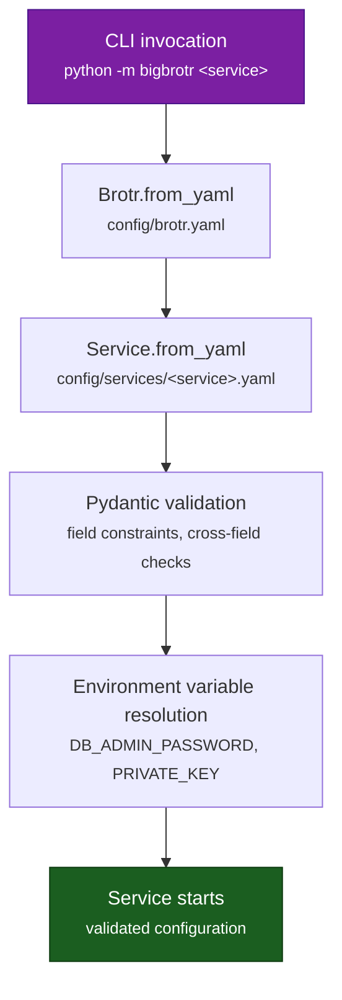

# Configuration Reference

Complete reference for BigBrotr's YAML configuration system with Pydantic v2 validation.

---

## Overview

BigBrotr uses hierarchical YAML configuration with Pydantic model validation:

1. **YAML files** define all non-sensitive settings
2. **Environment variables** supply secrets (passwords, private keys)
3. **Pydantic models** validate and enforce constraints at startup
4. **Sensible defaults** allow minimal configuration for most deployments

### Configuration Loading



### File Structure

Each deployment has its own configuration directory:

```text
deployments/
+-- bigbrotr/config/
|   +-- brotr.yaml
|   +-- services/
|       +-- seeder.yaml
|       +-- finder.yaml
|       +-- validator.yaml
|       +-- monitor.yaml
|       +-- synchronizer.yaml
+-- lilbrotr/config/
|   +-- brotr.yaml
|   +-- services/
|       +-- synchronizer.yaml
+-- brotr/config/                  <-- fully documented defaults
    +-- brotr.yaml
    +-- services/
        +-- seeder.yaml
        +-- finder.yaml
        +-- validator.yaml
        +-- monitor.yaml
        +-- synchronizer.yaml
```

!!! tip
    The `brotr` deployment contains every field with comments and is the canonical reference for defaults.

---

## Environment Variables

| Variable | Required | Used By | Description |
|----------|----------|---------|-------------|
| `DB_ADMIN_PASSWORD` | Yes | PostgreSQL admin, PGBouncer | Admin user password for database initialization and PGBouncer auth |
| `DB_WRITER_PASSWORD` | Yes | Pipeline services | Writer role password (seeder, finder, validator, monitor, synchronizer) |
| `DB_READER_PASSWORD` | Yes | Read-only services | Reader role password (postgres-exporter, future API/DVM) |
| `PRIVATE_KEY` | Monitor, optional for Synchronizer | Monitor, Synchronizer | Nostr private key (64-char hex or `nsec1...` bech32). Required for NIP-66 write tests and event publishing. Optional for Synchronizer NIP-42 authentication. |
| `GRAFANA_PASSWORD` | Docker only | Grafana | Grafana admin password |

### Setting Environment Variables

**Docker Compose** (`.env` file):

```bash
cp deployments/bigbrotr/.env.example deployments/bigbrotr/.env
# Edit and set DB_ADMIN_PASSWORD, DB_WRITER_PASSWORD, DB_READER_PASSWORD, PRIVATE_KEY, GRAFANA_PASSWORD
```

**Shell**:

```bash
export DB_WRITER_PASSWORD=your_writer_password
export PRIVATE_KEY=your_hex_private_key
```

**Systemd**:

```ini
[Service]
Environment="DB_WRITER_PASSWORD=your_writer_password"
Environment="PRIVATE_KEY=your_hex_private_key"
```

---

## CLI Arguments

```text
python -m bigbrotr <service> [options]

positional arguments:
  service                 seeder | finder | validator | monitor | synchronizer

options:
  --config PATH           Service config path (overrides default)
  --brotr-config PATH     Brotr config path (default: config/brotr.yaml)
  --log-level LEVEL       DEBUG | INFO | WARNING | ERROR (default: INFO)
  --once                  Run one cycle and exit
```

---

## Core Configuration (brotr.yaml)

The Brotr configuration controls the database connection pool and query behavior shared by all services. Per-service pool overrides (`user`, `password_env`, `min_size`, `max_size`) are set in each service's YAML file under a `pool:` section (see [Pool Overrides](#pool-overrides)).

!!! tip "API Reference"
    See [`bigbrotr.core.pool.PoolConfig`](../reference/core/pool.md) and [`bigbrotr.core.brotr.BrotrConfig`](../reference/core/brotr.md) for the config class APIs.

### Full Example

```yaml
pool:
  database:
    host: pgbouncer                          # Database/PGBouncer hostname
    port: 5432                               # Connection port
    database: bigbrotr                       # Database name
    user: admin                              # Database user (overridden per-service)
    password_env: DB_ADMIN_PASSWORD                # Env var for password (overridden per-service)

  limits:
    min_size: 2                              # Minimum pool connections (overridden per-service)
    max_size: 20                             # Maximum pool connections (overridden per-service)
    max_queries: 50000                       # Queries before connection recycle
    max_inactive_connection_lifetime: 300.0  # Idle connection timeout (seconds)

  timeouts:
    acquisition: 10.0                        # Connection acquisition timeout

  retry:
    max_attempts: 3                          # Connection retry attempts
    initial_delay: 1.0                       # Initial retry delay (seconds)
    max_delay: 10.0                          # Maximum retry delay (seconds)
    exponential_backoff: true                # Use exponential backoff

  server_settings:
    application_name: bigbrotr               # Auto-set to service name if omitted
    timezone: UTC                            # Session timezone
    statement_timeout: 300000                # Max query time (milliseconds)

batch:
  max_size: 1000                             # Records per bulk insert

timeouts:
  query: 60.0                                # Standard query timeout (seconds)
  batch: 120.0                               # Batch operation timeout
  cleanup: 90.0                              # Cleanup procedure timeout
  refresh: null                              # Materialized view refresh (null = no timeout)
```

!!! note
    In production, `brotr.yaml` typically only contains `pool.database.host` and `pool.database.database`. The `user`, `password_env`, `min_size`, and `max_size` are set per-service via pool overrides.

### Field Reference

#### DatabaseConfig

| Field | Type | Default | Description |
|-------|------|---------|-------------|
| `host` | string | `localhost` | Database/PGBouncer hostname |
| `port` | int | `5432` | Connection port (1-65535) |
| `database` | string | `bigbrotr` | Database name |
| `user` | string | `admin` | Database username (typically overridden per-service via pool overrides) |
| `password_env` | string | `DB_ADMIN_PASSWORD` | Environment variable containing password (typically overridden per-service) |

#### LimitsConfig

| Field | Type | Default | Range | Description |
|-------|------|---------|-------|-------------|
| `min_size` | int | `2` | 1-100 | Minimum pool connections (typically overridden per-service) |
| `max_size` | int | `20` | 1-200 | Maximum pool connections (must be >= min_size) |
| `max_queries` | int | `50000` | >= 100 | Queries before connection recycle |
| `max_inactive_connection_lifetime` | float | `300.0` | - | Idle connection timeout (seconds) |

#### TimeoutsConfig

| Field | Type | Default | Range | Description |
|-------|------|---------|-------|-------------|
| `acquisition` | float | `10.0` | >= 0.1 | Connection acquisition timeout |

#### RetryConfig

| Field | Type | Default | Range | Description |
|-------|------|---------|-------|-------------|
| `max_attempts` | int | `3` | 1-10 | Maximum retry attempts |
| `initial_delay` | float | `1.0` | >= 0.1 | Initial delay between retries |
| `max_delay` | float | `10.0` | >= initial_delay | Maximum retry delay |
| `exponential_backoff` | bool | `true` | - | Use exponential backoff |

#### ServerSettingsConfig

| Field | Type | Default | Description |
|-------|------|---------|-------------|
| `application_name` | string | `bigbrotr` | Application name in pg_stat_activity (auto-set to service name at startup) |
| `timezone` | string | `UTC` | Session timezone |
| `statement_timeout` | int | `300000` | Max query time in milliseconds (0 = no limit) |

#### BatchConfig

| Field | Type | Default | Range | Description |
|-------|------|---------|-------|-------------|
| `max_size` | int | `1000` | 1-100000 | Records per bulk operation |

#### TimeoutsConfig

| Field | Type | Default | Range | Description |
|-------|------|---------|-------|-------------|
| `query` | float or null | `60.0` | >= 0.1 | Standard query timeout |
| `batch` | float or null | `120.0` | >= 0.1 | Batch insert timeout |
| `cleanup` | float or null | `90.0` | >= 0.1 | Cleanup procedure timeout |
| `refresh` | float or null | `null` | >= 0.1 | Materialized view refresh timeout |

---

## Pool Overrides

Each service declares its own database connection settings in its YAML config file under a `pool:` section. These overrides are merged into the shared `brotr.yaml` configuration at startup. This enables per-service role isolation and right-sized connection pools.

### Example

```yaml
# config/services/monitor.yaml
pool:
  user: bigbrotr_writer
  password_env: DB_WRITER_PASSWORD
  min_size: 1
  max_size: 3

# ... rest of monitor config
```

### Override Fields

| Field | Type | Description |
|-------|------|-------------|
| `user` | string | Database role for this service (e.g., `bigbrotr_writer`, `bigbrotr_reader`) |
| `password_env` | string | Environment variable containing the role's password |
| `min_size` | int | Minimum pool connections for this service |
| `max_size` | int | Maximum pool connections for this service |
| `application_name` | string | Override for `pg_stat_activity` (auto-set to service name if omitted) |

### Merge Behavior

At startup, `__main__.py` extracts the `pool:` section from the service config and applies it to the shared brotr config:

- `user` / `password_env` → `pool.database.user` / `pool.database.password_env`
- `min_size` / `max_size` → `pool.limits.min_size` / `pool.limits.max_size`
- `application_name` → `pool.server_settings.application_name` (defaults to service name)

If no `pool:` section is present, the service uses the brotr.yaml defaults.

### Production Pool Sizing

| Service | Role | min | max | Notes |
|---------|------|-----|-----|-------|
| Seeder | writer | 1 | 2 | One-shot, minimal connections |
| Finder | writer | 1 | 3 | Periodic API + event scanning |
| Validator | writer | 1 | 3 | WebSocket testing + promotion |
| Monitor | writer | 1 | 3 | Health checks + metadata persistence |
| Synchronizer | writer | 2 | 5 | Highest throughput service |

---

## Base Service Configuration

All services inherit from `BaseServiceConfig` and share these fields:

!!! tip "API Reference"
    See [`bigbrotr.core.base_service.BaseServiceConfig`](../reference/core/base_service.md) for the config class API.

| Field | Type | Default | Range | Description |
|-------|------|---------|-------|-------------|
| `interval` | float | `300.0` | >= 60.0 | Seconds between service cycles |
| `max_consecutive_failures` | int | `5` | >= 0 | Stop after N consecutive failures (0 = never stop) |
| `metrics.enabled` | bool | `false` | - | Enable Prometheus /metrics endpoint |
| `metrics.port` | int | `8000` | 1-65535 | Metrics HTTP port |
| `metrics.host` | string | `127.0.0.1` | - | Metrics bind address |
| `metrics.path` | string | `/metrics` | - | Metrics URL path |

---

## Network Configuration

Services that connect to relays (Validator, Monitor, Synchronizer) share a unified network configuration:

!!! tip "API Reference"
    See [`bigbrotr.services.common.configs.NetworksConfig`](../reference/services/common/configs.md) for the config class API.

```yaml
networks:
  clearnet:
    enabled: true
    proxy_url: null
    max_tasks: 50
    timeout: 10.0
  tor:
    enabled: false
    proxy_url: "socks5://tor:9050"
    max_tasks: 10
    timeout: 30.0
  i2p:
    enabled: false
    proxy_url: "socks5://i2p:4447"
    max_tasks: 5
    timeout: 45.0
  loki:
    enabled: false
    proxy_url: "socks5://lokinet:1080"
    max_tasks: 5
    timeout: 30.0
```

| Field | Type | Default | Range | Description |
|-------|------|---------|-------|-------------|
| `enabled` | bool | varies | - | Enable this network type |
| `proxy_url` | string or null | varies | - | SOCKS5 proxy URL for overlay networks |
| `max_tasks` | int | varies | 1-200 | Maximum concurrent connections |
| `timeout` | float | varies | 1.0-120.0 | Connection timeout (seconds) |

**Defaults by network:**

| Network | enabled | proxy_url | max_tasks | timeout |
|---------|---------|-----------|-----------|---------|
| clearnet | `true` | `null` | `50` | `10.0` |
| tor | `false` | `socks5://tor:9050` | `10` | `30.0` |
| i2p | `false` | `socks5://i2p:4447` | `5` | `45.0` |
| loki | `false` | `socks5://lokinet:1080` | `5` | `30.0` |

---

## Seeder Configuration

One-shot service that seeds relay URLs from a static file.

```yaml
seed:
  file_path: "static/seed_relays.txt"        # Path to seed file (one URL per line)
  to_validate: true                           # true = insert as candidates, false = insert as relays
```

| Field | Type | Default | Description |
|-------|------|---------|-------------|
| `seed.file_path` | string | `static/seed_relays.txt` | Path to seed relay URLs file |
| `seed.to_validate` | bool | `true` | Insert as candidates (true) or directly as relays (false) |

---

## Finder Configuration

Discovers relay URLs from external APIs and stored Nostr events.

```yaml
interval: 3600.0

concurrency:
  max_parallel: 5                            # Concurrent API requests

events:
  enabled: true
  batch_size: 1000                           # Events per batch
  kinds: [2, 3, 10002]                       # Event kinds to scan for relay URLs

api:
  enabled: true
  verify_ssl: true
  sources:
    - url: "https://api.nostr.watch/v1/online"
      enabled: true
      timeout: 30.0
      connect_timeout: 10.0
    - url: "https://api.nostr.watch/v1/offline"
      enabled: true
      timeout: 30.0
  delay_between_requests: 1.0
```

| Field | Type | Default | Range | Description |
|-------|------|---------|-------|-------------|
| `interval` | float | `3600.0` | >= 60.0 | Seconds between discovery cycles |
| `concurrency.max_parallel` | int | `5` | 1-20 | Concurrent API requests |
| `events.enabled` | bool | `true` | - | Enable event-based relay discovery |
| `events.batch_size` | int | `1000` | 100-10000 | Events per scanning batch |
| `events.kinds` | list[int] | `[2, 3, 10002]` | - | Nostr event kinds to scan |
| `api.enabled` | bool | `true` | - | Enable API-based discovery |
| `api.verify_ssl` | bool | `true` | - | Verify TLS certificates |
| `api.sources[].url` | string | - | - | API endpoint URL |
| `api.sources[].enabled` | bool | `true` | - | Enable this source |
| `api.sources[].timeout` | float | `30.0` | 0.1-120.0 | HTTP request timeout |
| `api.sources[].connect_timeout` | float | `10.0` | 0.1-60.0 | HTTP connect timeout |
| `api.delay_between_requests` | float | `1.0` | 0.0-10.0 | Delay between API calls |

---

## Validator Configuration

Tests WebSocket connectivity for candidate relays and promotes them to the relay table.

```yaml
interval: 28800.0

metrics:
  enabled: true
  port: 8002

processing:
  chunk_size: 100                            # Candidates per fetch batch
  max_candidates: null                       # Max candidates per cycle (null = unlimited)

cleanup:
  enabled: true
  max_failures: 100                          # Remove candidate after N failures

networks:
  clearnet:
    enabled: true
    max_tasks: 50
    timeout: 10.0
  tor:
    enabled: true
    proxy_url: "socks5://tor:9050"
    max_tasks: 10
    timeout: 30.0
```

| Field | Type | Default | Range | Description |
|-------|------|---------|-------|-------------|
| `interval` | float | `28800.0` | >= 60.0 | Seconds between validation cycles |
| `processing.chunk_size` | int | `100` | 10-1000 | Candidates per fetch batch |
| `processing.max_candidates` | int or null | `null` | >= 1 | Max candidates per cycle |
| `cleanup.enabled` | bool | `false` | - | Enable stale candidate cleanup |
| `cleanup.max_failures` | int | `100` | 1-1000 | Failure threshold for removal |

---

## Monitor Configuration

Performs NIP-11 and NIP-66 health checks on validated relays and publishes monitoring events.

```yaml
interval: 3600.0

metrics:
  enabled: true
  port: 8003

keys: {}                                     # Loaded from PRIVATE_KEY env var

networks:
  clearnet:
    enabled: true
    max_tasks: 50
    timeout: 30.0
  tor:
    enabled: true
    proxy_url: "socks5://tor:9050"
    max_tasks: 10
    timeout: 60.0

processing:
  chunk_size: 100                            # Relays per batch
  max_relays: null                           # Max relays per cycle (null = unlimited)
  nip11_max_size: 1048576                    # Max NIP-11 response size (bytes)
  geohash_precision: 9                       # Geohash precision (1-12)

  compute:                                   # What metadata to compute
    nip11_info: true
    nip66_rtt: true
    nip66_ssl: true
    nip66_geo: true
    nip66_net: true
    nip66_dns: true
    nip66_http: true

  store:                                     # What metadata to persist (must be subset of compute)
    nip11_info: true
    nip66_rtt: true
    nip66_ssl: true
    nip66_geo: true
    nip66_net: true
    nip66_dns: true
    nip66_http: true

  retry:                                     # Per-metadata-type retry settings
    nip11_info:
      max_attempts: 0                        # 0 = no retry
      initial_delay: 1.0
      max_delay: 10.0
      jitter: 0.5
    nip66_rtt:
      max_attempts: 0
      initial_delay: 1.0
      max_delay: 10.0
      jitter: 0.5
    # nip66_ssl, nip66_geo, nip66_net, nip66_dns, nip66_http: same structure

geo:
  city_database_path: "static/GeoLite2-City.mmdb"
  asn_database_path: "static/GeoLite2-ASN.mmdb"
  city_download_url: "https://github.com/P3TERX/GeoLite.mmdb/raw/download/GeoLite2-City.mmdb"
  asn_download_url: "https://github.com/P3TERX/GeoLite.mmdb/raw/download/GeoLite2-ASN.mmdb"
  max_age_days: 30                           # Re-download if older (null = never)

publishing:
  relays: []                                 # Default relay list for publishing

discovery:
  enabled: true
  interval: 3600                             # Seconds between kind 30166 publishes
  include:                                   # Metadata to include in events
    nip11_info: true
    nip66_rtt: true
    nip66_ssl: true
    nip66_geo: true
    nip66_net: true
    nip66_dns: true
    nip66_http: true
  relays: []                                 # Override publishing.relays

announcement:
  enabled: true
  interval: 86400                            # Seconds between kind 10166 announcements

profile:
  enabled: false
  interval: 86400
  relays: []
  name: null
  about: null
  picture: null
  nip05: null
  website: null
  banner: null
  lud16: null
```

### Processing Reference

| Field | Type | Default | Range | Description |
|-------|------|---------|-------|-------------|
| `processing.chunk_size` | int | `100` | 10-1000 | Relays per batch |
| `processing.max_relays` | int or null | `null` | >= 1 | Max relays per cycle |
| `processing.nip11_max_size` | int | `1048576` | 1024-10485760 | Max NIP-11 response size (bytes) |
| `processing.geohash_precision` | int | `9` | 1-12 | Geohash precision for geolocation |
| `processing.compute.*` | bool | `true` | - | Enable computation per metadata type |
| `processing.store.*` | bool | `true` | - | Enable persistence per metadata type |

### Retry Reference

| Field | Type | Default | Range | Description |
|-------|------|---------|-------|-------------|
| `retry.*.max_attempts` | int | `0` | >= 0 | Max retry attempts (0 = no retry) |
| `retry.*.initial_delay` | float | `1.0` | - | Initial delay between retries |
| `retry.*.max_delay` | float | `10.0` | - | Maximum delay between retries |
| `retry.*.jitter` | float | `0.5` | - | Random jitter factor |

### Geo Reference

| Field | Type | Default | Description |
|-------|------|---------|-------------|
| `geo.city_database_path` | string | `static/GeoLite2-City.mmdb` | Path to MaxMind City database |
| `geo.asn_database_path` | string | `static/GeoLite2-ASN.mmdb` | Path to MaxMind ASN database |
| `geo.city_download_url` | string | GitHub mirror URL | Auto-download URL for City DB |
| `geo.asn_download_url` | string | GitHub mirror URL | Auto-download URL for ASN DB |
| `geo.max_age_days` | int or null | `30` | Re-download threshold in days (null = never) |

### Publishing Reference

| Field | Type | Default | Range | Description |
|-------|------|---------|-------|-------------|
| `publishing.relays` | list[string] | `[]` | - | Default relay list for all publishing |
| `discovery.enabled` | bool | `true` | - | Publish kind 30166 relay monitoring events |
| `discovery.interval` | int | `3600` | >= 60 | Seconds between discovery publishes |
| `discovery.include.*` | bool | `true` | - | Metadata types to include in events |
| `announcement.enabled` | bool | `true` | - | Publish kind 10166 monitor announcements |
| `announcement.interval` | int | `86400` | >= 60 | Seconds between announcements |
| `profile.enabled` | bool | `false` | - | Publish kind 0 monitor profile |
| `profile.name` | string or null | `null` | - | Display name |
| `profile.about` | string or null | `null` | - | Profile description |

---

## Synchronizer Configuration

Connects to validated relays and archives Nostr events using multiprocessing.

```yaml
interval: 900.0

metrics:
  enabled: true
  port: 8004

keys: {}                                     # Loaded from PRIVATE_KEY env var (for NIP-42)

networks:
  clearnet:
    enabled: true
    max_tasks: 10
    timeout: 30.0
  tor:
    enabled: true
    proxy_url: "socks5://tor:9050"
    max_tasks: 5
    timeout: 60.0

filter:
  ids: null                                  # Specific event IDs (null = all)
  kinds: null                                # Event kinds to sync (null = all)
  authors: null                              # Author pubkeys (null = all)
  tags: null                                 # Tag filters: {"e": [...], "p": [...]}
  limit: 500                                 # Events per REQ request

time_range:
  default_start: 0                           # Default start timestamp (0 = epoch)
  use_relay_state: true                      # Use per-relay incremental cursors
  lookback_seconds: 86400                    # Lookback window from cursor

timeouts:
  relay_clearnet: 1800.0                     # Max time per clearnet relay (30 min)
  relay_tor: 3600.0                          # Max time per Tor relay (1 hour)
  relay_i2p: 3600.0
  relay_loki: 3600.0

concurrency:
  max_parallel: 10                           # Concurrent relays per process
  cursor_flush_interval: 50                  # Flush cursors every N relays
  stagger_delay: [0, 60]                     # Random delay range [min, max] seconds

source:
  from_database: true                        # Fetch relay list from database

overrides: []                                # Per-relay timeout overrides
# - url: "wss://relay.damus.io"
#   timeouts:
#     request: 60.0
#     relay: 7200.0
```

### Filter Reference

| Field | Type | Default | Range | Description |
|-------|------|---------|-------|-------------|
| `filter.ids` | list[string] or null | `null` | - | Specific event IDs to sync |
| `filter.kinds` | list[int] or null | `null` | 0-65535 | Event kinds to sync |
| `filter.authors` | list[string] or null | `null` | 64-char hex | Author pubkeys |
| `filter.tags` | dict or null | `null` | - | Tag filters |
| `filter.limit` | int | `500` | 1-5000 | Events per REQ request |

### Time Range Reference

| Field | Type | Default | Range | Description |
|-------|------|---------|-------|-------------|
| `time_range.default_start` | int | `0` | - | Default start Unix timestamp |
| `time_range.use_relay_state` | bool | `true` | - | Use per-relay incremental cursors |
| `time_range.lookback_seconds` | int | `86400` | 3600-604800 | Lookback window from cursor position |

### Sync Timeouts Reference

| Field | Type | Default | Range | Description |
|-------|------|---------|-------|-------------|
| `timeouts.relay_clearnet` | float | `1800.0` | 60.0-14400.0 | Max time per clearnet relay |
| `timeouts.relay_tor` | float | `3600.0` | 60.0-14400.0 | Max time per Tor relay |
| `timeouts.relay_i2p` | float | `3600.0` | 60.0-14400.0 | Max time per I2P relay |
| `timeouts.relay_loki` | float | `3600.0` | 60.0-14400.0 | Max time per Lokinet relay |

### Concurrency Reference

| Field | Type | Default | Range | Description |
|-------|------|---------|-------|-------------|
| `concurrency.max_parallel` | int | `10` | 1-100 | Concurrent relays per process |
| `concurrency.cursor_flush_interval` | int | `50` | - | Flush cursors every N relays |
| `concurrency.stagger_delay` | list[int] | `[0, 60]` | - | Random delay range [min, max] seconds |

### Source Reference

| Field | Type | Default | Description |
|-------|------|---------|-------------|
| `source.from_database` | bool | `true` | Fetch relay list from database |

---

## Configuration Validation

### Pydantic Constraints

All configuration uses Pydantic v2 models with `Field()` constraints:

```python
class LimitsConfig(BaseModel):
    min_size: int = Field(default=2, ge=1, le=100)
    max_size: int = Field(default=20, ge=1, le=200)
```

Invalid configuration fails at startup with clear error messages:

```text
pydantic_core._pydantic_core.ValidationError: 1 validation error for LimitsConfig
max_size
  Input should be greater than or equal to 1 [type=greater_than_equal]
```

### Cross-Field Validation

Some models enforce relationships between fields:

- `LimitsConfig`: `max_size` must be >= `min_size`
- `RetryConfig`: `max_delay` must be >= `initial_delay`
- `ProcessingConfig`: `store` flags must be a subset of `compute` flags
- `KeysConfig`: validates hex string length (64 chars) or nsec1 bech32 format

!!! warning
    Cross-field validation errors surface at startup. The Monitor's `store` flags must be a subset of `compute` -- you cannot store metadata that is not computed.

---

## Configuration Examples

### Minimal Development

```yaml
# brotr.yaml -- shared connection settings
pool:
  database:
    host: localhost
    port: 5432
```

```yaml
# services/finder.yaml -- per-service pool overrides
pool:
  user: bigbrotr_writer
  password_env: DB_WRITER_PASSWORD
  min_size: 1
  max_size: 3

interval: 3600.0
```

### Production with PGBouncer

```yaml
# brotr.yaml -- host and database only, pool sizing per-service
pool:
  database:
    host: pgbouncer
    database: bigbrotr
  retry:
    max_attempts: 5
    exponential_backoff: true
```

### High-Volume Synchronizer

```yaml
# synchronizer.yaml
interval: 300.0
concurrency:
  max_parallel: 50
  stagger_delay: [0, 30]
source:
  from_database: true
```

### Monitoring-Only (No Event Archiving)

```yaml
# monitor.yaml - run without Synchronizer
interval: 1800.0
processing:
  compute:
    nip11_info: true
    nip66_rtt: true
    nip66_ssl: true
    nip66_geo: true
    nip66_net: false        # skip network info
    nip66_dns: false        # skip DNS resolution
    nip66_http: false       # skip HTTP header check
```

---

## Troubleshooting

**"DB_WRITER_PASSWORD environment variable not set"** -- Set the environment variable or add it to your `.env` file. Pipeline services use `DB_WRITER_PASSWORD`, read-only services use `DB_READER_PASSWORD`.

**"Connection refused"** -- Check `pool.database.host`. In Docker, use the service name (`pgbouncer` or `postgres`). Outside Docker, use `localhost`.

**"Pool exhausted"** -- Increase `pool.limits.max_size` or increase `pool.timeouts.acquisition`.

**"Timeout connecting to relay"** -- Increase `networks.<network>.timeout`. Tor relays typically need 30-60s.

**"Validation error for MonitorConfig"** -- The `store` flags must be a subset of `compute`. You cannot store metadata that is not computed.

---

## Related Documentation

- [Architecture](architecture.md) -- System architecture and module reference
- [Service Pipeline](pipeline.md) -- Deep dive into the five-service pipeline
- [Database](database.md) -- Database schema and stored procedures
- [Monitoring](monitoring.md) -- Prometheus metrics, alerting, and Grafana dashboards
