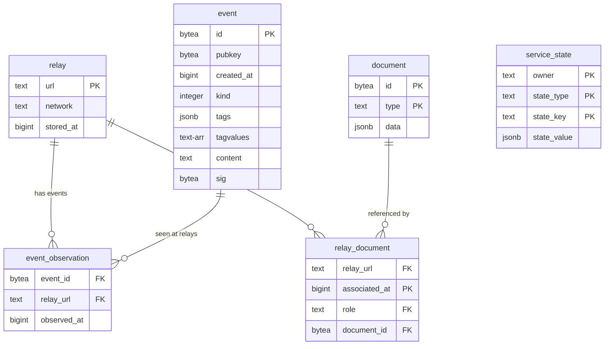
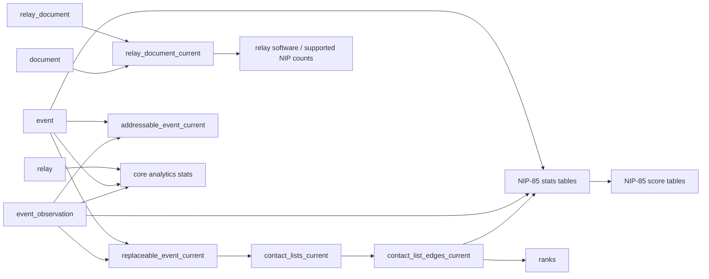

# Database Reference

Complete reference for BigBrotr's PostgreSQL schema, stored functions, derived tables, reporting views, and indexes.

---

## Overview

BigBrotr uses PostgreSQL 18+ with a schema designed for high-throughput event archiving and relay monitoring. Key design principles:

- **Content-addressed storage**: Document records are deduplicated by SHA-256 hash (~90% savings)
- **Bulk array parameters**: All mutations use stored functions with array parameters for batch efficiency
- **SECURITY INVOKER**: All functions execute with the caller's permissions (least privilege)
- **ON CONFLICT DO NOTHING**: All inserts are idempotent and safe to retry
- **No implicit orphan cleanup**: storage retention policy is not encoded as a base-schema invariant

Two schema variants exist:

| Variant | Event Storage | Derived Tables | Regular Views | Disk Usage |
|---------|--------------|----------------|---------------|------------|
| **BigBrotr** | Full NIP-01 (id, pubkey, created_at, kind, tags, content, sig) | 3 current-state tables + 19 analytics/score tables | 0 | 100% |
| **LilBrotr** | All 8 columns, with tags/content/sig nullable and always NULL | Same derived schema | 0 | ~40% |

---

## Schema Map

The core archive graph and the narrow winner-map current tables carry the only
enforced foreign keys. Analytics, contact-graph, and NIP-85 tables remain
refresh-maintained operational relations.

| Layer | Tables | Source |
|-------|--------|--------|
| Core archive | `relay`, `event`, `event_observation`, `document`, `relay_document`, `service_state` | Services and cascade insert functions |
| Current state | `relay_document_current`, `replaceable_event_current`, `addressable_event_current` | Refresher, `08_functions_refresh_current.sql` |
| Core analytics | `pubkey_kind_stats`, `pubkey_relay_stats`, `relay_kind_stats`, `pubkey_stats`, `kind_stats`, `relay_stats`, `daily_counts`, `relay_software_counts`, `supported_nip_counts`, `contact_lists_current`, `contact_list_edges_current` | Refresher, `09_functions_refresh_analytics.sql` |
| NIP-85 facts | `nip85_pubkey_stats`, `nip85_event_stats`, `nip85_addressable_stats`, `nip85_identifier_stats` | Refresher, `09_functions_refresh_analytics.sql` |
| NIP-85 scores | `pubkey_score`, `event_score`, `addressable_score`, `identifier_score` | Ranker public score exports |

### Core Entity Relationship Diagram



### Derived Data Flow



---

## Extensions

| Extension | Purpose | BigBrotr | LilBrotr |
|-----------|---------|----------|----------|
| `btree_gin` | GIN index support for `TEXT[]` containment queries | Yes | Yes |
| `pg_stat_statements` | Query execution statistics tracking | Yes | Yes |

---

## Tables

### relay

Validated Nostr relays that have passed WebSocket connectivity testing.

| Column | Type | Constraints | Description |
|--------|------|-------------|-------------|
| `url` | TEXT | PRIMARY KEY | WebSocket URL (e.g., `wss://relay.example.com`) |
| `network` | TEXT | NOT NULL | Network type: `clearnet`, `tor`, `i2p`, `loki` |
| `stored_at` | BIGINT | NOT NULL | Unix timestamp when the relay row entered the canonical stored relay pool |

### event (BigBrotr)

Complete NIP-01 event storage with all fields preserved.

| Column | Type | Constraints | Description |
|--------|------|-------------|-------------|
| `id` | BYTEA | PRIMARY KEY | SHA-256 event hash (32 bytes) |
| `pubkey` | BYTEA | NOT NULL | Author public key (32 bytes) |
| `created_at` | BIGINT | NOT NULL | Unix creation timestamp |
| `kind` | INTEGER | NOT NULL | NIP-01 event kind (0-65535) |
| `tags` | JSONB | NOT NULL | Tag array `[["e", "..."], ["p", "..."]]` |
| `tagvalues` | TEXT[] | NOT NULL | Single-char tag values for GIN indexing, computed at insert time |
| `content` | TEXT | NOT NULL | Event content |
| `sig` | BYTEA | NOT NULL | Schnorr signature (64 bytes) |

!!! note
    The `tagvalues` column is computed at insert time by `event_insert()` via the `tags_to_tagvalues()` function.

### event (LilBrotr)

Lightweight variant with all 8 columns but tags, content, and sig are nullable and always NULL.

| Column | Type | Constraints | Description |
|--------|------|-------------|-------------|
| `id` | BYTEA | PRIMARY KEY | SHA-256 event hash (32 bytes) |
| `pubkey` | BYTEA | NOT NULL | Author public key (32 bytes) |
| `created_at` | BIGINT | NOT NULL | Unix creation timestamp |
| `kind` | INTEGER | NOT NULL | NIP-01 event kind |
| `tags` | JSONB | Nullable, always NULL | Not stored in lightweight mode |
| `tagvalues` | TEXT[] | NOT NULL | Computed at insert time by `event_insert()` |
| `content` | TEXT | Nullable, always NULL | Not stored in lightweight mode |
| `sig` | BYTEA | Nullable, always NULL | Not stored in lightweight mode |

!!! note
    In LilBrotr, `tags`, `content`, and `sig` columns exist but are always NULL. The `tagvalues` column is computed by `event_insert()` from the incoming tags before the JSON is discarded. `tagvalues` preserves the original order of single-character tags and stores only each tag's first value (`tag[1]`), which allows most analytics logic to stay shared with BigBrotr. NULL values do not occupy storage, providing approximately 60% disk savings.

!!! note
    BigBrotr and LilBrotr intentionally share the same analytics schema and refresh logic wherever a metric can be reconstructed from `id`, `pubkey`, `created_at`, `kind`, `event_observation.observed_at`, and `tagvalues`. When a metric depends on tag fields that are not stored in LilBrotr (for example reply markers or multi-character tags such as `amount` and `bolt11`), LilBrotr uses a best-effort fallback instead of adding new persisted columns.

### event_observation

Junction table linking events to relays with first-seen timestamps.

| Column | Type | Constraints | Description |
|--------|------|-------------|-------------|
| `event_id` | BYTEA | PK (partial), FK -> event(id) ON DELETE CASCADE | Event hash |
| `relay_url` | TEXT | PK (partial), FK -> relay(url) ON DELETE CASCADE | Relay URL |
| `observed_at` | BIGINT | NOT NULL | Unix timestamp of first observation |

Primary key: `(event_id, relay_url)`.

### document

Content-addressed storage for NIP-11 and NIP-66 documents.

| Column | Type | Constraints | Description |
|--------|------|-------------|-------------|
| `id` | BYTEA | PK (partial) | SHA-256 content hash (32 bytes) |
| `type` | TEXT | PK (partial) | Check type (see DocumentType enum) |
| `data` | JSONB | NOT NULL | Complete JSON document |

Primary key: `(id, type)`. The SHA-256 hash is computed in the application layer. Multiple relays with identical documents reference the same row, providing significant deduplication.

### relay_document

Time-series junction table linking relays to document snapshots.

| Column | Type | Constraints | Description |
|--------|------|-------------|-------------|
| `relay_url` | TEXT | PK (partial), FK -> relay(url) ON DELETE CASCADE | Relay URL |
| `associated_at` | BIGINT | PK (partial) | Unix timestamp when the document became associated with the relay |
| `role` | TEXT | PK (partial) | Document role (see below) |
| `document_id` | BYTEA | NOT NULL, part of FK -> document(id, type) ON DELETE CASCADE with `role` | Content hash reference |

Primary key: `(relay_url, associated_at, role)`.

**Document roles**: `nip11_info`, `nip66_rtt`, `nip66_ssl`, `nip66_geo`, `nip66_net`, `nip66_dns`, `nip66_http`

### service_state

Generic key-value store for shared operational state between restarts.

| Column | Type | Constraints | Description |
|--------|------|-------------|-------------|
| `owner` | TEXT | PK (partial) | State owner identifier |
| `state_type` | TEXT | PK (partial) | State category: `checkpoint`, `cursor` |
| `state_key` | TEXT | PK (partial) | Unique key within owner+type |
| `state_value` | JSONB | NOT NULL, DEFAULT `{}` | Service-specific JSONB state value |

Primary key: `(owner, state_type, state_key)`.

---

## Foreign Keys and Cascade Deletes

All foreign keys use `ON DELETE CASCADE`:

| Child Table | Column | Parent Table | Cascade Effect |
|------------|--------|-------------|----------------|
| `event_observation` | `event_id` | `event(id)` | Deleting an event removes all relay associations |
| `event_observation` | `relay_url` | `relay(url)` | Deleting a relay removes all event associations |
| `relay_document` | `relay_url` | `relay(url)` | Deleting a relay removes all document snapshots |
| `relay_document` | `document_id + role` | `document(id, type)` | Deleting a document removes all references |

!!! warning "Storage Semantics"
    - `event` rows can exist even when no `event_observation` rows currently reference them
    - `document` rows can exist even when no `relay_document` rows currently reference them
    - Any future reclamation policy must be explicit and deployment-specific, not assumed by the base schema

---

## Utility Functions

### tags_to_tagvalues(JSONB) -> TEXT[]

Extracts key-prefixed values from single-character tag keys in a Nostr event tags array. Each value is prefixed with its tag key and a colon separator, enabling GIN queries that discriminate between tag types.

```sql
LANGUAGE SQL IMMUTABLE RETURNS NULL ON NULL INPUT SECURITY INVOKER
```

**Example**: `[["e", "abc"], ["p", "def"], ["relay", "wss://..."]]` -> `ARRAY['e:abc', 'p:def']`

Tags with multi-character keys (like `relay`) are excluded.

---

## CRUD Functions

All CRUD functions share these properties:

- `LANGUAGE plpgsql` with `SECURITY INVOKER`
- Accept bulk array parameters for batch efficiency
- Use `ON CONFLICT DO NOTHING` for idempotent inserts
- Return `INTEGER` (rows affected) unless noted

### relay_insert

```sql
relay_insert(p_urls TEXT[], p_networks TEXT[], p_stored_ats BIGINT[]) -> INTEGER
```

Bulk-inserts relay records. Existing relays (by URL) are silently skipped.

### event_insert

```sql
event_insert(
    p_event_ids BYTEA[], p_pubkeys BYTEA[], p_created_ats BIGINT[],
    p_kinds INTEGER[], p_tags JSONB[], p_content_values TEXT[], p_sigs BYTEA[]
) -> INTEGER
```

Bulk-inserts Nostr events. Duplicate events (by id) are silently skipped.

- **BigBrotr**: Stores all 7 fields
- **LilBrotr**: Accepts all 7 parameters for interface compatibility but stores only `id`, `pubkey`, `created_at`, `kind`, and computed `tagvalues`

### document_insert

```sql
document_insert(p_ids BYTEA[], p_document_roles TEXT[], p_data JSONB[]) -> INTEGER
```

Bulk-inserts content-addressed documents. Duplicate hashes are silently skipped.

### event_observation_insert

```sql
event_observation_insert(p_event_ids BYTEA[], p_relay_urls TEXT[], p_observed_ats BIGINT[]) -> INTEGER
```

Bulk-inserts event-observation junction records. Both event and relay must already exist.

### relay_document_insert

```sql
relay_document_insert(
    p_relay_urls TEXT[], p_document_ids BYTEA[],
    p_roles TEXT[], p_associated_ats BIGINT[]
) -> INTEGER
```

Bulk-inserts relay-document junction records. Both relay and document must already exist.

### service_state_upsert

```sql
service_state_upsert(
    p_owners TEXT[], p_state_types TEXT[], p_state_keys TEXT[],
    p_state_values JSONB[]
) -> INTEGER
```

Bulk upsert service state records. Uses `DISTINCT ON` within the batch to deduplicate, then `ON CONFLICT DO UPDATE SET` for full replacement semantics. Returns the number of rows affected.

### service_state_get

```sql
service_state_get(
    p_owner TEXT, p_state_type TEXT, p_state_key TEXT DEFAULT NULL
) -> TABLE(state_key TEXT, state_value JSONB)
```

Retrieves service state records. If `p_state_key` is NULL, returns all records for the service+type ordered by `state_key ASC`.

### service_state_delete

```sql
service_state_delete(p_owners TEXT[], p_state_types TEXT[], p_state_keys TEXT[]) -> INTEGER
```

Bulk-deletes service state records matching composite keys.

---

## Cascade Functions

Atomic multi-table operations that call Level 1 CRUD functions within a single transaction.

### event_observation_insert_cascade

```sql
event_observation_insert_cascade(
    p_event_ids BYTEA[], p_pubkeys BYTEA[], p_created_ats BIGINT[],
    p_kinds INTEGER[], p_tags JSONB[], p_content_values TEXT[], p_sigs BYTEA[],
    p_relay_urls TEXT[], p_relay_networks TEXT[], p_relay_stored_ats BIGINT[],
    p_observed_ats BIGINT[]
) -> INTEGER
```

Atomically inserts relays, events, and event-observation junctions:

1. `relay_insert()` -- ensures relays exist
2. `event_insert()` -- ensures events exist
3. Inserts junction records with `DISTINCT ON (event_id, relay_url)` deduplication

Returns the number of junction rows inserted.

### relay_document_insert_cascade

```sql
relay_document_insert_cascade(
    p_relay_urls TEXT[], p_relay_networks TEXT[], p_relay_stored_ats BIGINT[],
    p_document_ids BYTEA[], p_roles TEXT[],
    p_document_data JSONB[], p_associated_ats BIGINT[]
) -> INTEGER
```

Atomically inserts relays, documents, and relay-document junctions:

1. `relay_insert()` -- ensures relays exist
2. `document_insert()` -- ensures document rows exist
3. Inserts junction records

Returns the number of junction rows inserted.

---

## Cleanup Functions

No schema-level orphan cleanup functions are defined in the base contract.
The shared database intentionally avoids assuming that detached storage rows are
invalid by default.

---

## Core Analytics Summary Tables

All deployments (BigBrotr, LilBrotr) share these core analytics tables. They are regular tables refreshed incrementally via range-based refresh functions that receive `(after, until)` parameters and return the number of rows affected.

### pubkey_kind_stats

Per-author, per-kind event statistics.

| Column | Type | Constraints | Description |
|--------|------|-------------|-------------|
| `pubkey` | TEXT | PRIMARY KEY (partial) | Author public key as hex |
| `kind` | INTEGER | PRIMARY KEY (partial) | Event kind |
| `event_count` | BIGINT | NOT NULL DEFAULT 0 | Total events by this author of this kind |
| `first_event_created_at` | BIGINT | Nullable | Earliest event timestamp |
| `last_event_created_at` | BIGINT | Nullable | Latest event timestamp |

Primary key: `(pubkey, kind)`.

### pubkey_relay_stats

Per-author, per-relay activity metrics.

| Column | Type | Constraints | Description |
|--------|------|-------------|-------------|
| `pubkey` | TEXT | PRIMARY KEY (partial) | Author public key as hex |
| `relay_url` | TEXT | PRIMARY KEY (partial) | Relay WebSocket URL |
| `event_count` | BIGINT | NOT NULL DEFAULT 0 | Events by this author on this relay |
| `first_event_created_at` | BIGINT | Nullable | Earliest event timestamp |
| `last_event_created_at` | BIGINT | Nullable | Latest event timestamp |

Primary key: `(pubkey, relay_url)`.

### relay_kind_stats

Per-relay, per-kind event distribution.

| Column | Type | Constraints | Description |
|--------|------|-------------|-------------|
| `relay_url` | TEXT | PRIMARY KEY (partial) | Relay WebSocket URL |
| `kind` | INTEGER | PRIMARY KEY (partial) | Event kind |
| `event_count` | BIGINT | NOT NULL DEFAULT 0 | Events of this kind on this relay |
| `first_event_created_at` | BIGINT | Nullable | Earliest event timestamp |
| `last_event_created_at` | BIGINT | Nullable | Latest event timestamp |

Primary key: `(relay_url, kind)`.

### pubkey_stats

Global author activity metrics.

| Column | Type | Description |
|--------|------|-------------|
| `pubkey` | TEXT PRIMARY KEY | Author public key as hex |
| `event_count` | BIGINT | Total events by this author |
| `kind_count` | INTEGER | Event kinds authored |
| `relay_count` | INTEGER | Relays where this author was observed |
| `first_event_created_at` | BIGINT | Earliest event timestamp |
| `last_event_created_at` | BIGINT | Latest event timestamp |
| `events_last_24h`, `events_last_7d`, `events_last_30d` | BIGINT | Rolling activity windows |
| `regular_count`, `replaceable_count`, `ephemeral_count`, `addressable_count` | BIGINT | Event counts by NIP-01 category |

### kind_stats

Global event count distribution by NIP-01 kind with category labels.

| Column | Type | Description |
|--------|------|-------------|
| `kind` | INTEGER PRIMARY KEY | Event kind |
| `event_count` | BIGINT | Total events of this kind |
| `pubkey_count` | INTEGER | Authors publishing this kind |
| `relay_count` | INTEGER | Relays that carried this kind |
| `category` | TEXT | NIP-01 category: regular, replaceable, ephemeral, addressable, other |
| `first_event_created_at`, `last_event_created_at` | BIGINT | Earliest and latest event timestamps |
| `events_last_24h`, `events_last_7d`, `events_last_30d` | BIGINT | Rolling activity windows |

### relay_stats

Per-relay event counts, averaged round-trip times, and NIP-11 info.

| Column | Type | Description |
|--------|------|-------------|
| `relay_url` | TEXT PRIMARY KEY | Relay WebSocket URL |
| `network` | TEXT | Network type |
| `stored_at` | BIGINT | Unix archive-entry timestamp |
| `event_count` | BIGINT | Total events on relay |
| `pubkey_count` | INTEGER | Unique authors on relay |
| `kind_count` | INTEGER | Unique event kinds on relay |
| `first_event_created_at`, `last_event_created_at` | BIGINT | Earliest and latest event timestamps |
| `events_last_24h`, `events_last_7d`, `events_last_30d` | BIGINT | Rolling activity windows |
| `regular_count`, `replaceable_count`, `ephemeral_count`, `addressable_count` | BIGINT | Event counts by NIP-01 category |
| `avg_rtt_open`, `avg_rtt_read`, `avg_rtt_write` | NUMERIC(10,2) | NIP-66 RTT averages |
| `nip11_name`, `nip11_software`, `nip11_version` | TEXT | Current NIP-11 document fields |

---

## Derived Current-State Tables

All deployments (BigBrotr, LilBrotr) share the same narrow current-state tables. The Refresher maintains them incrementally through checkpointed refresh functions rather than `REFRESH MATERIALIZED VIEW CONCURRENTLY`.

### relay_document_current

Latest relay-document winner per relay and role.

| Column | Type | Constraints | Description |
|--------|------|-------------|-------------|
| `relay_url` | TEXT | PRIMARY KEY (partial) | Relay WebSocket URL |
| `role` | TEXT | PRIMARY KEY (partial) | Document role |
| `associated_at` | BIGINT | NOT NULL | Timestamp of latest association |
| `document_id` | BYTEA | NOT NULL | Content-addressed hash |

Primary key: `(relay_url, role)`.

This table is intentionally narrow. Rich document payload is reconstructed
through `document` joins.

### replaceable_event_current

Latest replaceable event per author and kind.

| Column | Type | Constraints | Description |
|--------|------|-------------|-------------|
| `pubkey` | BYTEA | PRIMARY KEY (partial) | Author public key |
| `kind` | INTEGER | PRIMARY KEY (partial) | Event kind (replaceable range) |
| `event_id` | BYTEA | NOT NULL, UNIQUE | Current winning event hash |

Primary key: `(pubkey, kind)`.

This table is intentionally narrow. Created-at ordering and payload shape are
recovered through `event` and `event_observation`.

### addressable_event_current

Latest addressable event per author, kind, and `d`-value identifier.

BigBrotr extracts `d_value` from the first `d` tag in the stored JSON tags.
LilBrotr uses the same table definition but falls back to the ordered
`tagvalues` entry `d:*` when full tags are not persisted.

| Column | Type | Constraints | Description |
|--------|------|-------------|-------------|
| `pubkey` | BYTEA | PRIMARY KEY (partial) | Author public key |
| `kind` | INTEGER | PRIMARY KEY (partial) | Event kind (addressable range) |
| `d_value` | TEXT | PRIMARY KEY (partial) | Addressable identifier |
| `event_id` | BYTEA | NOT NULL, UNIQUE | Current winning event hash |

Primary key: `(pubkey, kind, d_value)`.

This table is intentionally narrow. Rich event payload and deterministic tie
break semantics still come from the canonical `event` archive table.

---

## Analytics And Operational-Fact Tables

### contact_lists_current

Materialized current latest kind=3 contact list per author.

| Column | Type | Description |
|--------|------|-------------|
| `follower_pubkey` | TEXT PRIMARY KEY | Pubkey that published the current contact list |
| `source_event_id` | TEXT | Current kind=3 event id |
| `source_created_at` | BIGINT | Event creation timestamp |
| `source_seen_at` | BIGINT | First observation timestamp for the source event |
| `follow_count` | BIGINT | Deduplicated number of followed pubkeys |

### contact_list_edges_current

Materialized deduplicated follow graph edges.

| Column | Type | Description |
|--------|------|-------------|
| `follower_pubkey` | TEXT PRIMARY KEY (partial) | Following pubkey |
| `followed_pubkey` | TEXT PRIMARY KEY (partial) | Followed pubkey |
| `source_event_id` | TEXT | Current kind=3 event id that produced the edge |
| `source_created_at` | BIGINT | Event creation timestamp |
| `source_seen_at` | BIGINT | First observation timestamp for the source event |

Primary key: `(follower_pubkey, followed_pubkey)`.

!!! note
    `contact_lists_current` and `contact_list_edges_current` remain
    materialized operational facts for now because the Ranker graph sync and
    `nip85_follower_count_refresh()` still consume them incrementally. They are
    the explicit exception to the long-term view-first contact-graph target.

### relay_software_counts

NIP-11 software distribution across relays. Depends on `relay_document_current`.

| Column | Type | Description |
|--------|------|-------------|
| `software` | TEXT PRIMARY KEY (partial) | Software name from NIP-11 |
| `version` | TEXT PRIMARY KEY (partial) | Software version |
| `relay_count` | BIGINT | Relays running this software/version pair |

Primary key: `(software, version)`.

### supported_nip_counts

NIP support distribution from NIP-11 info. Depends on `relay_document_current`.

| Column | Type | Description |
|--------|------|-------------|
| `nip` | INTEGER PRIMARY KEY | NIP number |
| `relay_count` | BIGINT | Relays supporting this NIP |

### daily_counts

Daily event aggregation for time-series analysis (UTC).

| Column | Type | Description |
|--------|------|-------------|
| `day` | DATE PRIMARY KEY | UTC date |
| `event_count` | BIGINT | Events on this day |
| `pubkey_count` | BIGINT | Unique authors on this day |
| `kind_count` | BIGINT | Unique event kinds on this day |

---

## NIP-85 Stats And Rank Tables

NIP-85 stats tables store facts used to publish trusted assertions. Rank tables store score snapshots exported by the ranker. These tables are not foreign-key constrained to the core archive; they use text identifiers for API/publication compatibility.

### nip85_pubkey_stats

Per-pubkey social metrics for NIP-85 kind 30382.

| Column | Type | Description |
|--------|------|-------------|
| `pubkey` | TEXT PRIMARY KEY | Asserted pubkey |
| `post_count`, `reply_count` | BIGINT | Authored post and reply counts |
| `reaction_count_sent`, `reaction_count_recd` | BIGINT | Reactions sent and received |
| `repost_count_sent`, `repost_count_recd` | BIGINT | Reposts sent and received |
| `report_count_sent`, `report_count_recd` | BIGINT | Reports sent and received |
| `zap_count_sent`, `zap_count_recd` | BIGINT | Zaps sent and received |
| `zap_amount_sent`, `zap_amount_recd` | BIGINT | Bolt11-verified zap amounts |
| `first_created_at` | BIGINT | First known authored event timestamp |
| `activity_hours` | INTEGER[24] | UTC hour activity heatmap |
| `topic_counts` | JSONB | Topic counters by tag/topic |
| `follower_count`, `following_count` | BIGINT | Counts reconciled from current contact-list facts |

### nip85_event_stats

Per-event engagement metrics for NIP-85 kind 30383.

| Column | Type | Description |
|--------|------|-------------|
| `event_id` | TEXT PRIMARY KEY | Asserted event id |
| `author_pubkey` | TEXT | Event author pubkey |
| `comment_count`, `quote_count`, `repost_count`, `reaction_count` | BIGINT | Engagement counters |
| `zap_count`, `zap_amount` | BIGINT | Bolt11-verified zap counters |

### nip85_addressable_stats

Per-addressable-event engagement metrics for NIP-85 kind 30384.

| Column | Type | Description |
|--------|------|-------------|
| `event_address` | TEXT PRIMARY KEY | Canonical `kind:pubkey:d_tag` coordinate |
| `author_pubkey` | TEXT | Addressable event author pubkey |
| `comment_count`, `quote_count`, `repost_count`, `reaction_count` | BIGINT | Engagement counters |
| `zap_count`, `zap_amount` | BIGINT | Bolt11-verified zap counters |

### nip85_identifier_stats

Per-identifier engagement metrics for NIP-85 kind 30385.

| Column | Type | Description |
|--------|------|-------------|
| `identifier` | TEXT PRIMARY KEY | NIP-73 identifier string |
| `comment_count`, `reaction_count` | BIGINT | Engagement counters |
| `k_tags` | TEXT[] | Deduplicated sorted NIP-73 `k` tags observed with the identifier |

### Score tables

The public score tables share the same shape:

| Table | Subject |
|-------|---------|
| `pubkey_score` | Pubkey, for kind 30382 |
| `event_score` | Event id, for kind 30383 |
| `addressable_score` | Addressable coordinate, for kind 30384 |
| `identifier_score` | NIP-73 identifier, for kind 30385 |

| Column | Type | Description |
|--------|------|-------------|
| `algorithm_id` | TEXT PRIMARY KEY (partial) | Ranking algorithm identifier |
| subject key | TEXT PRIMARY KEY (partial) | `pubkey`, `event_id`, `event_address`, or `identifier` depending on the table |
| `score` | DOUBLE PRECISION | Final public 0-100 score exported by the Ranker |

Primary key: `(algorithm_id, <subject key>)`.

---

## Refresh Functions

The **Refresher** service (`python -m bigbrotr refresher`) orchestrates all refresh functions automatically, executing each configured target in dependency order with per-target logging, checkpoints, metrics, and error isolation.

### Current-State Refresh Functions

Current-state refresh functions accept `(p_after BIGINT, p_until BIGINT)` range parameters and return `INTEGER` (rows affected). The Refresher computes the range from each target checkpoint to the next source watermark.

| Function | Target Table | Recommended Schedule |
|----------|-------------|---------------------|
| `relay_document_current_refresh(after, until)` | relay_document_current | Daily |
| `replaceable_event_current_refresh(after, until)` | replaceable_event_current | Hourly |
| `addressable_event_current_refresh(after, until)` | addressable_event_current | Hourly |

### Analytics Refresh Functions

Analytics refresh functions also accept `(p_after BIGINT, p_until BIGINT)` range parameters and return `INTEGER` (rows affected).

| Function | Target Table | Recommended Schedule |
|----------|-------------|---------------------|
| `contact_lists_current_refresh(after, until)` | contact_lists_current | Hourly |
| `contact_list_edges_current_refresh(after, until)` | contact_list_edges_current | Hourly |
| `daily_counts_refresh(after, until)` | daily_counts | Daily |
| `relay_software_counts_refresh(after, until)` | relay_software_counts | Daily |
| `supported_nip_counts_refresh(after, until)` | supported_nip_counts | Daily |
| `pubkey_kind_stats_refresh(after, until)` | pubkey_kind_stats | Hourly |
| `pubkey_relay_stats_refresh(after, until)` | pubkey_relay_stats | Hourly |
| `relay_kind_stats_refresh(after, until)` | relay_kind_stats | Hourly |
| `pubkey_stats_refresh(after, until)` | pubkey_stats | Hourly |
| `kind_stats_refresh(after, until)` | kind_stats | Hourly |
| `relay_stats_refresh(after, until)` | relay_stats | Hourly |
| `nip85_pubkey_stats_refresh(after, until)` | nip85_pubkey_stats | Hourly |
| `nip85_event_stats_refresh(after, until)` | nip85_event_stats | Hourly |
| `nip85_addressable_stats_refresh(after, until)` | nip85_addressable_stats | Hourly |
| `nip85_identifier_stats_refresh(after, until)` | nip85_identifier_stats | Hourly |

### Periodic Functions

| Function | Purpose | Recommended Schedule |
|----------|---------|---------------------|
| `rolling_windows_refresh()` | Refresh rolling time-window columns in summary tables | Hourly |
| `relay_stats_document_refresh()` | Refresh document-derived columns in relay_stats (RTT, NIP-11) | Daily |
| `nip85_follower_count_refresh()` | Recompute NIP-85 follower/following counts | Hourly |

!!! note
    `relay_software_counts` and `supported_nip_counts` depend on `relay_document_current`; the Refresher config validates that `relay_document_current` is included when those analytics targets are enabled.

---

## Indexes

### BigBrotr Table Indexes

#### event

| Index | Columns | Type | Purpose |
|-------|---------|------|---------|
| PK | `id` | BTREE | Primary key |
| `idx_event_created_at_id` | `created_at DESC, id DESC` | BTREE | Global timeline with cursor pagination (covers created_at-only via prefix) |
| `idx_event_kind_created_at` | `kind, created_at DESC` | BTREE | Kind + timeline (covers kind-only via leftmost prefix) |
| `idx_event_pubkey_created_at` | `pubkey, created_at DESC` | BTREE | Author timeline |
| `idx_event_pubkey_kind_created_at` | `pubkey, kind, created_at DESC` | BTREE | Author + kind + timeline |
| `idx_event_tagvalues` | `tagvalues` | GIN | Tag containment (`@>`) |

#### event_observation Indexes

| Index | Columns | Type | Purpose |
|-------|---------|------|---------|
| PK | `event_id, relay_url` | BTREE | Composite primary key |
| `idx_event_observation_observed_at` | `observed_at DESC` | BTREE | Global observed_at ordering for API |
| `idx_event_observation_relay_url_observed_at_event_id` | `relay_url, observed_at ASC, event_id ASC` | BTREE | Finder cursor pagination (covers relay_url-only via prefix) |

#### relay_document Indexes

| Index | Columns | Type | Purpose |
|-------|---------|------|---------|
| PK | `relay_url, associated_at, role` | BTREE | Composite primary key |
| `idx_relay_document_associated_at` | `associated_at DESC` | BTREE | Recent relay-document associations |
| `idx_relay_document_document_id` | `document_id` | BTREE | Content-addressed lookups |
| `idx_relay_document_relay_url_role_associated_at` | `relay_url, role, associated_at DESC` | BTREE | Latest document per relay+role |

#### service_state Indexes

| Index | Columns | Type | Purpose |
|-------|---------|------|---------|
| PK | `owner, state_type, state_key` | BTREE | Covers single and double-prefix queries |
| `idx_service_state_candidate_network` | `state_value ->> 'network'` (partial) | BTREE | Validator: filter candidates by network |

!!! note
    The partial index on `service_state` has a WHERE clause: `WHERE owner = 'validator' AND state_type = 'checkpoint'`. Only validator checkpoint rows contain the `network` key in their `state_value` JSONB.

### Summary Table Indexes

Summary tables use their primary keys for uniqueness. Additional secondary indexes support common query patterns.

| Index | Table | Columns | Type |
|-------|-------|---------|------|
| PK | relay_stats | `relay_url` | Primary key |
| Secondary | relay_stats | `network` | BTREE |
| PK | kind_stats | `kind` | Primary key |
| PK | pubkey_stats | `pubkey` | Primary key |
| PK | relay_kind_stats | `relay_url, kind` | Composite primary key |
| Secondary | relay_kind_stats | `relay_url` | BTREE |
| PK | pubkey_kind_stats | `pubkey, kind` | Composite primary key |
| PK | pubkey_relay_stats | `pubkey, relay_url` | Composite primary key |
| Secondary | pubkey_relay_stats | `relay_url` | BTREE |

### Current And Analytics Indexes

Narrow current winner tables and analytics/operational-fact tables use primary keys for deterministic upserts. Additional secondary indexes support common access paths.

| Index | Table | Columns | Unique |
|-------|-------|---------|--------|
| `idx_relay_document_current_role_associated_at` | relay_document_current | `role, associated_at ASC` | No |
| `idx_replaceable_event_current_event_id` | replaceable_event_current | `event_id` | Yes |
| `idx_replaceable_event_current_kind` | replaceable_event_current | `kind` | No |
| `idx_addressable_event_current_event_id` | addressable_event_current | `event_id` | Yes |
| `idx_addressable_event_current_kind` | addressable_event_current | `kind` | No |
| `idx_contact_lists_current_source_seen_at_follower` | contact_lists_current | `source_seen_at ASC, follower_pubkey ASC` | No |
| `idx_contact_list_edges_current_followed` | contact_list_edges_current | `followed_pubkey` | No |
| `idx_nip85_event_stats_author` | nip85_event_stats | `author_pubkey` | No |
| `idx_nip85_addressable_stats_author` | nip85_addressable_stats | `author_pubkey` | No |

### LilBrotr Table Indexes

LilBrotr uses the same table, current-state, analytics, and score indexes as BigBrotr (see above). The only schema difference is the event table column nullability.

---

## Schema Initialization

SQL files execute in alphabetical order via Docker's `/docker-entrypoint-initdb.d/`:

### BigBrotr

| File | Content |
|------|---------|
| `00_extensions.sql` | `btree_gin`, `pg_stat_statements` |
| `01_functions_utility.sql` | Tag and event-address utility functions |
| `02_tables_core.sql` | Core relay, event, document, junction, and service-state tables |
| `03_tables_current.sql` | Current-state tables |
| `04_tables_analytics.sql` | Analytics and NIP-85 score tables |
| `05_functions_crud.sql` | CRUD, cascade, and service-state functions |
| `06_functions_cleanup.sql` | no shared cleanup functions |
| `07_views_reporting.sql` | Reporting views |
| `08_functions_refresh_current.sql` | Current-state refresh functions |
| `09_functions_refresh_analytics.sql` | Analytics, contact-graph, and periodic refresh functions |
| `10_indexes_core.sql` | Core table indexes |
| `11_indexes_current.sql` | Current-state indexes |
| `12_indexes_analytics.sql` | Analytics and score indexes |
| `98_grants.sh` | Role grants |
| `99_verify.sql` | Verification queries |

### LilBrotr

| File | Content |
|------|---------|
| `00_extensions.sql` | `btree_gin`, `pg_stat_statements` |
| `01_functions_utility.sql` | Tag and event-address utility functions |
| `02_tables_core.sql` | Core relay, event, document, junction, and service-state tables |
| `03_tables_current.sql` | Current-state tables |
| `04_tables_analytics.sql` | Analytics and NIP-85 score tables |
| `05_functions_crud.sql` | CRUD, cascade, and service-state functions |
| `06_functions_cleanup.sql` | no shared cleanup functions |
| `07_views_reporting.sql` | Reporting views |
| `08_functions_refresh_current.sql` | Current-state refresh functions |
| `09_functions_refresh_analytics.sql` | Analytics, contact-graph, and periodic refresh functions |
| `10_indexes_core.sql` | Core table indexes |
| `11_indexes_current.sql` | Current-state indexes |
| `12_indexes_analytics.sql` | Analytics and score indexes |
| `98_grants.sh` | Role grants |
| `99_verify.sql` | Verification queries |

---

## Deployment-Specific Schemas

**BigBrotr** (full archive): stores all 8 columns. Tagvalues computed at insert time by `event_insert()`.

```sql
CREATE TABLE event (
    id BYTEA PRIMARY KEY,
    pubkey BYTEA NOT NULL,
    created_at BIGINT NOT NULL,
    kind INTEGER NOT NULL,
    tags JSONB NOT NULL,
    tagvalues TEXT[] NOT NULL,
    content TEXT NOT NULL,
    sig BYTEA NOT NULL
);
```

**LilBrotr** (lightweight): all 8 columns present but tags, content, sig are nullable and always NULL for ~60% disk savings. `tagvalues` is still computed at insert time by `event_insert()` and remains the compatibility layer that keeps most analytics behavior aligned with BigBrotr.

```sql
CREATE TABLE event (
    id BYTEA PRIMARY KEY,
    pubkey BYTEA NOT NULL,
    created_at BIGINT NOT NULL,
    kind INTEGER NOT NULL,
    tags JSONB,
    tagvalues TEXT[] NOT NULL,
    content TEXT,
    sig BYTEA
);
```

---

## Function Summary

| Category | Count | Functions |
|----------|-------|-----------|
| Utility | 5 | `tags_to_tagvalues`, event address helpers, and `bolt11_amount_msats` |
| CRUD (Level 1) | 8 | `relay_insert`, `event_insert`, `document_insert`, `event_observation_insert`, `relay_document_insert`, `service_state_upsert`, `service_state_get`, `service_state_delete` |
| CRUD (Level 2) | 2 | `event_observation_insert_cascade`, `relay_document_insert_cascade` |
| Cleanup | 0 | none |
| Current refresh | 3 | `relay_document_current_refresh`, `replaceable_event_current_refresh`, `addressable_event_current_refresh` |
| Analytics refresh | 15 | `contact_lists_current_refresh`, `contact_list_edges_current_refresh`, `daily_counts_refresh`, document-backed analytics, entity stats, and NIP-85 stats refresh functions |
| Periodic refresh | 3 | `rolling_windows_refresh`, `relay_stats_document_refresh`, `nip85_follower_count_refresh` |
| **Total** | **38** | |

---

## Maintenance Schedule

| Task | Frequency | Command |
|------|-----------|---------|
| Refresh current-state and analytics/operational-fact tables | Hourly/Daily | Run via Refresher service (orchestrates configured targets individually) |
| Refresh periodic reconciliation targets | Hourly/Daily | Run via Refresher service (orchestrates configured targets individually) |
| VACUUM ANALYZE | Weekly | `VACUUM ANALYZE event; VACUUM ANALYZE event_observation;` |

---

## Related Documentation

- [Architecture](architecture.md) -- System architecture and module reference
- [Services](services.md) -- Deep dive into the ten independent services
- [Configuration](configuration.md) -- YAML configuration reference
- [Monitoring](monitoring.md) -- Prometheus metrics, alerting, and Grafana dashboards
