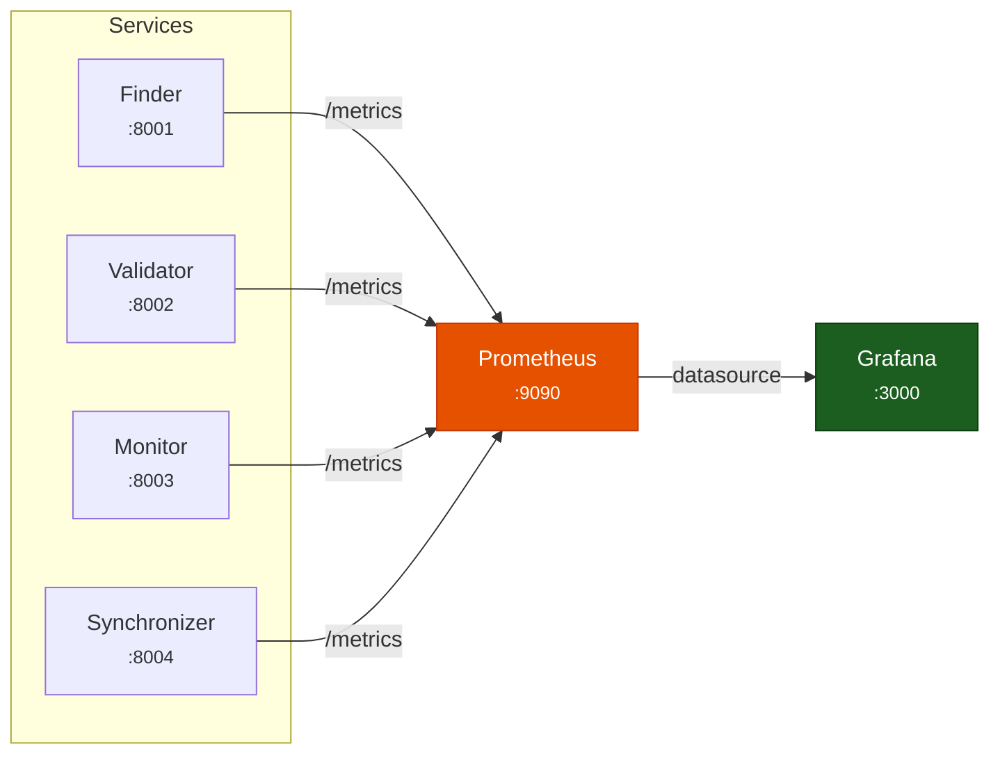

# Monitoring

Consolidated reference for BigBrotr's observability stack: Prometheus metrics, alerting rules, Grafana dashboards, and structured logging.

---

## Overview

BigBrotr exposes operational telemetry through three channels:

1. **Prometheus metrics** -- `/metrics` HTTP endpoint on each service
2. **Structured logging** -- key=value text or JSON output
3. **Grafana dashboards** -- auto-provisioned visualization



---

## Prometheus Metrics

Each service exposes four metric types via the `/metrics` endpoint, implemented in `src/bigbrotr/core/metrics.py`.

### Metric Types

| Metric Name | Prometheus Type | Labels | Description |
|-------------|----------------|--------|-------------|
| `service_info` | Info | `service` | Static service metadata (version, name) |
| `service_gauge` | Gauge | `service`, `name` | Point-in-time operational state |
| `service_counter` | Counter | `service`, `name` | Cumulative totals since startup |
| `cycle_duration_seconds` | Histogram | `service` | Cycle execution latency distribution |

### Gauge Names

| Gauge `name` Label | Description |
|--------------------|-------------|
| `consecutive_failures` | Number of consecutive failed cycles (resets to 0 on success) |
| `progress` | Current batch progress (0.0 to 1.0) |
| `last_cycle_timestamp` | Unix timestamp of the last completed cycle |

### Counter Names

| Counter `name` Label | Description |
|----------------------|-------------|
| `cycles_success` | Total successful cycles since startup |
| `cycles_failed` | Total failed cycles since startup |
| `errors` | Total errors encountered since startup |

### Histogram Buckets

The `cycle_duration_seconds` histogram uses 10 buckets spanning typical cycle durations:

`1s, 5s, 10s, 30s, 60s, 120s, 300s, 600s, 1800s, 3600s`

### MetricsConfig

Metrics are configured per service in the service YAML file:

```yaml
metrics:
  enabled: true          # Enable /metrics endpoint (default: false)
  port: 8000             # HTTP port (default: 8000)
  host: "0.0.0.0"        # Bind address (use 0.0.0.0 in containers)
  path: "/metrics"       # URL path (default: /metrics)
```

!!! warning
    Metrics are **disabled by default**. Set `metrics.enabled: true` in the service configuration to expose the `/metrics` endpoint.

!!! tip "API Reference"
    See [`bigbrotr.core.metrics`](../reference/core/metrics.md) for the complete Metrics API.

---

## Health Checks

Each service container uses the `/metrics` endpoint as its Docker health check:

```yaml
healthcheck:
  test: ["CMD", "curl", "-sf", "http://localhost:8000/metrics"]
  interval: 30s
  timeout: 10s
  retries: 3
  start_period: 30s
```

!!! note
    This is a real health check, not a PID-based fake check. If the metrics endpoint is unreachable, Docker marks the container as unhealthy.

---

## Prometheus Configuration

### Scrape Configuration

Prometheus scrapes all service endpoints every 30 seconds. The configuration is in `deployments/*/monitoring/prometheus/prometheus.yaml`:

```yaml
global:
  scrape_interval: 15s
  evaluation_interval: 15s

scrape_configs:
  - job_name: "finder"
    static_configs:
      - targets: ["finder:8001"]
    scrape_interval: 30s

  - job_name: "validator"
    static_configs:
      - targets: ["validator:8002"]
    scrape_interval: 30s

  - job_name: "monitor"
    static_configs:
      - targets: ["monitor:8003"]
    scrape_interval: 30s

  - job_name: "synchronizer"
    static_configs:
      - targets: ["synchronizer:8004"]
    scrape_interval: 30s

  - job_name: "prometheus"
    static_configs:
      - targets: ["localhost:9090"]
```

### Data Retention

Prometheus is configured with 30-day data retention. Data is persisted to a named Docker volume (`prometheus-data`).

---

## Alerting Rules

Six alerting rules are defined in `deployments/bigbrotr/monitoring/prometheus/rules/alerts.yml`:

### ServiceDown

```yaml
alert: ServiceDown
expr: up == 0
for: 5m
labels:
  severity: critical
```

Fires when a service's `/metrics` endpoint is unreachable for more than 5 minutes. This indicates the service process has crashed or the container is unhealthy.

### HighFailureRate

```yaml
alert: HighFailureRate
expr: rate(bigbrotr_errors_total[5m]) > 0.1
for: 5m
labels:
  severity: warning
```

Fires when the error rate exceeds 0.1 errors/second over a 5-minute window. This may indicate connectivity issues, database problems, or relay protocol changes.

### PoolExhausted

```yaml
alert: PoolExhausted
expr: bigbrotr_pool_available_connections == 0 and bigbrotr_pool_max_connections > 0
for: 2m
labels:
  severity: critical
```

Fires when the database connection pool has zero available connections for more than 2 minutes. Queries will queue or timeout. Resolution: increase `pool.limits.max_size` in `brotr.yaml`.

### ConsecutiveFailures

```yaml
alert: ConsecutiveFailures
expr: service_gauge{name="consecutive_failures"} >= 5
for: 1m
labels:
  severity: warning
```

Fires when a service has accumulated 5 or more consecutive failures. This typically means the service is about to auto-stop (default `max_consecutive_failures: 5`).

### SlowCycles

```yaml
alert: SlowCycles
expr: histogram_quantile(0.99, rate(cycle_duration_seconds_bucket[5m])) > 300
for: 5m
labels:
  severity: warning
```

Fires when the p99 cycle duration exceeds 5 minutes. This may indicate network congestion, database contention, or relay connectivity issues.

### DatabaseConnectionsHigh

```yaml
alert: DatabaseConnectionsHigh
expr: pg_stat_activity_count > 80
for: 5m
labels:
  severity: warning
```

Fires when the total PostgreSQL connection count exceeds 80. Check pool sizing and PGBouncer configuration.

### CacheHitRatioLow

```yaml
alert: CacheHitRatioLow
expr: pg_stat_database_blks_hit / (pg_stat_database_blks_hit + pg_stat_database_blks_read) < 0.95
for: 10m
labels:
  severity: warning
```

Fires when the PostgreSQL buffer cache hit ratio drops below 95%. This may indicate insufficient `shared_buffers` or dataset growth exceeding available memory.

### Alert Summary

| Alert | Condition | Duration | Severity |
|-------|-----------|----------|----------|
| ServiceDown | `up == 0` | 5 min | critical |
| HighFailureRate | Error rate > 0.1/s | 5 min | warning |
| ConsecutiveFailures | Consecutive failures >= 5 | 1 min | warning |
| SlowCycles | p99 cycle duration > 300s | 5 min | warning |
| DatabaseConnectionsHigh | PG connections > 80 | 5 min | warning |
| CacheHitRatioLow | Buffer cache hit < 95% | 10 min | warning |

---

## Grafana Dashboards

Grafana is auto-provisioned with a Prometheus datasource and a BigBrotr dashboard. The dashboard provides per-service panels organized in rows.

### Dashboard Panels

Each service (Finder, Validator, Monitor, Synchronizer) has a row with:

| Panel | Visualization | Query |
|-------|--------------|-------|
| Last Cycle | Stat (single value) | `time() - service_gauge{service="<name>", name="last_cycle_timestamp"}` |
| Cycle Duration | Histogram | `cycle_duration_seconds{service="<name>"}` |
| Error Count (24h) | Stat | `increase(service_counter{service="<name>", name="errors"}[24h])` |
| Consecutive Failures | Stat | `service_gauge{service="<name>", name="consecutive_failures"}` |

### Thresholds

The "Last Cycle" panel uses color thresholds to indicate staleness:

| Color | Condition | Meaning |
|-------|-----------|---------|
| Green | < 30 minutes | Normal operation |
| Yellow | 30-60 minutes | Potentially delayed |
| Red | > 60 minutes | Service may be stalled |

### Provisioning

Grafana provisioning files are located in `deployments/*/monitoring/grafana/provisioning/`:

```text
grafana/provisioning/
+-- datasources/
|   +-- prometheus.yaml       # Prometheus datasource (auto-configured)
+-- dashboards/
    +-- dashboards.yaml       # Dashboard provider configuration
    +-- bigbrotr.json         # BigBrotr dashboard definition
```

!!! note
    In the BigBrotr deployment, dashboards are configured as non-editable to prevent drift from the provisioned state.

### Port Mappings

| Deployment | Grafana Port | Prometheus Port |
|------------|-------------|----------------|
| BigBrotr | 3000 | 9090 |
| LilBrotr | 3001 | 9091 |

---

## Structured Logging

BigBrotr uses the custom `Logger` class (`src/bigbrotr/core/logger.py`) for structured logging with key=value pairs.

### Text Mode (Default)

```text
2026-02-09 12:00:00 INFO synchronizer: sync_completed events=1500 duration=45.2
2026-02-09 12:00:01 WARNING monitor: check_failed relay=wss://example.com error="connection timeout"
2026-02-09 12:00:02 ERROR validator: cycle_failed consecutive_failures=3 error="pool exhausted"
```

Format: `{timestamp} {level} {service}: {message} {key=value pairs}`

### JSON Mode

For cloud log aggregation (ELK, Loki, CloudWatch), enable JSON output via the `--log-level` flag or logger configuration:

```json
{
  "timestamp": "2026-02-09T12:34:56+00:00",
  "level": "info",
  "service": "synchronizer",
  "message": "sync_completed",
  "events": 1500,
  "duration": 45.2
}
```

### Log Levels

| Level | Use Case |
|-------|----------|
| `DEBUG` | Detailed operational tracing (per-relay, per-event) |
| `INFO` | Normal operational events (cycle start/end, batch progress) |
| `WARNING` | Recoverable issues (relay timeouts, retry attempts) |
| `ERROR` | Failures requiring attention (cycle failures, database errors) |

Set the log level via CLI:

```bash
python -m bigbrotr monitor --log-level DEBUG
```

### Docker Log Management

Docker Compose is configured with JSON file logging and size limits:

| Service | Max Log Size |
|---------|-------------|
| Seeder | 10 MB |
| Finder | 50 MB |
| Validator | 50 MB |
| Monitor | 50 MB |
| Synchronizer | 100 MB |

---

## Useful PromQL Queries

### Service Health

```promql
# Are all services up?
up{job=~"finder|validator|monitor|synchronizer"}

# Time since last successful cycle per service
time() - service_gauge{name="last_cycle_timestamp"}

# Consecutive failures
service_gauge{name="consecutive_failures"}
```

### Performance

```promql
# Average cycle duration (5m window)
rate(cycle_duration_seconds_sum[5m]) / rate(cycle_duration_seconds_count[5m])

# p99 cycle duration
histogram_quantile(0.99, rate(cycle_duration_seconds_bucket[5m]))

# Error rate per service
rate(service_counter{name="errors"}[5m])
```

### Throughput

```promql
# Successful cycles per hour
increase(service_counter{name="cycles_success"}[1h])

# Total errors in past 24h
increase(service_counter{name="errors"}[24h])
```

---

## Related Documentation

- [Architecture](architecture.md) -- System architecture and module reference
- [Services](services.md) -- Deep dive into the six independent services
- [Configuration](configuration.md) -- YAML configuration reference (MetricsConfig details)
- [Database](database.md) -- PostgreSQL schema and stored functions
