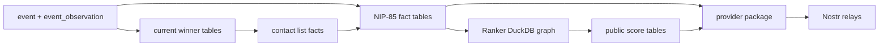

# NIP-85 Pipeline

BigBrotr's NIP-85 pipeline turns archived observations into public trusted
assertion outputs. The pipeline is split deliberately across Refresher, Ranker,
and Assertor so each service owns one kind of work.

## Pipeline Stages

## Refresher Ownership

Refresher owns PostgreSQL fact derivation. It refreshes:

- current winner maps for replaceable and addressable events;
- current contact lists;
- contact-list edge facts;
- NIP-85 user, event, addressable, and identifier fact tables;
- analytics tables that support API, DVM, Ranker, and operator visibility.

Refresher does not publish Nostr events and does not compute PageRank. It keeps
the shared facts deterministic and queryable.

See [Refresher](services.md#refresher) and [Database](database.md).

## Ranker Ownership

Ranker computes public score snapshots. It reads PostgreSQL facts, maintains a
private DuckDB store, computes ranks, stages non-user scores, and exports public
score tables back to PostgreSQL.

Primary Ranker state:

| State | Location | Reason |
| --- | --- | --- |
| Canonical input facts | PostgreSQL | Shared, refresh-maintained facts |
| Local graph | DuckDB | Analytical, large, Ranker-owned |
| Graph sync checkpoint | DuckDB | Bound to the local graph snapshot |
| PageRank working tables | DuckDB | Compute-local intermediate state |
| Public scores | PostgreSQL | Shared output for read side and Assertor |

Ranker should not mirror its graph state into `service_state`. `service_state`
is appropriate for small operational records, not an analytical graph.

See [Ranker](services.md#ranker), [Data Flow](../project/data-flow.md#ranker-state),
and [Backup And Restore](../how-to/backup-restore.md).

## Assertor Ownership

Assertor publishes NIP-85 outputs. It reads canonical facts and public scores,
builds provider-package events, publishes them to configured relays, and stores
publication checkpoints.

Assertor should not recompute Ranker scores. It consumes the score outputs as a
published data product.

See [Assertor](services.md#assertor) and
[Configuration](configuration.md#assertor-configuration).

## Failure Semantics

| Failure | Effect | Recovery |
| --- | --- | --- |
| Synchronizer stale | Facts stop receiving new event observations. | Resume relay fetch and cursor processing. |
| Refresher stale | Current, analytics, and NIP-85 facts lag behind archive data. | Run Refresher; verify refresh order and metrics. |
| Ranker stale | Public score snapshots stop updating. | Restart Ranker; if DuckDB is lost, rebuild from PostgreSQL facts. |
| Assertor stale | Published NIP-85 provider package stops advancing. | Restart Assertor after facts and scores are current. |
| Relay publication failure | Some relays miss the latest package. | Assertor retries according to config and checkpoint state. |

## Operational Checks

Use these checks when the NIP-85 output appears wrong:

1. Confirm Synchronizer is still archiving events.
2. Confirm Refresher updated contact and NIP-85 fact tables.
3. Confirm Ranker exported fresh score snapshots.
4. Confirm Assertor has current publication checkpoints.
5. Confirm configured publication relays accept the provider package.

Related pages:

- [Services](services.md)
- [Database](database.md)
- [Configuration](configuration.md)
- [Monitoring](monitoring.md)
- [Evidence Map](../appendices/evidence-map.md)
