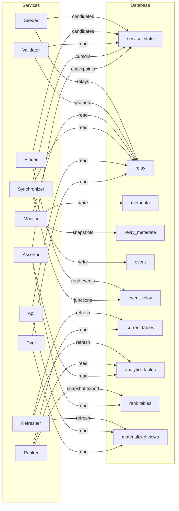
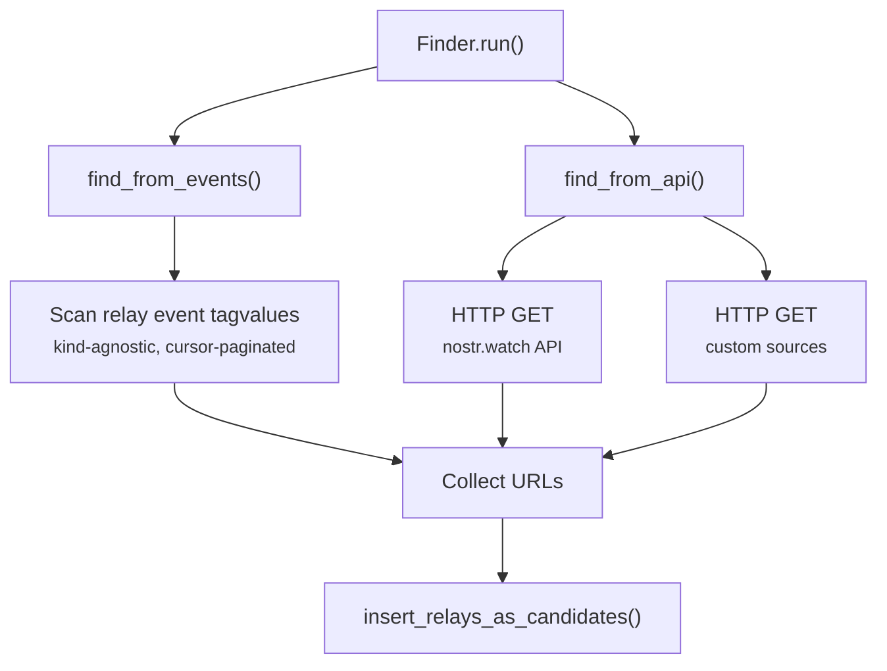
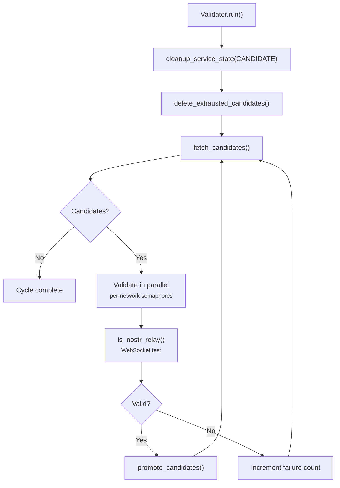
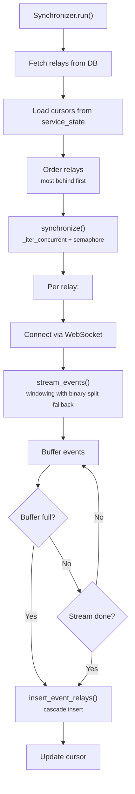
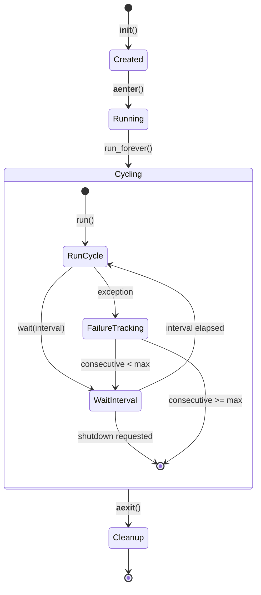

# Services

Deep dive into BigBrotr's ten independent services: how relays are discovered, validated, monitored, how events are archived, how derived facts are refreshed, how NIP-85 rank snapshots are computed, and how data is exposed via REST API and Nostr.

---

## Overview

BigBrotr uses ten independent async services that share a PostgreSQL database. Each service runs as its own process and can be started, stopped, and scaled independently:

--8<-- "docs/_snippets/pipeline.md"

--8<-- "docs/_snippets/service-table.md"

Services communicate exclusively through the shared PostgreSQL database. There is no direct inter-service communication or dependency ordering.

---

## Service-Database Interactions

The following diagram shows which database tables each service reads from and writes to:


```mermaid
flowchart LR
    subgraph Services
        SE["Seeder"]
        FI["Finder"]
        VA["Validator"]
        MO["Monitor"]
        SY["Synchronizer"]
        RE2["Refresher"]
        RA["Ranker"]
        AS["Assertor"]
        AP["Api"]
        DV["Dvm"]
    end

    subgraph Database
        SS["service_state"]
        RE["relay"]
        MD["metadata"]
        RM["relay_metadata"]
        EV["event"]
        ER["event_relay"]
        CT["current tables"]
        ST["analytics tables"]
        RK["rank tables"]
        MV["materialized views"]
    end

    SE -->|"candidates"| SS
    SE -->|"relays"| RE
    FI -->|"read events"| ER
    FI -->|"candidates"| SS
    VA -->|"read"| SS
    VA -->|"promote"| RE
    MO -->|"read"| RE
    MO -->|"write"| MD
    MO -->|"snapshots"| RM
    SY -->|"read"| RE
    SY -->|"cursors"| SS
    SY -->|"write"| EV
    SY -->|"junctions"| ER
    RE2 -->|"refresh"| CT
    RE2 -->|"refresh"| ST
    RE2 -->|"refresh"| MV
    RA -->|"read"| CT
    RA -->|"read"| ST
    RA -->|"snapshot export"| RK
    AS -->|"read"| ST
    AS -->|"read"| RK
    AS -->|"checkpoints"| SS
    AP -->|"read"| RE
    AP -->|"read"| MV
    DV -->|"read"| RE
    DV -->|"read"| MV
```

---

## Seeder

**Purpose**: Bootstrap the system by loading relay URLs from a static seed file.

**Mode**: One-shot (`--once` flag). Runs once and exits.

**Reads**: Seed file (`static/seed_relays.txt`)
**Writes**: `service_state` (candidates) or `relay` (direct insert)

### How It Works

1. Read the seed file (one URL per line, `#` comments skipped)
2. Parse each URL into a `Relay` object (validates URL format, detects network type)
3. Insert as candidates via `insert_relays_as_candidates()` (default) or directly to the `relay` table

!!! tip
    Set `to_validate: false` in the Seeder config to skip validation and insert relays directly. This is useful when seeding with a trusted, pre-validated relay list.

### Configuration

| Field | Type | Default | Description |
|-------|------|---------|-------------|
| `seed.file_path` | string | `static/seed_relays.txt` | Path to seed relay URLs file |
| `seed.to_validate` | bool | `true` | Insert as candidates (true) or directly as relays (false) |

!!! tip "API Reference"
    See [`bigbrotr.services.seeder`](../reference/services/seeder/index.md) for the complete Seeder API.

---

## Finder

**Purpose**: Discover new relay URLs from stored Nostr events and external HTTP APIs.

**Mode**: Continuous (`run_forever`)

**Reads**: `event` (stored Nostr events), external HTTP APIs
**Writes**: `service_state` (candidates)

### How It Works


```mermaid
flowchart TD
    A["Finder.run()"] --> B["find_from_events()"]
    A --> C["find_from_api()"]

    B --> D["Scan relay event tagvalues<br/><small>kind-agnostic, cursor-paginated</small>"]

    C --> G["HTTP GET<br/><small>nostr.watch API</small>"]
    C --> H["HTTP GET<br/><small>custom sources</small>"]

    D --> I["Collect URLs"]
    G --> I
    H --> I

    I --> J["insert_relays_as_candidates()"]

```

**Discovery sources:**

1. **Event scanning** -- extracts relay URLs from event `tagvalues` regardless of event kind. Any tagvalue that parses as a valid relay URL (`wss://` or `ws://`) becomes a candidate. Scanning is cursor-paginated per relay with `(seen_at, event_id)` tie-breaking.

2. **API fetching** -- HTTP requests to external sources:
    - Default: nostr.watch online/offline relay list endpoints
    - Configurable timeout, SSL verification, delay between requests
    - JMESPath expressions for extracting URLs from JSON responses

### Configuration

| Field | Type | Default | Description |
|-------|------|---------|-------------|
| `events.enabled` | bool | `true` | Enable event-based relay discovery |
| `events.batch_size` | int | `500` | Events per scanning batch |
| `events.scan_size` | int | `500` | Rows per paginated DB query (range 10-10000) |
| `events.parallel_relays` | int | `50` | Maximum concurrent relay event scans |
| `events.max_relay_time` | float | `900.0` | Maximum seconds to scan a single relay |
| `events.max_duration` | float | `7200.0` | Maximum seconds for the entire event scanning phase |
| `api.enabled` | bool | `true` | Enable API-based discovery |
| `api.cooldown` | float | `86400.0` | Minimum seconds before querying any source again |
| `api.sources[].url` | string | -- | API endpoint URL (required) |
| `api.sources[].expression` | string | -- | JMESPath expression for URL extraction (required) |
| `api.request_delay` | float | `1.0` | Delay between API calls |
| `api.max_response_size` | int | `5242880` | Maximum API response body size in bytes (5 MB) |

!!! tip "API Reference"
    See [`bigbrotr.services.finder`](../reference/services/finder/index.md) for the complete Finder API.

---

## Validator

**Purpose**: Test candidate relay URLs via WebSocket and promote valid ones to the relay table.

**Mode**: Continuous (`run_forever`)

**Reads**: `service_state` (candidates)
**Writes**: `relay` (promoted valid relays), `service_state` (updated failure counts)

### How It Works


```mermaid
flowchart TD
    A["Validator.run()"] --> B["cleanup_service_state(CANDIDATE)"]
    B --> C["delete_exhausted_candidates()"]
    C --> D["fetch_candidates()"]
    D --> E{Candidates?}
    E -->|No| F["Cycle complete"]
    E -->|Yes| G["Validate in parallel<br/><small>per-network semaphores</small>"]
    G --> H["is_nostr_relay()<br/><small>WebSocket test</small>"]
    H --> I{Valid?}
    I -->|Yes| J["promote_candidates()"]
    I -->|No| K["Increment failure count"]
    J --> D
    K --> D

```

1. Delete stale candidates (URLs already in the relay table)
2. Delete exhausted candidates (exceeded `max_failures` threshold)
3. Fetch a chunk of candidates ordered by failure count (ASC) then age (ASC)
4. Validate in parallel with per-network semaphores via `is_nostr_relay(relay, timeout, proxy_url)`
5. Promote valid candidates to the relay table; increment failure count for invalid ones
6. Repeat until all candidates are processed

!!! note
    The Validator uses `is_nostr_relay()` which performs a WebSocket handshake and checks for a valid Nostr protocol response. It does not verify event storage or relay policies.

### Configuration

| Field | Type | Default | Description |
|-------|------|---------|-------------|
| `processing.chunk_size` | int | `100` | Candidates per fetch batch |
| `processing.max_candidates` | int or null | `null` | Max candidates per cycle |
| `processing.interval` | float | `3600.0` | Minimum seconds before retrying a failed candidate |
| `processing.allow_insecure` | bool | `false` | Fall back to insecure transport on SSL failure |
| `cleanup.enabled` | bool | `true` | Enable exhausted candidate cleanup |
| `cleanup.max_failures` | int | `720` | Failure threshold for removal |
| `networks` | NetworksConfig | -- | Per-network timeouts and concurrency |

!!! tip "API Reference"
    See [`bigbrotr.services.validator`](../reference/services/validator/index.md) for the complete Validator API.

---

## Monitor

**Purpose**: Perform NIP-11 and NIP-66 health checks on all validated relays and publish results as Nostr events.

**Mode**: Continuous (`run_forever`)

**Reads**: `relay` (validated relays)
**Writes**: `metadata`, `relay_metadata` (health check results); publishes Nostr kind 0, 10166, 30166 events

### How It Works

The Monitor is the most complex service (`services/monitor/service.py`), handling
health checks and event publishing orchestration. NIP-66 tag building is delegated
to `nips/event_builders.py`.

**Orchestration flow:**

1. `run()` -- update geo databases, open geo readers, publish profile/announcement, delegate to `monitor()`
2. `monitor()` -- count relays, fetch in chunks, check concurrently via `_iter_concurrent()`, persist metadata, update checkpoints
3. `check_relay(relay)` -- run NIP-11 + all NIP-66 checks, return `CheckResult`
4. `publish_discovery(relay, result)` -- build and broadcast kind 30166 per successful check
5. `publish_announcement()` -- kind 10166 (monitor capabilities)
6. `publish_profile()` -- kind 0 (monitor profile metadata)

**CheckResult** (what each relay check produces):

```python
class CheckResult(NamedTuple):
    generated_at: int
    nip11_info: Nip11InfoMetadata | None
    nip66_rtt: Nip66RttMetadata | None
    nip66_ssl: Nip66SslMetadata | None
    nip66_geo: Nip66GeoMetadata | None
    nip66_net: Nip66NetMetadata | None
    nip66_dns: Nip66DnsMetadata | None
    nip66_http: Nip66HttpMetadata | None
```

**Checkpoint tracking:**

The Monitor uses two types of `CHECKPOINT` records in `service_state`:

- **Per-relay monitoring checkpoints** (key = relay URL) -- track when each relay was last checked, used for cleanup of stale entries when relays are removed.
- **Publishing checkpoints** (key = `"announcement"` or `"profile"`) -- track when the last kind 10166 announcement or kind 0 profile event was published, enforcing the configured minimum interval between publishes.

**Published Nostr events:**

| Kind | Type | Content |
|------|------|---------|
| 0 | Profile | Monitor name, about, picture (NIP-01) |
| 10166 | Announcement | Monitor capabilities, check frequency, supported checks (NIP-66) |
| 30166 | Discovery | Per-relay health data: RTT, SSL, DNS, Geo, Net, NIP-11 (addressable, `d` tag = relay URL) |

**NIP-66 tag building** is delegated to `nips/event_builders.py`, not handled in `monitor/service.py`. The event builder functions (`build_relay_discovery`, `build_monitor_announcement`, `build_profile_event`) construct the appropriate NIP-66 tags from check result data.

### Configuration

| Field | Type | Default | Description |
|-------|------|---------|-------------|
| `processing.chunk_size` | int | `100` | Relays per batch |
| `processing.max_relays` | int or null | `null` | Max relays per cycle |
| `processing.compute.*` | bool | `true` | Enable computation per metadata type |
| `processing.store.*` | bool | `true` | Enable persistence per metadata type |
| `discovery.enabled` | bool | `true` | Publish kind 30166 events |
| `announcement.enabled` | bool | `true` | Publish kind 10166 events |
| `networks` | NetworkConfig | -- | Per-network timeouts and concurrency |

!!! warning
    The Monitor uses `NOSTR_PRIVATE_KEY_MONITOR` for signing published Nostr
    events and performing NIP-66 write tests. If the variable is blank or
    unset, the config generates one ephemeral key once at startup.

!!! tip "API Reference"
    See [`bigbrotr.services.monitor`](../reference/services/monitor/index.md) for the complete Monitor API.

---

## Synchronizer

**Purpose**: Connect to relays, subscribe to events, and archive them to PostgreSQL.

**Mode**: Continuous (`run_forever`)

**Reads**: `relay` (validated relays), `service_state` (cursors)
**Writes**: `event`, `event_relay` (archived events and junctions), `service_state` (updated cursors)

### How It Works


```mermaid
flowchart TD
    A["Synchronizer.run()"] --> B["Fetch relays from DB"]
    B --> C["Load cursors from service_state"]
    C --> D["Order relays<br/><small>most behind first</small>"]
    D --> E["synchronize()<br/><small>_iter_concurrent + semaphore</small>"]
    E --> F["Per relay:"]
    F --> G["Connect via WebSocket"]
    G --> H["stream_events()<br/><small>windowing with binary-split fallback</small>"]
    H --> I["Buffer events"]
    I --> J{Buffer full?}
    J -->|Yes| K["insert_event_relays()<br/><small>cascade insert</small>"]
    J -->|No| L{Stream done?}
    L -->|Yes| K
    L -->|No| I
    K --> M["Update cursor"]

```

1. `run()` delegates to `synchronize()` -- fetch cursors ordered by sync progress ascending (most behind first), distribute work
2. `synchronize()` -- `_iter_concurrent()` with `_sync_worker` async generators and per-network semaphores
3. For each relay: `_sync_relay_events()` connects via WebSocket, streams events using `stream_events()` with data-driven windowing and binary-split fallback for completeness
4. Events are buffered and batch-inserted via `insert_event_relays()` (cascade insert to `event` + `event_relay`)
5. Per-relay cursor tracking via `ServiceState` with `ServiceStateType.CURSOR`, cursors saved in batch via `upsert_sync_cursors()` at each buffer flush
6. Cursor set to `end_time` on completion, or last event's `created_at` on partial completion

### Configuration

| Field | Type | Default | Description |
|-------|------|---------|-------------|
| `processing.filters` | list[dict] | `[{}]` | NIP-01 filter dicts for event subscription (OR semantics) |
| `processing.limit` | int | `500` | Max events per relay request (REQ limit) |
| `processing.since` | int | `0` | Default start timestamp for relays without a cursor |
| `processing.until` | int or null | `null` | Upper bound timestamp (null = now) |
| `processing.end_lag` | int | `86400` | Seconds subtracted from until to compute sync end time |
| `processing.batch_size` | int | `1000` | Events to buffer before flushing to the database |
| `processing.allow_insecure` | bool | `false` | Fall back to insecure transport on SSL failure |
| `timeouts.relay_clearnet` | float | `1800.0` | Max time per clearnet relay sync |
| `timeouts.relay_tor` | float | `3600.0` | Max time per Tor relay sync |
| `timeouts.max_duration` | float | `14400.0` | Maximum seconds for the entire sync phase |
| `networks` | NetworksConfig | -- | Per-network timeouts and concurrency |

!!! note "NIP-42 Auth Key"
    The Synchronizer uses `NOSTR_PRIVATE_KEY_SYNCHRONIZER` when a relay
    requires authenticated reads via NIP-42. If blank or unset, the config
    generates one ephemeral key once at startup.

!!! tip "API Reference"
    See [`bigbrotr.services.synchronizer`](../reference/services/synchronizer/index.md) for the complete Synchronizer API.

---

## Refresher

**Purpose**: Refresh current-state tables, analytics facts, and periodic reconciliation tasks that power downstream services.

**Mode**: Continuous (`run_forever`)

**Reads**: Base tables (indirectly, via refresh functions)
**Writes**: current-state tables, analytics tables, and service checkpoints

### How It Works

1. Resolve the configured `current.targets` and `analytics.targets` into canonical dependency-safe order
2. Incrementally refresh each current-state table from its source watermark range
3. Incrementally refresh each analytics table from its source watermark range
4. Run enabled periodic reconciliations (`rolling_windows`, `relay_stats_metadata`, `nip85_followers`) and emit per-target timing, row, watermark-lag, and failure metrics

Each target is isolated by default: one failed refresh does not stop the rest of the cycle unless `processing.continue_on_target_error` is disabled.

### Configuration

| Field | Type | Default | Description |
|-------|------|---------|-------------|
| `current.targets` | list[string] | canonical current-state set | Current-state tables to refresh incrementally |
| `analytics.targets` | list[string] | canonical analytics set | Analytics tables to refresh incrementally |
| `periodic.rolling_windows` | bool | `true` | Recompute rolling time-window columns |
| `periodic.relay_stats_metadata` | bool | `true` | Refresh `relay_stats` metadata fields |
| `periodic.nip85_followers` | bool | `true` | Recompute NIP-85 follower/following counts |
| `processing.max_duration` | float or null | `null` | Maximum seconds for one refresh cycle |
| `processing.max_targets_per_cycle` | int or null | `null` | Maximum targets attempted per cycle |
| `processing.continue_on_target_error` | bool | `true` | Continue after isolated target failures |
| `cleanup.enabled` | bool | `true` | Remove stale checkpoints for targets no longer configured |

!!! tip "API Reference"
    See [`bigbrotr.services.refresher`](../reference/services/refresher/index.md) for the complete Refresher API.

---

## Ranker

**Purpose**: Compute deterministic NIP-85 rank snapshots in a private DuckDB store and export them back to PostgreSQL.

**Mode**: Continuous (`run_forever`)

**Reads**: `contact_lists_current`, `contact_list_edges_current`, `nip85_event_stats`, `nip85_addressable_stats`, `nip85_identifier_stats`
**Writes**: `nip85_pubkey_ranks`, `nip85_event_ranks`, `nip85_addressable_ranks`, `nip85_identifier_ranks`, private DuckDB graph state + checkpoint file

### How It Works

1. Open the private DuckDB store for the service lifetime and load the incremental PostgreSQL -> DuckDB graph checkpoint
2. Pull changed canonical contact lists and follow edges from PostgreSQL current tables
3. Apply the graph delta in DuckDB, then reload non-user fact stages (`event`, `addressable`, `identifier`)
4. Compute deterministic pubkey PageRank (`30382`) plus derived non-user ranks (`30383`, `30384`, `30385`)
5. Snapshot-export one complete `algorithm_id` rank set back to PostgreSQL for downstream assertion publishing

### Configuration

| Field | Type | Default | Description |
|-------|------|---------|-------------|
| `algorithm_id` | string | `global-pagerank` | Namespace written into exported rank snapshots |
| `storage.path` | path | `/app/data/ranker.duckdb` | Private DuckDB database path |
| `storage.checkpoint_path` | path | `/app/data/ranker.checkpoint.json` | Incremental graph sync checkpoint |
| `processing.max_duration` | float or null | `null` | Maximum seconds for one ranker cycle |
| `graph.damping` | float | `0.85` | PageRank damping factor for pubkey ranking |
| `graph.iterations` | int | `20` | Deterministic PageRank iteration count |
| `sync.batch_size` | int | `1000` | Changed followers synced per PostgreSQL batch |
| `sync.max_batches` | int or null | `null` | Maximum follow-graph sync batches per cycle |
| `sync.max_followers_per_cycle` | int or null | `null` | Maximum changed followers synced per cycle |
| `facts_stage.batch_size` | int | `1000` | Rows fetched per non-user fact staging batch |
| `facts_stage.max_event_rows` | int or null | `null` | Maximum event fact rows staged per cycle |
| `facts_stage.max_addressable_rows` | int or null | `null` | Maximum addressable fact rows staged per cycle |
| `facts_stage.max_identifier_rows` | int or null | `null` | Maximum identifier fact rows staged per cycle |
| `export.batch_size` | int | `1000` | Rows exported per rank snapshot batch |
| `export.max_batches_per_subject` | int or null | `null` | Maximum export batches per rank subject per cycle |
| `cleanup.rank_runs_retention` | int or null | `100` | DuckDB-local rank run records to keep |

!!! tip "API Reference"
    See [`bigbrotr.services.ranker`](../reference/services/ranker/index.md) for the complete Ranker API.

---

## Assertor

**Purpose**: Publish NIP-85 trusted assertions and the optional provider profile for an algorithm-scoped service key.

**Mode**: Continuous (`run_forever`)

**Reads**: `nip85_pubkey_stats`, `nip85_event_stats`, `nip85_addressable_stats`, `nip85_identifier_stats`, `nip85_pubkey_ranks`, `nip85_event_ranks`, `nip85_addressable_ranks`, `nip85_identifier_ranks`, `pubkey_stats`, `service_state`
**Writes**: `service_state` (checkpoints), published Nostr events (kinds 30382-30385, optional kind 0)

### How It Works

1. On startup (`__aenter__`), build a Nostr client from the configured signing key and connect to relays
2. During each `run()` cycle, query eligible user, event, addressable, and identifier facts joined with the current algorithm's rank snapshots
3. Hash each assertion payload and compare it against `service_state` using `<algorithm_id>:<kind>:<subject_id>` checkpoint keys
4. Publish only changed assertions, optionally publish a Kind 0 provider profile, then persist the new hashes
5. Remove stale or non-canonical checkpoints after the cycle, keeping only current canonical state for the active algorithm namespace

### Configuration

| Field | Type | Default | Description |
|-------|------|---------|-------------|
| `algorithm_id` | string | `global-pagerank` | Stable namespace for checkpoint keys and provider identity |
| `keys.keys_env` | string | `NOSTR_PRIVATE_KEY_ASSERTOR` | Environment variable that supplies the signing key |
| `publishing.relays` | list[string] | 3 public relays | Relays used for NIP-85 publishing |
| `selection.kinds` | list[int] | `[30382, 30383, 30384, 30385]` | Assertion kinds to publish |
| `selection.batch_size` | int | `500` | Maximum eligible subjects per cycle |
| `selection.min_events` | int | `1` | Minimum total events required for user assertions |
| `selection.top_topics` | int | `5` | Maximum topic tags included in user assertions |
| `cleanup.remove_stale_checkpoints` | bool | `true` | Remove stale or non-canonical checkpoints after each cycle |
| `provider_profile.enabled` | bool | `false` | Publish a Kind 0 provider profile for the assertor identity |

!!! note "Assertor Key Lifecycle"
    The shipped BigBrotr and LilBrotr deployments configure the Assertor with
    `keys.keys_env: NOSTR_PRIVATE_KEY_ASSERTOR`. If that variable is blank or
    unset, the config generates one ephemeral key once at startup. To keep a
    stable NIP-85 identity across restarts, set the variable explicitly. Per
    NIP-85, use a distinct service key for each distinct algorithm or
    personalized point of view.

!!! note "Trusted Provider Declarations"
    NIP-85 kind `10040` events declare a user's trusted providers. Those are
    user/client authorization events, so the Assertor does not publish them as
    part of its provider flow. The NIP helper layer exposes a dedicated builder
    for projects that need to create public or NIP-44 encrypted provider lists.

!!! tip "API Reference"
    See [`bigbrotr.services.assertor`](../reference/services/assertor/index.md) for the complete Assertor API.

---

## Api

**Purpose**: Expose BigBrotr public read models as a read-only REST API via FastAPI.

**Mode**: Continuous (HTTP server runs alongside the `run_forever` cycle)

**Reads**: Public read models backed by Catalog-managed tables, views, and materialized views
**Writes**: -- (read-only; emits Prometheus metrics)

### How It Works

1. On startup (`__aenter__`), discover the backing catalog via the shared Catalog
2. Build a FastAPI application with discovery endpoints for enabled public read models
3. Register list endpoints (`GET /api/v1/{read_model}`) with read-model query params:
   `limit`, `sort`, column filters, optional `cursor`, optional `include_total`,
   and `offset` only as a compatibility fallback
4. Register detail endpoints (`GET /api/v1/{read_model}/{pk}`) for read models with a primary key
5. Start uvicorn as a background asyncio task
6. Each `run()` cycle logs request statistics (total, failed) and updates Prometheus gauges

Endpoints also include `/health` (readiness check), `GET /api/v1/read-models`, and
`GET /api/v1/read-models/{read_model}` for public surface discovery.

For read models with a primary key, list responses default to cursor pagination:

- the request can pass `cursor=<opaque-token>` for the next page
- the response `meta` can include `next_cursor`
- `include_total=true` opt-in enables the extra `COUNT(*)` query only when needed

For read models without a stable primary key, the API falls back to offset pagination.

### Configuration

| Field | Type | Default | Description |
|-------|------|---------|-------------|
| `host` | string | `0.0.0.0` | HTTP bind address |
| `port` | int | `8080` | HTTP listen port |
| `max_page_size` | int | `1000` | Hard ceiling on the `limit` query parameter |
| `default_page_size` | int | `100` | Default `limit` when not specified |
| `read_models` | dict | `{}` | Per-read-model access policies (`enabled`) |
| `cors_origins` | list | `[]` | Allowed CORS origins (empty disables CORS) |
| `request_timeout` | float | `30.0` | Timeout in seconds for each database query |

!!! tip "API Reference"
    See [`bigbrotr.services.api`](../reference/services/api/index.md) for the complete Api service API.

---

## Dvm

**Purpose**: Serve public BigBrotr read-model queries over the Nostr protocol as a NIP-90 Data Vending Machine.

**Mode**: Continuous (`run_forever`, default interval 60 seconds)

**Reads**: Public read models backed by Catalog-managed tables, views, and materialized views
**Writes**: -- (publishes Nostr events: kind 6050 results, kind 7000 feedback)

### How It Works

1. On startup (`__aenter__`), connect to configured relays and discover the backing catalog
2. Optionally publish a NIP-89 handler announcement (kind 31990) advertising available read models
3. Restore a persisted `(timestamp, event_id)` request cursor and open a long-lived kind 5050 subscription on the connected relays
4. Each `run()` cycle drains buffered subscription notifications in cursor order
5. Parse job parameters from event tags: `read_model`, `limit`, `sort`, `filter`,
   optional `cursor`, optional `include_total`, and `offset` only as a compatibility fallback
6. Execute the query via the shared Catalog (same engine as the Api service)
7. Publish the result as a kind 6050 event, or publish error/payment-required feedback (kind 7000)

The Dvm supports per-read-model pricing via `ReadModelConfig.price`. When a job's bid is below the required price, a payment-required feedback event is published instead of the query result.

When the target read model has a primary key, DVM list jobs default to the same
cursor-based contract as the API:

- pass `cursor=<opaque-token>` in a `param` tag to continue a prior page
- inspect `meta.next_cursor` in the result event content
- request `include_total=true` only when the full filtered count is actually needed

### Configuration

| Field | Type | Default | Description |
|-------|------|---------|-------------|
| `relays` | list[string] | -- (required) | Relay URLs to listen on and publish to |
| `kind` | int | `5050` | NIP-90 request event kind (result = kind + 1000) |
| `max_page_size` | int | `1000` | Hard ceiling on query limit |
| `read_models` | dict | `{}` | Per-read-model policies: `enabled` (bool), `price` (int, millisats) |
| `announce` | bool | `true` | Publish NIP-89 handler announcement at startup |
| `fetch_timeout` | float | `30.0` | Timeout for relay subscription setup and initial request replay |

!!! note "Nostr Keys"
    The Dvm uses `NOSTR_PRIVATE_KEY_DVM` (secp256k1 hex or `nsec1...`). If the
    variable is blank or unset, the config generates one ephemeral key once at
    startup. See [KeysConfig](../reference/utils/keys.md) for details.

!!! tip "API Reference"
    See [`bigbrotr.services.dvm`](../reference/services/dvm/index.md) for the complete Dvm service API.

---

## Service Lifecycle

All services share a common lifecycle managed by `BaseService`:


```mermaid
stateDiagram-v2
    [*] --> Created: __init__()
    Created --> Running: __aenter__()
    Running --> Cycling: run_forever()

    state Cycling {
        [*] --> RunCycle: run()
        RunCycle --> WaitInterval: wait(interval)
        WaitInterval --> RunCycle: interval elapsed
        WaitInterval --> [*]: shutdown requested
        RunCycle --> FailureTracking: exception
        FailureTracking --> WaitInterval: consecutive < max
        FailureTracking --> [*]: consecutive >= max
    }

    Cycling --> Cleanup: __aexit__()
    Cleanup --> [*]
```

### run() vs run_forever()

| Method | Behavior | Use Case |
|--------|----------|----------|
| `run()` | Execute a single cycle, return | Testing, one-shot (`--once` flag) |
| `run_forever()` | Loop: `run()` -> `wait(interval)` -> repeat | Production continuous operation |

### Failure Handling

- Each service tracks consecutive failures
- After `max_consecutive_failures` (default 5), the service stops
- Set `max_consecutive_failures: 0` to disable the limit (never auto-stop)
- A successful cycle resets the consecutive failure counter

### Graceful Shutdown

- `SIGTERM` or `SIGINT` triggers `request_shutdown()`
- The current cycle completes before exiting
- `wait()` is interruptible -- no waiting for the full interval
- `stop_grace_period: 60s` in Docker Compose ensures time for cleanup

---

## Configuration Reference

For complete configuration details including all fields, defaults, constraints, and YAML examples, see the [Configuration](configuration.md) reference. Key tuning parameters per service:

| Service | Key Config | Impact |
|---------|-----------|--------|
| Seeder | `seed.to_validate` | Skip validation for trusted seed lists |
| Finder | `events.parallel_relays`, `api.sources` | Control discovery breadth and concurrency |
| Validator | `processing.chunk_size`, `cleanup.max_failures` | Throughput vs resource usage |
| Monitor | `processing.compute.*`, `discovery.enabled` | Which checks to run and publish |
| Synchronizer | `filters`, `limit`, `timeouts.max_duration` | Archival throughput and scope |
| Refresher | `views`, `interval` | Which views to refresh and how often |
| Ranker | `algorithm_id`, `graph.*`, `export.batch_size` | PageRank namespace, graph behavior, and snapshot export throughput |
| Assertor | `algorithm_id`, `selection.kinds`, `provider_profile.enabled` | Assertion namespace, publish scope, and provider identity |
| Api | `read_models`, `max_page_size`, `cors_origins` | Which read models to expose and pagination limits |
| Dvm | `relays`, `read_models`, `kind` | Which relays to listen on and read models to serve |

---

## Related Documentation

- [Architecture](architecture.md) -- Diamond DAG layer structure and design patterns
- [Configuration](configuration.md) -- Complete YAML configuration reference
- [Database](database.md) -- PostgreSQL schema and stored functions
- [Monitoring](monitoring.md) -- Prometheus metrics, alerting, and dashboards
