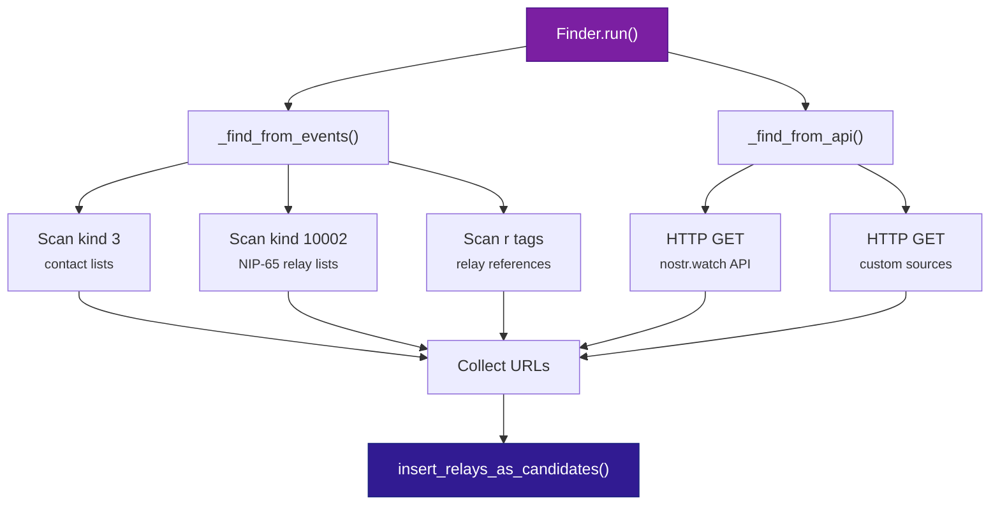
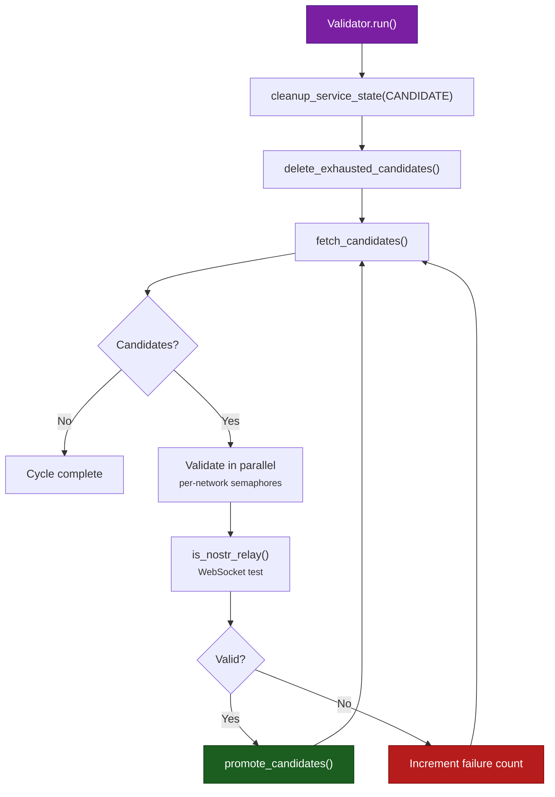
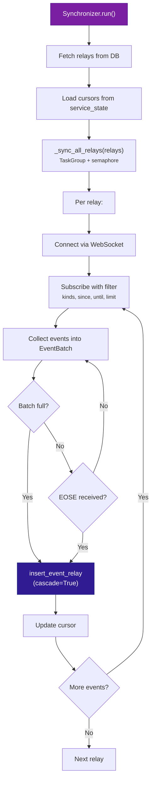

# Services

Deep dive into BigBrotr's eight independent services: how relays are discovered, validated, monitored, how events are archived, how analytics views are refreshed, and how data is exposed via REST API and Nostr.

---

## Overview

BigBrotr uses eight independent async services that share a PostgreSQL database. Each service runs as its own process and can be started, stopped, and scaled independently:

--8<-- "docs/_snippets/pipeline.md"

--8<-- "docs/_snippets/service-table.md"

Services communicate exclusively through the shared PostgreSQL database. There is no direct inter-service communication or dependency ordering.

---

## Service-Database Interactions

The following diagram shows which database tables each service reads from and writes to:

```mermaid
flowchart TD
    subgraph Services
        SE["Seeder"]
        FI["Finder"]
        VA["Validator"]
        MO["Monitor"]
        SY["Synchronizer"]
        RE2["Refresher"]
    end

    subgraph Database
        SS["service_state<br/><small>candidates, cursors</small>"]
        RE["relay<br/><small>validated URLs</small>"]
        MD["metadata<br/><small>NIP-11/NIP-66 docs</small>"]
        RM["relay_metadata<br/><small>time-series snapshots</small>"]
        EV["event<br/><small>Nostr events</small>"]
        ER["event_relay<br/><small>event-relay junction</small>"]
        MV["materialized views<br/><small>11 analytics views</small>"]
    end

    SE -->|"write candidates"| SS
    SE -->|"write relays"| RE
    FI -->|"read events"| ER
    FI -->|"write candidates"| SS
    VA -->|"read candidates"| SS
    VA -->|"promote valid"| RE
    VA -->|"update failures"| SS
    MO -->|"read relays"| RE
    MO -->|"write metadata"| MD
    MO -->|"write snapshots"| RM
    SY -->|"read relays"| RE
    SY -->|"read/write cursors"| SS
    SY -->|"write events"| EV
    SY -->|"write junctions"| ER
    RE2 -->|"refresh"| MV

    style SE fill:#7B1FA2,color:#fff,stroke:#4A148C
    style FI fill:#7B1FA2,color:#fff,stroke:#4A148C
    style VA fill:#7B1FA2,color:#fff,stroke:#4A148C
    style MO fill:#7B1FA2,color:#fff,stroke:#4A148C
    style SY fill:#7B1FA2,color:#fff,stroke:#4A148C
    style RE2 fill:#7B1FA2,color:#fff,stroke:#4A148C
    style SS fill:#311B92,color:#fff,stroke:#1A237E
    style RE fill:#311B92,color:#fff,stroke:#1A237E
    style MD fill:#311B92,color:#fff,stroke:#1A237E
    style RM fill:#311B92,color:#fff,stroke:#1A237E
    style EV fill:#311B92,color:#fff,stroke:#1A237E
    style ER fill:#311B92,color:#fff,stroke:#1A237E
    style MV fill:#311B92,color:#fff,stroke:#1A237E
```



---

## Seeder

**Purpose**: Bootstrap the system by loading relay URLs from a static seed file.

**Mode**: One-shot (`--once` flag). Runs once and exits.

**Reads**: Seed file (`static/seed_relays.txt`)
**Writes**: `service_state` (candidates) or `relay` (direct insert)

### How It Works

1. Read the seed file (one URL per line, `#` comments skipped)
2. Parse each URL into a `Relay` object (validates URL format, detects network type)
3. Insert as candidates via `insert_relays_as_candidates()` (default) or directly to the `relay` table

!!! tip
    Set `to_validate: false` in the Seeder config to skip validation and insert relays directly. This is useful when seeding with a trusted, pre-validated relay list.

### Configuration

| Field | Type | Default | Description |
|-------|------|---------|-------------|
| `seed.file_path` | string | `static/seed_relays.txt` | Path to seed relay URLs file |
| `seed.to_validate` | bool | `true` | Insert as candidates (true) or directly as relays (false) |

!!! tip "API Reference"
    See [`bigbrotr.services.seeder`](../reference/services/seeder/index.md) for the complete Seeder API.

---

## Finder

**Purpose**: Discover new relay URLs from stored Nostr events and external HTTP APIs.

**Mode**: Continuous (`run_forever`, default interval 1 hour)

**Reads**: `event` (stored Nostr events), external HTTP APIs
**Writes**: `service_state` (candidates)

### How It Works



**Discovery sources:**

1. **Event scanning** -- extracts relay URLs from:
    - Kind 3 (contact list): content field contains JSON with relay URLs as keys
    - Kind 10002 (NIP-65 relay list): `r` tags contain relay URLs
    - Any event with `r` tags

2. **API fetching** -- HTTP requests to external sources:
    - Default: nostr.watch online/offline relay list endpoints
    - Configurable timeout, SSL verification, delay between requests

### Configuration

| Field | Type | Default | Description |
|-------|------|---------|-------------|
| `interval` | float | `3600.0` | Seconds between discovery cycles |
| `concurrency.max_parallel` | int | `5` | Concurrent API requests |
| `events.enabled` | bool | `true` | Enable event-based relay discovery |
| `events.batch_size` | int | `1000` | Events per scanning batch |
| `events.kinds` | list[int] | `[2, 3, 10002]` | Nostr event kinds to scan |
| `api.enabled` | bool | `true` | Enable API-based discovery |
| `api.sources[].url` | string | -- | API endpoint URL |
| `api.delay_between_requests` | float | `1.0` | Delay between API calls |

!!! tip "API Reference"
    See [`bigbrotr.services.finder`](../reference/services/finder/index.md) for the complete Finder API.

---

## Validator

**Purpose**: Test candidate relay URLs via WebSocket and promote valid ones to the relay table.

**Mode**: Continuous (`run_forever`, default interval 8 hours)

**Reads**: `service_state` (candidates)
**Writes**: `relay` (promoted valid relays), `service_state` (updated failure counts)

### How It Works



1. Delete stale candidates (URLs already in the relay table)
2. Delete exhausted candidates (exceeded `max_failures` threshold)
3. Fetch a chunk of candidates ordered by failure count (ASC) then age (ASC)
4. Validate in parallel with per-network semaphores via `is_nostr_relay(relay, timeout, proxy_url)`
5. Promote valid candidates to the relay table; increment failure count for invalid ones
6. Repeat until all candidates are processed

!!! note
    The Validator uses `is_nostr_relay()` which performs a WebSocket handshake and checks for a valid Nostr protocol response. It does not verify event storage or relay policies.

### Configuration

| Field | Type | Default | Description |
|-------|------|---------|-------------|
| `interval` | float | `28800.0` | Seconds between validation cycles |
| `processing.chunk_size` | int | `100` | Candidates per fetch batch |
| `processing.max_candidates` | int or null | `null` | Max candidates per cycle |
| `cleanup.enabled` | bool | `false` | Enable stale candidate cleanup |
| `cleanup.max_failures` | int | `100` | Failure threshold for removal |
| `networks` | NetworkConfig | -- | Per-network timeouts and concurrency |

!!! tip "API Reference"
    See [`bigbrotr.services.validator`](../reference/services/validator/index.md) for the complete Validator API.

---

## Monitor

**Purpose**: Perform NIP-11 and NIP-66 health checks on all validated relays and publish results as Nostr events.

**Mode**: Continuous (`run_forever`, default interval 1 hour)

**Reads**: `relay` (validated relays)
**Writes**: `metadata`, `relay_metadata` (health check results); publishes Nostr kind 0, 10166, 30166 events

### How It Works

The Monitor is the most complex service (`services/monitor/service.py`), handling
health checks, event publishing, and NIP-66 tag building in a single module.

**Orchestration flow:**

1. `run()` -- setup (geo, publish profile/announcement), delegate to `monitor()`
2. `monitor()` -- count relays, process chunks, emit metrics
3. `check_chunks()` -- async generator yielding (successful, failed) per chunk
4. `check_relay(relay)` -- run NIP-11 + all NIP-66 checks, return `CheckResult`
5. `_persist_results(successful, failed)` -- insert metadata to DB
6. `publish_relay_discoveries(successful)` -- build and broadcast kind 30166 events
6. `_publish_announcement()` -- kind 10166 (monitor capabilities)
7. `_publish_profile()` -- kind 0 (monitor profile metadata)

**CheckResult** (what each relay check produces):

```python
class CheckResult(NamedTuple):
    nip11: RelayMetadata | None
    nip66_rtt: RelayMetadata | None
    nip66_ssl: RelayMetadata | None
    nip66_geo: RelayMetadata | None
    nip66_net: RelayMetadata | None
    nip66_dns: RelayMetadata | None
    nip66_http: RelayMetadata | None
```

**Published Nostr events:**

| Kind | Type | Content |
|------|------|---------|
| 0 | Profile | Monitor name, about, picture (NIP-01) |
| 10166 | Announcement | Monitor capabilities, check frequency, supported checks (NIP-66) |
| 30166 | Discovery | Per-relay health data: RTT, SSL, DNS, Geo, Net, NIP-11 (addressable, `d` tag = relay URL) |

**NIP-66 tags produced by `monitor/service.py`:**

| Method | Tags Produced |
|--------|--------------|
| `_add_rtt_tags()` | `rtt-open`, `rtt-read`, `rtt-write` |
| `_add_ssl_tags()` | `ssl`, `ssl-expires`, `ssl-issuer` |
| `_add_net_tags()` | `net-ip`, `net-ipv6`, `net-asn`, `net-asn-org` |
| `_add_geo_tags()` | `g` (geohash), `geo-country`, `geo-city`, `geo-lat`, `geo-lon`, `geo-tz` |
| `_add_nip11_tags()` | `N` (NIPs), `t` (topics), `l` (languages), `R` (requirements), `T` (types) |

### Configuration

| Field | Type | Default | Description |
|-------|------|---------|-------------|
| `interval` | float | `3600.0` | Seconds between check cycles |
| `processing.chunk_size` | int | `100` | Relays per batch |
| `processing.max_relays` | int or null | `null` | Max relays per cycle |
| `processing.compute.*` | bool | `true` | Enable computation per metadata type |
| `processing.store.*` | bool | `true` | Enable persistence per metadata type |
| `discovery.enabled` | bool | `true` | Publish kind 30166 events |
| `announcement.enabled` | bool | `true` | Publish kind 10166 events |
| `networks` | NetworkConfig | -- | Per-network timeouts and concurrency |

!!! warning
    The Monitor requires the `NOSTR_PRIVATE_KEY` environment variable for signing published Nostr events and performing NIP-66 write tests.

!!! tip "API Reference"
    See [`bigbrotr.services.monitor`](../reference/services/monitor/index.md) for the complete Monitor API.

---

## Synchronizer

**Purpose**: Connect to relays, subscribe to events, and archive them to PostgreSQL.

**Mode**: Continuous (`run_forever`, default interval 15 minutes)

**Reads**: `relay` (validated relays), `service_state` (cursors)
**Writes**: `event`, `event_relay` (archived events and junctions), `service_state` (updated cursors)

### How It Works



1. `run()` -- fetch relays from DB, load cursors, distribute work
2. `_sync_all_relays(relays)` -- `TaskGroup` with semaphore coordination
3. For each relay: connect via WebSocket, subscribe with filter, collect events
4. Per-relay cursor tracking via `ServiceState` with `ServiceStateType.CURSOR`
5. Batch insert events + relay junctions via `insert_event_relay(cascade=True)`
6. Flush cursor updates periodically

**EventBatch** -- bounded event buffer:

```python
class EventBatch:
    since: int           # filter start timestamp
    until: int           # filter end timestamp
    limit: int           # max events
    events: list[Event]  # collected events

    def append(event) -> None   # raises OverflowError if full
    def is_full() -> bool
    def is_empty() -> bool
```

### Configuration

| Field | Type | Default | Description |
|-------|------|---------|-------------|
| `interval` | float | `900.0` | Seconds between sync cycles |
| `filter.kinds` | list[int] or null | `null` | Event kinds to sync (null = all) |
| `filter.limit` | int | `500` | Events per REQ request |
| `time_range.use_relay_state` | bool | `true` | Use per-relay incremental cursors |
| `time_range.lookback_seconds` | int | `86400` | Lookback window from cursor position |
| `concurrency.max_parallel` | int | `10` | Concurrent relays |
| `source.from_database` | bool | `true` | Fetch relay list from database |
| `networks` | NetworkConfig | -- | Per-network timeouts and concurrency |

!!! tip "API Reference"
    See [`bigbrotr.services.synchronizer`](../reference/services/synchronizer/index.md) for the complete Synchronizer API.

---

## Refresher

**Purpose**: Refresh materialized views that power analytics queries.

**Mode**: Continuous (`run_forever`, default interval 1 hour)

**Reads**: Base tables (indirectly, via `REFRESH MATERIALIZED VIEW CONCURRENTLY`)
**Writes**: 11 materialized views

### How It Works

1. Iterate over the configured list of materialized views
2. Refresh each view individually via its stored function (e.g., `relay_metadata_latest_refresh()`)
3. Log per-view timing and success/failure
4. A failure on one view does not prevent subsequent views from refreshing

The Refresher calls views in dependency order: `relay_metadata_latest` first (because `relay_software_counts` and `supported_nip_counts` depend on it), then all remaining views.

### Configuration

| Field | Type | Default | Description |
|-------|------|---------|-------------|
| `interval` | float | `3600.0` | Seconds between refresh cycles |
| `views` | list[string] | all 11 views | Materialized views to refresh |

!!! tip "API Reference"
    See [`bigbrotr.services.refresher`](../reference/services/refresher/index.md) for the complete Refresher API.

---

## Api

**Purpose**: Expose the BigBrotr database as a read-only REST API via FastAPI.

**Mode**: Continuous (HTTP server runs alongside the `run_forever` cycle)

**Reads**: All tables, views, and materialized views (via Catalog)
**Writes**: -- (read-only; emits Prometheus metrics)

### How It Works

1. On startup (`__aenter__`), discover the database schema via the shared Catalog
2. Build a FastAPI application with auto-generated routes for each enabled table
3. Register list endpoints (`GET /api/v1/{table}`) with pagination (`limit`, `offset`, `sort`, filters)
4. Register detail endpoints (`GET /api/v1/{table}/{pk}`) for tables with a primary key
5. Start uvicorn as a background asyncio task
6. Each `run()` cycle logs request statistics (total, failed) and updates Prometheus gauges

Endpoints also include `/health` (readiness check) and `/api/v1/schema` (schema introspection).

### Configuration

| Field | Type | Default | Description |
|-------|------|---------|-------------|
| `host` | string | `0.0.0.0` | HTTP bind address |
| `port` | int | `8080` | HTTP listen port |
| `max_page_size` | int | `1000` | Hard ceiling on the `limit` query parameter |
| `default_page_size` | int | `100` | Default `limit` when not specified |
| `tables` | dict | `{}` | Per-table access policies (`enabled`, `price`) |
| `cors_origins` | list | `[]` | Allowed CORS origins (empty disables CORS) |
| `request_timeout` | float | `30.0` | Timeout in seconds for each database query |

!!! tip "API Reference"
    See [`bigbrotr.services.api`](../reference/services/api/index.md) for the complete Api service API.

---

## Dvm

**Purpose**: Serve database queries over the Nostr protocol as a NIP-90 Data Vending Machine.

**Mode**: Continuous (`run_forever`, default interval 60 seconds)

**Reads**: All tables, views, and materialized views (via Catalog)
**Writes**: -- (publishes Nostr events: kind 6050 results, kind 7000 feedback)

### How It Works

1. On startup (`__aenter__`), connect to configured relays and discover the database schema
2. Optionally publish a NIP-89 handler announcement (kind 31990) advertising available tables
3. Each `run()` cycle fetches new kind 5050 job request events using a `since` timestamp filter
4. Parse job parameters from event tags: `table`, `limit`, `offset`, `sort`, `filter`, `columns`
5. Execute the query via the shared Catalog (same engine as the Api service)
6. Publish the result as a kind 6050 event, or publish error/payment-required feedback (kind 7000)

The Dvm supports per-table pricing via `TableConfig.price`. When a job's bid is below the required price, a payment-required feedback event is published instead of the query result.

### Configuration

| Field | Type | Default | Description |
|-------|------|---------|-------------|
| `relays` | list[string] | -- (required) | Relay URLs to listen on and publish to |
| `kind` | int | `5050` | NIP-90 request event kind (result = kind + 1000) |
| `max_page_size` | int | `1000` | Hard ceiling on query limit |
| `tables` | dict | `{}` | Per-table policies: `enabled` (bool), `price` (int, millisats) |
| `announce` | bool | `true` | Publish NIP-89 handler announcement at startup |
| `fetch_timeout` | float | `30.0` | Timeout for relay event fetching |

!!! note "Nostr Keys"
    The Dvm requires a `NOSTR_PRIVATE_KEY` environment variable (secp256k1 hex). See [KeysConfig](../reference/utils/keys.md) for details.

!!! tip "API Reference"
    See [`bigbrotr.services.dvm`](../reference/services/dvm/index.md) for the complete Dvm service API.

---

## Service Lifecycle

All services share a common lifecycle managed by `BaseService`:

```mermaid
statediagram-v2
    [*] --> Created: __init__()
    Created --> Running: __aenter__()
    Running --> Cycling: run_forever()

    state Cycling {
        [*] --> RunCycle: run()
        RunCycle --> WaitInterval: wait(interval)
        WaitInterval --> RunCycle: interval elapsed
        WaitInterval --> [*]: shutdown requested
        RunCycle --> FailureTracking: exception
        FailureTracking --> WaitInterval: consecutive < max
        FailureTracking --> [*]: consecutive >= max
    }

    Cycling --> Cleanup: __aexit__()
    Cleanup --> [*]
```

### run() vs run_forever()

| Method | Behavior | Use Case |
|--------|----------|----------|
| `run()` | Execute a single cycle, return | Testing, one-shot (`--once` flag) |
| `run_forever()` | Loop: `run()` -> `wait(interval)` -> repeat | Production continuous operation |

### Failure Handling

- Each service tracks consecutive failures
- After `max_consecutive_failures` (default 5), the service stops
- Set `max_consecutive_failures: 0` to disable the limit (never auto-stop)
- A successful cycle resets the consecutive failure counter

### Graceful Shutdown

- `SIGTERM` or `SIGINT` triggers `request_shutdown()`
- The current cycle completes before exiting
- `wait()` is interruptible -- no waiting for the full interval
- `stop_grace_period: 60s` in Docker Compose ensures time for cleanup

---

## Configuration Reference

For complete configuration details including all fields, defaults, constraints, and YAML examples, see the [Configuration](configuration.md) reference. Key tuning parameters per service:

| Service | Key Config | Impact |
|---------|-----------|--------|
| Seeder | `seed.to_validate` | Skip validation for trusted seed lists |
| Finder | `events.kinds`, `api.sources` | Control discovery breadth |
| Validator | `processing.chunk_size`, `cleanup.max_failures` | Throughput vs resource usage |
| Monitor | `processing.compute.*`, `discovery.enabled` | Which checks to run and publish |
| Synchronizer | `concurrency.max_parallel`, `filter.kinds` | Archival throughput and scope |
| Refresher | `views`, `interval` | Which views to refresh and how often |
| Api | `tables`, `max_page_size`, `cors_origins` | Which tables to expose and pagination limits |
| Dvm | `relays`, `tables`, `kind` | Which relays to listen on and tables to serve |

---

## Related Documentation

- [Architecture](architecture.md) -- Diamond DAG layer structure and design patterns
- [Configuration](configuration.md) -- Complete YAML configuration reference
- [Database](database.md) -- PostgreSQL schema and stored functions
- [Monitoring](monitoring.md) -- Prometheus metrics, alerting, and dashboards
