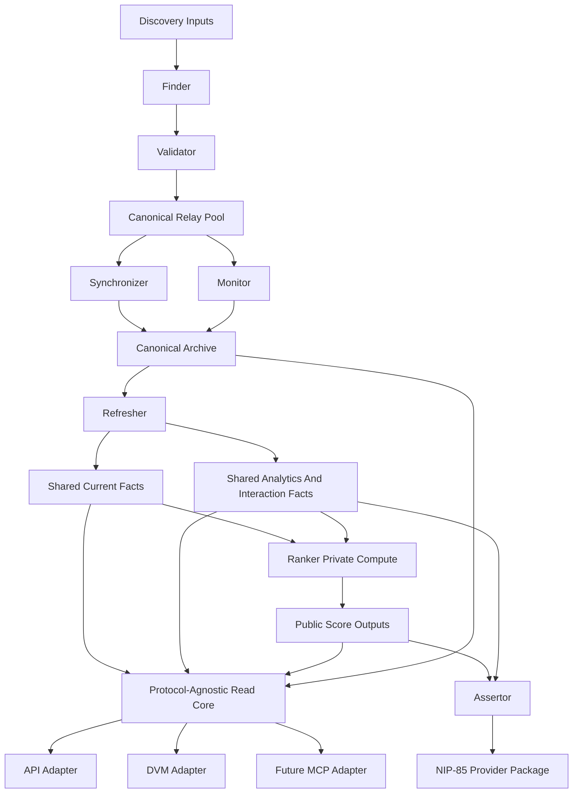
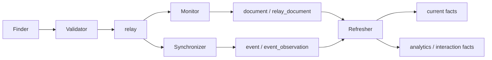
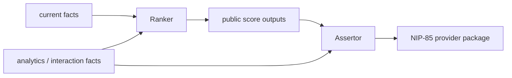
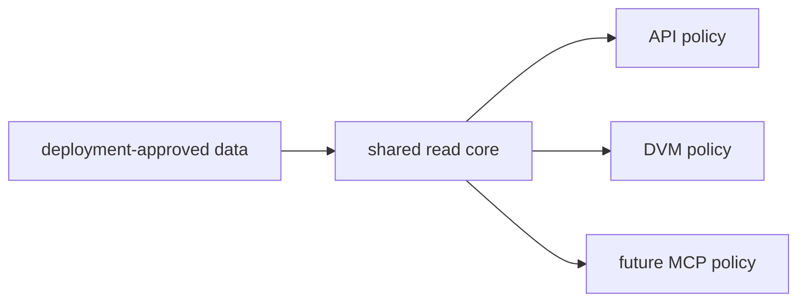

# Target Architecture Schema

## Purpose

This file describes the **target operating shape** of BigBrotr after the
definitive redesign has been completed.

It is not a migration script and it is not a task breakdown.
It is the reference answer to this question:

> What should BigBrotr look like, how should it be structured, and how should
> data move through it once the redesign is done correctly?

This file reflects the current final planning direction, including:

- the consolidated DB vision;
- the decision to keep `Monitor` unified;
- the decision to make `Assertor` publish the full NIP-85 provider package;
- the decision to use a protocol-agnostic read core under `api`, `dvm`, and
  future adapters;
- the decision to treat deployment folders and YAML as the canonical deployment
  model;
- the decision to keep a formal static NIP capability registry.

---

## 1. System Identity

BigBrotr is a **modular Nostr observability and data platform**.

Its job is to answer, continuously and reliably:

- which relays exist;
- which relays are valid enough to enter the canonical pool;
- how healthy those relays are;
- what events are being observed and archived;
- what shared facts, analytics, scores, and assertions can be derived from
  that archive;
- how those results can be exposed through protocol-specific read surfaces.

BigBrotr is not:

- a generic SQL browser;
- a generic Nostr client;
- a plugin-heavy framework;
- a direct-service-call monolith.

BigBrotr is:

- a set of independent services coordinated through PostgreSQL;
- a storage-first archive and derivation system;
- a protocol-aware product with explicit exposure policy;
- an extensible platform for new deployments, storage profiles, services, and
  protocols.

---

## 2. Core Design Principles

### 2.1 Storage first

The canonical shared database is shaped around durable storage truths, not
around the convenience of current services.

The ordering is:

1. canonical storage;
2. canonical shared derivation;
3. private compute where needed;
4. public and protocol-specific read exposure.

### 2.2 Huge-DB assumption everywhere

The system must always be designed as if the database were already very large.

That means:

- chunked iteration by default;
- paginated and cursor-driven reads by default;
- no full-fetch runtime paths on large operational sets;
- bounded, resumable, incremental background maintenance;
- storage and index design that supports large archive tables cleanly.

### 2.3 Canonical, operational, derived, and private data are different

The redesign keeps a hard distinction between:

- canonical archive data;
- shared operational state;
- shared current and analytics facts;
- private compute state;
- public convenience projections.

These categories should never blur together just because today’s code happens
to use them close to each other.

### 2.4 Tables must earn their bytes

A stored table is justified only when it provides one or more of:

- durable canonical meaning;
- shared value across multiple consumers;
- an important incremental refresh boundary;
- a real performance win that outweighs duplication cost.

If a shape is mainly for convenience, the default target is:

- a view;
- a materialized view;
- or a bounded read-core projection.

### 2.5 One shared semantic read core, many protocol adapters

`api`, `dvm`, and any future adapter such as `mcp` are not separate conceptual
products. They are protocol-specific ways to read the same underlying data
surface.

The target architecture is therefore:

- one protocol-agnostic read core;
- one deployment-scoped readable-resource inventory;
- one protocol-specific exposure policy per adapter.

### 2.6 Draft-first, not compatibility-first

Because the project is still draft-stage, the right priorities are:

- correctness;
- long-term naming quality;
- clean boundaries;
- sound extension surfaces;
- performance discipline.

The project should not preserve weak naming, partial legacy paths, or
compatibility layers just because they already exist.

---

## 3. Topology Overview

The key shape is:

- discovery and validation happen before the canonical relay pool;
- monitoring and synchronization feed the shared archive;
- shared derivation is centralized;
- ranking is downstream and private;
- public reading is downstream from shared facts and storage through one common
  read core;
- protocol publication is explicit and owned.

---

## 4. Target Data Strata

## 4.1 Stratum A: Canonical archive

This is the durable shared record.

Target conceptual contents:

- `relay`
- `event`
- `event_observation`
- `document`
- `relay_document`

This stratum answers:

- what exists in the archive;
- what event payload was stored;
- what relay-document history was recorded;
- what relay observed what event and when.

It is:

- durable;
- auditable;
- mostly append-shaped;
- semantically honest.

It is not:

- a score store;
- a current cache layer;
- a service-private workspace.

## 4.2 Stratum B: Shared operational state

This is the persistence that lets independent services run safely and resume
work.

Typical contents:

- cursors;
- checkpoints;
- cycle positions;
- publication offsets;
- resumable work state.

Target direction:

- one disciplined shared operational state subsystem;
- no explosion of bespoke service tables unless a concept becomes truly
  canonical.

## 4.3 Stratum C: Shared current facts and shared derived facts

This contains the shared facts that are important enough to materialize.

Typical contents:

- narrow current winner tables;
- shared summary tables;
- shared interaction facts;
- other derivations that clearly earn storage.

Important constraint:

- contact-graph projections are **not** automatically materialized by default;
- they should be views or promoted later only if they prove real shared
  hot-path value.

## 4.4 Stratum D: Public convenience projections

This is where views, read-core projections, and protocol-shaped response
surfaces live.

This layer is where convenience belongs.

It is the right place for:

- richer current projections;
- counts and distributions that do not earn persistent tables;
- protocol-facing shape adjustments;
- resource discovery payloads.

## 4.5 Stratum E: Private compute state

This is where specialized engines such as `Ranker` keep their own working
structures if they need them.

This state:

- can use a different storage engine if justified;
- is allowed to be highly algorithm-specific;
- must be rebuilt from canonical shared facts rather than forcing the shared DB
  to model it in advance.

---

## 5. Service Ownership Model

## 5.1 Seeder

Owns bootstrap input of candidate relays from static seed material.

It remains intentionally small and does not need architectural expansion.

## 5.2 Finder

Owns discovery of relay candidates from:

- external APIs;
- archived events;
- other discovery inputs.

It produces candidates and discovery knowledge.
It does not own canonical relay promotion.

## 5.3 Validator

Owns the candidate-to-relay promotion boundary.

This remains the only place that turns discovered candidates into entries in
the canonical relay pool.

## 5.4 Monitor

Owns:

- relay health probing;
- relay-oriented document persistence;
- relay-oriented protocol publication.

The final direction is:

- keep `Monitor` as one service;
- give it clearer internal sub-boundaries for probing, persistence, and
  publication;
- do not split publication into a separate service unless future evidence shows
  a real operational boundary.

## 5.5 Synchronizer

Owns canonical event ingestion.

It is archive-facing and should stay archive-facing:

- relay reads;
- event persistence;
- archival cursoring;
- ingestion completeness strategy.

It should not absorb analytics or ranking logic.

## 5.6 Refresher

Owns canonical shared derivation.

This includes:

- current winner maintenance;
- summary tables;
- interaction facts;
- canonical NIP-85 facts that other services depend on.

`Refresher` is the shared downstream fact producer.

## 5.7 Ranker

Owns private score computation.

It reads:

- canonical current facts;
- shared analytics;
- shared interaction facts.

It writes back only the public score outputs that the shared system needs.

Its internal working structures remain private and replaceable.

## 5.8 Assertor

Owns publication of the complete NIP-85 provider package.

That includes:

- trusted assertions;
- provider profile publication;
- trusted-provider-list publication.

It consumes shared facts and public score outputs, not raw archive internals.

## 5.9 Read adapters

`Api`, `Dvm`, and future adapters such as `Mcp` own protocol delivery, not
data semantics.

They should:

- depend on one common read core;
- expose deployment-approved readable resources;
- apply protocol-specific exposure policy and formatting.

---

## 6. Public Read Surface Model

## 6.1 Deployment determines the maximum readable universe

A deployment decides what is stored and therefore what can even exist as
readable data.

This means the deployment is the first read-surface boundary.

## 6.2 The read core is protocol-agnostic

The shared read core should provide:

- readable-resource resolution;
- bounded filtering and sorting;
- pagination and cursor logic;
- identity lookups where supported;
- shared error normalization;
- resource discovery metadata.

Its center should be “approved readable resources”, not “whatever table happens
to exist in the schema”.

## 6.3 Protocol adapters apply exposure policy

Each protocol adapter config decides:

- which readable resources to expose;
- whether they are enabled;
- what limits or policy apply;
- how discovery and response envelopes are shaped for that protocol.

So the final layering is:

1. deployment decides what data exists;
2. read core decides how readable resources are resolved and queried;
3. each protocol adapter decides what it exposes and how.

## 6.4 `Catalog` survives as infrastructure, not as the conceptual center

The current `Catalog` is good infrastructure:

- schema discovery;
- safe parameterized query execution;
- generic pagination;
- generic filtering;
- generic sorting.

The future shape should keep that strength but reposition it:

- `Catalog` stays underneath the read core as a relation-oriented engine;
- the public conceptual center becomes the readable-resource layer above it.

---

## 7. NIP And Capability Strategy

BigBrotr should stay focused on the NIPs that matter most to the product.

The architecture should keep a **static capability-oriented NIP registry** that
describes real architectural facts such as:

- supported protocol event kinds;
- canonical document families;
- capability bundles used by services and publications;
- NIP-aware integration points.

This registry should be:

- formal;
- explicit;
- static;
- non-magical.

It should not turn BigBrotr into a plugin framework.

---

## 8. Deployment Composition Model

Deployments are folder-based, YAML-first compositions.

Each deployment should be understood as a concrete package of:

- storage profile;
- enabled services;
- protocol exposure policy;
- network and proxy policy;
- publication policy;
- deployment-local assets and orchestration.

This means:

- deployments remain easy to clone and customize;
- `bigbrotr` and `lilbrotr` remain first-class examples, not special hacks;
- future deployments can vary storage fidelity, scope, protocol exposure, or
  relay/event policy without forking the core.

---

## 9. Extension Model

## 9.1 New service

Requires:

- a local service package;
- config model and runtime logic;
- registration in the service registry;
- deployment opt-in.

## 9.2 New NIP support

Requires:

- local NIP module or package;
- parsing/building/data semantics;
- capability registration in the static registry if architecturally relevant;
- service or publication integration where needed.

## 9.3 New protocol adapter

Requires:

- one adapter package;
- mapping between protocol inputs and the shared read-query contract;
- exposure policy config;
- formatting of discovery and results.

It should not require inventing a second data semantics layer.

## 9.4 New deployment

Requires:

- one deployment folder cloned or scaffolded from the reference shape;
- storage-profile choice;
- service-set choice;
- protocol exposure policy;
- runtime and infra customization.

---

## 10. End-To-End Operating Flows

## 10.1 Archive and derivation flow

## 10.2 Score and assertion flow

## 10.3 Public read flow

---

## 11. Final Shape In One Page

If the redesign succeeds, BigBrotr should look like this:

- a storage-first observability platform over a very large PostgreSQL archive;
- a clean split between storage, shared derivation, private compute, and
  protocol exposure;
- a single shared operational-state subsystem;
- a unified `Monitor` service with clearer internal boundaries;
- a `Refresher` that owns canonical downstream shared facts;
- a `Ranker` that stays private except for public score outputs;
- an `Assertor` that publishes the full NIP-85 provider package;
- a static capability-oriented NIP registry;
- one protocol-agnostic read core under all read adapters;
- folder-based YAML-first deployments that make storage profiles and exposure
  policy explicit.

That is the target architecture shape the implementation plan should now serve.
